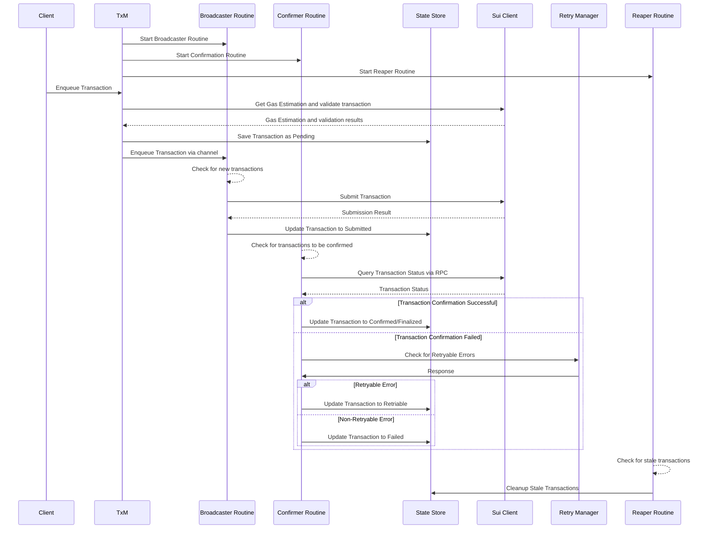

# Transaction Manager (TxM)

## 1. Introduction

### 1.1 Purpose
The Transaction Manager (TxM) is a core component of the SUI blockchain integration, responsible for managing the lifecycle of transactions. It will handle transaction submission, state management, confirmation, gas estimation and error handling. It is designed to ensure reliability, scalability, and extensibility while addressing SUI-specific requirements.
This document outlines the design, architecture, and task breakdown for the TxM.

### 1.2 Objectives
- Efficiently manage the lifecycle of transactions.
- Ensure transaction finality and correctness.
- Provide robust error handling and retry mechanisms.
- Optimize gas usage
- Fully leverage the Sui client interface to interact with the SUI node.

## 2. Architecture

### 2.1 High-Level Architecture

The TxM will manage transactions through the following states:
1. **Pending**: Transaction is created but not yet submitted.
2. **Submitted**: Transaction is sent to the SUI node.
3. **Finalized**: Transaction has reached finality. This happens when a transaction is included in a checkpoint and cannot be reverted. 
4. **Retriable**: Transaction encountered an error (e.g. not enough gas) and will be retried.
5. **Failed**: Transaction has failed and cannot be finalized.

Thre are two final states: **Finalized** and **Failed**. **Finalized** means the transaction has been confirmed and is considered successful. **Failed** means the transaction has encountered an error and cannot be finalized.

In order to achieve this, the TxM is composed of the following components:

1. **Broadcaster Routine**: Responsible for receiving requests and enqueueing transactions for submission.
2. **State Store**: Manages transaction states and provides APIs for state retrieval and updates.
3. **Confirmer Routine**: Periodically polls the state store for transaction confirmation and finality.
4. **Retry Manager**: Implements retry strategies for transient errors.
5. **Reaper Routine**: Periodically cleans up stale or finalized transactions from the State Store.

Additionally, all components will interact with the SUI node via the Client Interface Abstraction, which provides a unified interface for interacting with the SUI node. More details about the Client Interface can be found in section TODO.

### 2.2 Flow diagram

The diagram below represents the high-level flow of a transaction through the TxM.

-----

## 3. Components

### 3.1 Broadcaster
#### Responsibilities:
- Submit transactions to SUI nodes using the Sui Client
- Manage transaction queues and implement backpressure control.

#### Implementation:
- Go routine that listens for incoming transactions.
- Ensures older transactions (ie. that are being retried) are handled first;
- Leverages the Client Interface to interact with SUI nodes for:
  - Transaction validation;
  - Gas estimation;
  - Transaction submission.
- Ensure transactions are marked as **Submitted** in the State Store after successful broadcasting.

---

### 3.2 Confirmer
#### Responsibilities:
- Poll SUI nodes to confirm transaction status.
- Updates the State Store with the latest transaction status.
- Follows a retry strategy for transactions that encounter transient errors.

#### Implementation:
- Go Routine that periodically checks in-flight transactions from the state store
- Leverage the Client Interface to query on-chain transaction status.
- Leverages the Retry Manager to check if a transaction is retryable or not;
- Update the State Store with the latest transaction state (e.g., **Confirmed**, **Finalized**, or **Failed**).

---

### 3.3 Retry Manager
#### Responsibilities:
- Handle retries for transient errors (e.g., insufficient gas, network issues).
- Implement exponential backoff for retries.

#### Implementation:
- Define retryable and non-retryable error categories.
- Use a configurable retry strategy to avoid network congestion.
- Does not write to the State Store directly, but communicates with the Confirmer to update transaction states.

### 3.4 Sui Client
#### Responsibilities:
- Abstract all interactions with the SUI node by leveraging the SUI JSON-RPC API.
- Provide a unified interface for transaction submission, status queries, and gas estimation.
- Handle RPC calls and responses.

#### Implementation:
- Define a Client Interface that includes methods for:
  - Submitting transactions (e.g. singleTransaction, ProgrammableTransactionBlock, etc).;
  - Querying transaction status.
  - Estimating gas.
- A wrapper around a Go client implementation.

Given the findings from the team, the current block vision Go library seems to be missing support for Programatic Transaction Blocks. A possible solution would be to reuse a component of the [comming chat SDk](https://github.com/coming-chat/go-sui-sdk/blob/main/sui_types/programmable_transaction_builder.go) that has the required functionality. The implications of this need to be further discussed with the team and are out of scope of this document.

### 3.5 State Store
#### Responsibilities:
- Persist transaction states
- Provide APIs for querying and updating transaction states.
- Integrate with the Reaper Routine for periodic cleanup.

#### Implementation:
- Use an in-memory store (e.g., `sync.Map`) for lightweight implementations or a persistent database (e.g., SQLite, PostgreSQL) for production-grade systems.
  - @JoaoVasques question: do we need a persistent store?
- Implement synchronization primitives (e.g., `sync.RWMutex`) for thread-safe access.
- Define a schema or structure for storing transaction metadata. A proposal can be a map with three keys that store transaction objects:
  - In Flight: Transactions that are pending submission or confirmation.
  - Finalized: Transactions that have reached finality.
  - Retriable: Transactions that encountered transient errors and are pending retry.

### 3.6 Reaper Routine
#### Responsibilities:
- Periodically clean up stale or finalized transactions from the State Store.
- Ensure the State Store remains efficient and does not grow indefinitely.

#### Implementation:
- Implement a background goroutine that runs at a configurable interval.
- Define cleanup criteria, such as:
  - Transactions in the **Finalized** or **Failed** state for a certain duration.
  - Transactions that exceed a maximum retention period.

## 4. Error Handling and Retry Logic

### 4.1 Error Classification
1. **Retryable Errors**:
   - Insufficient gas.
   - Transient network issues.
   - Object version conflicts.

2. **Non-Retryable Errors**:
   - Invalid transaction structure.
   - Expired gas objects.

## 5. Gas and Fee Management

TODO: this requires more research. We need to understand how gas estimation works in SUI and how we can optimize it.

---

## 6. Task Breakdown

### 6.1 State Store
#### Tasks:
1. **Initialize State Store**:
   - Implement an in-memory store (e.g., `sync.Map`) for lightweight use cases.
   - Optionally, set up a persistent database (e.g., SQLite, PostgreSQL) for production-grade systems.
     - Decide whether a persistent store is required (pending discussion).

2. **Define Transaction Schema**:
   - Design a schema or structure for storing transaction metadata.
     - **In-Flight**: Transactions pending submission or confirmation.
     - **Finalized**: Transactions that have reached finality.
     - **Retriable**: Transactions pending retry due to transient errors.

3. **Implement APIs for State Management**:
   - Add APIs for:
     - Adding new transactions.
     - Updating transaction states (e.g., Pending → Submitted → Confirmed).
     - Querying transactions by state or ID.
     - Cleanup transactions based on criteria (e.g., stale, finalized).

4. **Concurrency Control**:
   - Use synchronization primitives (e.g., `sync.RWMutex`) to ensure thread-safe access to the store.

5. **Integration with Other Components**:
   - Allow the **Broadcaster**, **Confirmer**, and **Retry Manager** to interact with the store for state updates and queries.

6. **Reaper Integration**:
   - Provide APIs for the **Reaper Routine** to clean up stale or finalized transactions.

---

### 6.2 Broadcaster Routine
#### Tasks:
1. **Initialize Broadcaster Routine**:
   - Create a Go routine to listen for incoming transactions.
   - Set up a channel for transaction enqueueing.

2. **Transaction Queue Management**:
   - Implement a priority queue to ensure older transactions (e.g., retries) are handled first.

3. **Transaction Submission**:
   - Fetch transactions from the queue.
   - Submit transactions to the SUI node using the **Sui Client**.
   - Handle submission errors and update the **State Store** accordingly.
---

### 6.3 Confirmer Routine
#### Tasks:
1. **Initialize Confirmer Routine**:
   - Create a Go routine to periodically check for transactions requiring confirmation.

2. **Fetch In-Flight Transactions**:
   - Query the **State Store** for transactions in the **Submitted** state.

3. **Query Transaction Status**:
   - Use the **Sui Client** to query the status of each transaction.

4. **Check for Retryable transactions**:
  - Leverages the RetryManager to check if a transaction is retryable or not.

6. **Update Transaction State**:
   - Update the **State Store** with the latest transaction state:
     - **Confirmed**: Transaction is confirmed in the blockchain.
     - **Finalized**: Transaction has reached finality.
     - **Failed**: Transaction cannot be confirmed.

7. **Handle Failed Transactions**:
   - Forward retryable transactions to the **Retry Manager**.
   - Mark non-retryable transactions as **Failed** in the **State Store**.

### 6.4 Retry Manager
#### Tasks:
1. **Define Retryable and Non-Retryable Errors**:
   - Classify errors into:
     - **Retryable Errors**: Insufficient gas, transient network issues, object version conflicts.
     - **Non-Retryable Errors**: Invalid transaction structure, expired gas objects.

3. **Integrate with the Confirmer Routine**:
   - Allow the **Confirmer Routine** to invoke the **Retry Manager** when a transaction encounters a retryable error.
   - Return the retry result to the **Confirmer Routine**:
     - **Success**: Transaction is resubmitted successfully.
     - **Failure**: Transaction cannot be retried further.

4. **Exponential Backoff**:
   - Provide an exponential backoff mechanism for retries to avoid overwhelming the network.
   - Allow configuration of backoff parameters (e.g., initial delay, maximum retries).
---

### 6.5 Reaper Routine
#### Tasks:
1. **Initialize Reaper Routine**:
   - Create a Go routine to periodically clean up stale transactions.

2. **Define Cleanup Criteria**:
   - Identify transactions to be cleaned up based on:
     - State (e.g., **Finalized**, **Failed**).
     - Retention period (e.g., transactions older than 24 hours).

3. **Fetch Stale Transactions**:
   - Query the **State Store** for transactions meeting the cleanup criteria.

4. **Remove Stale Transactions**:
   - Delete stale transactions from the **State Store**.

5. **Configuration**:
   - Allow configurable parameters for:
     - Retention period.
     - Cleanup interval.

---

## 7. References
- [Transaction Lifecycle](https://docs.sui.io/concepts/sui-architecture/transaction-lifecycle)
- [SUI JSON-RPC API](https://docs.sui.io/sui-api-ref)
- [SUI Gas and Fees](https://docs.sui.io/concepts/tokenomics/gas-in-sui)