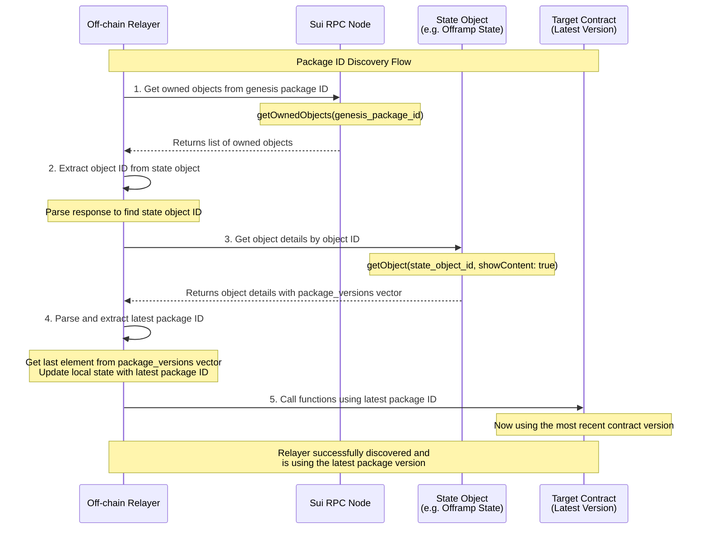
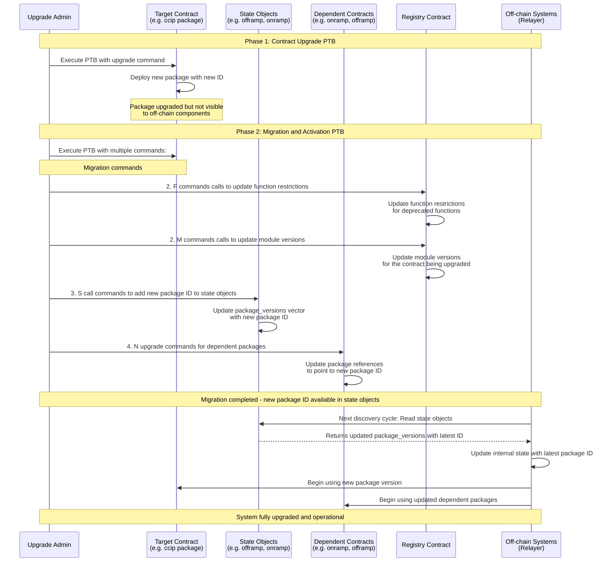

# Package Upgrades on CCIP Contracts

- [Package Upgrades on CCIP Contracts](#package-upgrades-on-ccip-contracts)
  - [1. Overview](#1-overview)
  - [2. Context](#2-context)
    - [2.1 Current CCIP on-chain architecture](#21-current-ccip-on-chain-architecture)
    - [2.2 Sui Package and Object Model](#22-sui-package-and-object-model)
    - [2.3 Upgrade Transaction Requirements](#23-upgrade-transaction-requirements)
    - [2.4 Discovery and Coordination Challenges](#24-discovery-and-coordination-challenges)
  - [3. Goals](#3-goals)
  - [4. Design options](#4-design-options)
    - [4.1 Selected option: Two-Phase Upgrade with current on-chain architecture](#41-selected-option-two-phase-upgrade-with-current-on-chain-architecture)
      - [Phase 1 - Contract Upgrade PTB](#phase-1---contract-upgrade-ptb)
      - [Phase 2 - Migration and Activation](#phase-2---migration-and-activation)
      - [Two-Phase Upgrade Flow](#two-phase-upgrade-flow)
      - [State pointer objects](#state-pointer-objects)
      - [Versioning strategy - Registry-Based Restrictions](#versioning-strategy---registry-based-restrictions)
      - [Task breakdown](#task-breakdown)
  - [5. Alternative Options](#5-alternative-options)
    - [5.1 One Package ID Approach](#51-one-package-id-approach)
      - [Phase 1 - Contract Upgrade PTB](#phase-1---contract-upgrade-ptb-1)
      - [Phase 2 - Migration and Activation](#phase-2---migration-and-activation-1)
      - [Pros and cons of one package ID approach](#pros-and-cons-of-one-package-id-approach)
    - [5.2 Package-Level Version Constants](#52-package-level-version-constants)
    - [5.3 Feature Flags with Version Control](#53-feature-flags-with-version-control)
  - [6. Proposed Architecture](#6-proposed-architecture)
  - [7. Appendix](#7-appendix)
    - [7.1 References](#71-references)


## 1. Overview

This document describes a system design for performing **Sui package upgrades** for CCIP contracts in a way that ensures:

- **Consistency**: Objects are safely migrated to the new version, and new state is initialized.
- **Discoverability**: Off-chain components can always determine the most recent package version 
- **Traceability**: All upgrades and migrations are recorded on-chain and can be easily verified.
- **Reliability**: Failures during migration are recoverable without leaving the system in an inconsistent state. 
- **Flexibility**: The system should be flexible enough to support N versions of the same contract (N can be 1 or more)
- **Deprecation**: The system should be able to deprecate old versions of the contract and stop the from being used.

## 2. Context

This aims to give some prior context before diving into the design. It starts by describing the current CCIP on-chain architecture and the challenges it faces with regards to upgradeability. Then, it presents a quick sumamry of SUI's package and object model. Finally, it provides a summary of the requirements and coordination challenges that we will need to address.

### 2.1 Current CCIP on-chain architecture

The current CCIP on-chain architecture consists of the following packages:

- `ccip`: Contains some of the core (and shared) modules from CCIP such as: `token_admin_registry`, `receiver_registry`, `fee_quoter`, `nonce_manager`, `rmn_remote`, `client`, `state_object`, etc
- `ccip_onramp`: Contains the on-ramp contract, depends on `ccip` package
- `ccip_offramp`: Contains the off-ramp contract, depends on `ccip` package
- `ccip_router`: Contains the router contract, depends on `ccip` package
- `ccip_router`: Contains the router contract, depends on `ccip` package
- `ccip_token_pool`: Contains the token pool contract, depends on `ccip` package

This approach has the following benefits in terms of upgradeability:
- A package that does not have any dependencies can be upgraded independently of other packages (e.g. `ccip_offramp` can be upgraded independently of `ccip_onramp`);
- The packages are smaller in size, which makes upgrades cheaper in terms of gas;

On the other hand, this approach has the following upgradeability challenges:

- Increased cognitive load - each package has its own upgrade logic, which can be complex to implement and maintain;
- Cascading upgrades - if another package depends on a package that is being upgraded, that package will also need to be upgraded;


### 2.2 Sui Package and Object Model

**Package Immutability:**
- **Immutable by Design**: Once published, Sui packages are immutable and cannot be modified
- **Package ID**: Each package has a unique, deterministic address derived from its bytecode
- **Version Independence**: Different package versions have completely different package IDs
- **Upgrade Mechanism**: "Upgrades" actually deploy entirely new packages with upgrade capabilities

**Object Lifecycle:**
- **Initialization**: Objects are created with specific types defined by Move modules in a package
- **Ownership**: Objects can be owned (by address), shared (global access), or immutable
- **State**: Object data is stored on-chain and tied to the package version that created it
- **Type Identity**: Object types include the package ID in their fully qualified name (e.g., `0xabc123::module::Struct`)

**Package Upgrades Impact:**
- **New Package ID**: Upgrades create a new package with a completely different address/ID
- **Type Evolution**: Object types now reference the new package ID in their fully qualified names
- **Object Ownership**: Objects created by old packages are not owned by the new package
- **Schema Changes**: Object fields may be added, removed, or modified between versions
- **Function Updates**: Entry functions and public interfaces may change behavior or signatures


### 2.3 Upgrade Transaction Requirements

Package upgrades on Sui require **two separate transactions**. This is required because the new package ID is not available until the upgrade transaction is finalized.

1. **Upgrade Transaction**: 
   - Performs the package upgrade that results in a new package ID.

2. **Migration Transaction**: 
   - Calls migration entry functions in the new package
   - Updates existing objects to be compatible with new package version
   - Upgrade any dependent packages (if they exist) to point to the new package ID

### 2.4 Discovery and Coordination Challenges

- **Package ID Discovery**: During the gap between transactions, the new package ID is not directly callable by off-chain systems unless they know how to discover it
- **Off-chain Coordination**: Off-chain systems must be notified of the new package ID and when it's safe to use
- **Migration Timing**: Migration must happen before off-chain systems begin using the new package
- **Rollback Complexity**: Failed migrations leave the system in an inconsistent state that's difficult to recover from
- **Version Deprecation**: The system should be able to deprecate old versions of the contract and stop the from being used.


## 3. Goals

1. Strategy to upgrade CCIP contracts
2. Retriable and idempotent migrations
3. Off-chain system must have a discovery mechanism to get the latest package ID
4. We can deprecate old versions of the contract functionality and stop the from being used.
5. Keep a record of all package versions and the history of all package upgrades.

## 4. Design options

### 4.1 Selected option: Two-Phase Upgrade with current on-chain architecture


This option introduces a new contract, `registry contract`. This contract will be used to store all of the deprecated functions and module versions. The log of all package versions will be stored inside the state object of each contract (e.g. offramp, onramp, etc). One could have stored this information in the registry contract. However, this approach has the following benefits:

- **Simplified object discovery**: The off-chain relayer already relies on the state object data of some contracts (e.g. offramp) for some of its operations. This approach will allow the relayer to continue using the same logic to have access to the log of package versions.
- **Transparent upgrades to the off-chain system**: the off-chain system will only need to store the first version of the Package ID of each contract. Since the state object is owned by the initial package version, the latest package version can be easily discovered. A reader familiar with computer networks will see a parallel with NAT (Network Address Translation) table entries
- **Versioning**: Easier to keep track of all version changes and deprecations since they are all stored in the registry contract.

Here is the high level flow of the package ID discovery flow:



The contract upgrade flow consists of two phases (transactions): contract upgrade and migration and activation.

#### Phase 1 - Contract Upgrade PTB
- Single transaction containing `upgrade` command
- Package is upgraded but not yet visible for the off-chain components

#### Phase 2 - Migration and Activation

A migration operation will be executed in the contract is being upgraded (e.g. `token_admin_registry`). This migration operation has the following steps:

1. If required, deprecated specific functions for a given version(s) of the contract.
2. For each contract that was updated, add the new package ID to its state object,

In terms of transactions this consist of a PTB with the following commands:
1. 1 `upgrade` command to upgrade the package
2. F number of `call` command to update the function restrictions (where F is the number of functions to be deprecated)
3. S number of `call` command to add the new package ID to the state object of the contract being upgraded (where S is the number of contracts have been updated)
4. U number of `upgrade` commands to upgrade the contracts that depend on the contract being upgraded

After all on-chain migrations are done, the most recent package ID will be available the next time the relayer needs to access the state object of the contract being upgraded.

#### Two-Phase Upgrade Flow

The following diagram illustrates the complete two-phase upgrade process using registry-based function restrictions.



The sample pseudo code below represents the code changes that the offramp contract will be updated to use the new package ID.

```move
module ccip_offramp::offramp {
    use ccip::upgrade_registry::{Self, UpgradeRegistry};
    use std::string;
}

public struct OffRampState has key, store {
    id: UID,
    // other fields
    package_ids: vector<address>,
}

fun migrate(
    state: &mut OffRampState,
    new_package_id: address,
    ctx: &mut TxContext
) {
    // Append the new package ID to the package_ids vector
    vector::push_back(&mut state.package_ids, new_package_id);
}

```

#### State pointer objects

The state pointer objects are created when CCIP is deployed the first time (i.e. in the `init` function of the module that owns them). When we do an upgrade the new package ID is stored in the state object of the contract being upgraded. Because the state pointer is owned by the initial package ID, the relayer will continue using it to access the state pointer objects. 

#### Versioning strategy - Registry-Based Restrictions

Let's consider a scenario where we found a critical bug in a contract and we must update it. The fix will be available in the new contract version but we also need to restrict the usage of the old version of the contract. This is where versioning comes into play. The current versioning strategy is based on the registry-based restrictions. This allow us to have a fine grained control over the usage of the old version of the contract.

- Restrict the usage of specific functions for a given version(s) of the contract
- Restrict the usage of specific modules for a given version(s) of the contract

In Move contracts, we implement version-based restrictions leveraging the registry contract. A sample implementation is presented below.

**Note:** this is Move pseudo-code, it is not guaranteed to compile or to be safe

```move
// registry contract
module ccip::upgrade_registry {
    use std::string::{Self, String};
    
    const E_FUNCTION_BLOCKED: u64 = 1001;

    public struct PackageHistory has store, copy, drop {
      package_id: address,
      version: u64,
      timestamp: u64,
    }

    public struct UpgradeRegistry has key {
        id: UID,
        // Maps module_name -> (function_name, blocked_versions)
        function_restrictions: Table<FunctionKey, vector<vector<u64>>>,

        // Maps module_name -> (module name, blocked_versions)
        module_restrictions: Table<ModuleKey, vector<vector<u64>>>,

        // Maps module_name -> current_version
        current_module_versions: Table<String, u64>,

        package_history: Table<String, vector<PackageHistory>>,
    }

    public struct FunctionKey has store, copy, drop {
        module_name: String,
        function_name: String,
    }

    public struct ModuleKey has store, copy, drop {
        module_name: String,
    }

    // Check if a function is allowed for a specific contract version
    public fun is_function_allowed(
        registry: &UpgradeRegistry,
        module_name: String,
        function_name: String,
        contract_version: u64,
    ): bool {
        let key = FunctionKey { module_name, function_name };
        
        if (table::contains(&registry.function_restrictions, key)) {
            let blocked_versions = table::borrow(&registry.function_restrictions, key);
            !vector::contains(blocked_versions, &contract_version)
        } else {
            true // If not in restrictions, function is allowed
        }
    }

    // check if a module is allowed for a specific contract version
    public fun is_module_allowed(
        registry: &UpgradeRegistry,
        module_name: String,
        contract_version: u64,
    ): bool {
        let key = ModuleKey { module_name };
        if (table::contains(&registry.module_restrictions, key)) {
            let blocked_versions = table::borrow(&registry.module_restrictions, key);
            !vector::contains(blocked_versions, &contract_version)
        } else {
            true // If not in restrictions, module is allowed
        }
    }

    // Update function restrictions (called during migrations)
    public fun update_function_restrictions(
        registry: &mut UpgradeRegistry,
        module_name: String,
        function_name: String,
        blocked_versions: vector<vector<u64>>,
        ctx: &mut TxContext
    ) {
        let key = FunctionKey { module_name, function_name };
        table::upsert(&mut registry.function_restrictions, key, blocked_versions);
    }

    // Update module restrictions (called during migrations)
    public fun update_module_restrictions(
        registry: &mut UpgradeRegistry,
        module_name: String,
        blocked_versions: vector<vector<u64>>,
        ctx: &mut TxContext
    ) {
        let key = ModuleKey { module_name };
        table::upsert(&mut registry.module_restrictions, key, blocked_versions);
    }

    // Update package version (called during upgrades)
    public fun update_module_version(
        _: &CCIPOwnerCap,
        registry: &mut UpgradeRegistry,
        module_name: String,
        new_version: u64,
        ctx: &mut TxContext
    ) {
        table::upsert(&mut registry.package_versions, module_name, new_version);
    }
}

// contract being upgraded
module ccip::offramp {
    use ccip::upgrade_registry::{Self, UpgradeRegistry};
    use std::string;

    // Each contract must declare its version
    const CONTRACT_VERSION: u64 = 2;

    public struct OffRampState has key, store {
        id: UID,
        // ... other fields
    }

    // Helper function to check if a function is allowed
    fun assert_function_allowed(
        upgrade_registry: &UpgradeRegistry,
        function_name: vector<u8>,
    ) {
        let module_name = string::utf8(b"offramp");
        let allowed = upgrade_registry::is_module_allowed(
            upgrade_registry,
            module_name,
            CONTRACT_VERSION
        );
        assert!(allowed, upgrade_registry::E_MODULE_BLOCKED);

        let allowed = upgrade_registry::is_function_allowed(
            upgrade_registry,
            string::utf8(b"offramp"),
            string::utf8(function_name),
            CONTRACT_VERSION
        );
        assert!(allowed, upgrade_registry::E_FUNCTION_BLOCKED);
    }

    // This function works across all versions unless explicitly blocked
    public fun execute(
        state: &mut OffRampState,
        upgrade_registry: &UpgradeRegistry,
        token: address,
        admin: address,
        ctx: &mut TxContext
    ) {
        assert_function_allowed(upgrade_registry, b"execute");
        // Function implementation - same logic across versions
    }

    // Getter function to expose contract version
    public fun get_contract_version(): u64 {
        CONTRACT_VERSION
    }

    // etc...
}
```

**Benefits of this approach:**
- **Centralized management**: All restrictions at module and function level are managed in one place
- **Version-agnostic**: Old packages work without knowing about future versions
- **Cross-package restrictions**: Can manage restrictions across multiple CCIP packages
- **Emergency response**: Can quickly disable vulnerable functions system-wide
- **Audit trail**: Centralized view of all function restrictions and version history
- **+Off-chain agnostic**: The off-chain system only needs to know the original Package ID.

**Cons of this approach:**
- **Registry dependency**: All functions must reference the upgrade registry
- **Strong coupling**: All packages depend on the same registry contract (assuming we decouple it from the CCIP package)
- **Gas costs**: Additional registry lookup on every function call
- **String-based keys**: Function/package names as strings could be error-prone
- **Migration coordination**: Registry updates must be coordinated with package upgrades

**Example migration scenarios:**

```move
// Scenario 1: Block vulnerable function in specific versions
upgrade_registry::update_function_restrictions(
    registry,
    string::utf8(b"token_admin_registry"),
    string::utf8(b"vulnerable_function"),
    vector[1, 2] // Block only for versions 1 and 2 (fixed in v3)
);

// Scenario 2: Emergency block function across all current versions
upgrade_registry::update_function_restrictions(
    registry,
    string::utf8(b"onramp"),
    string::utf8(b"send_message"),
    vector[1, 2, 3] // Block across all deployed versions
);

// Scenario 3: Deprecate legacy function starting from version 3
upgrade_registry::update_function_restrictions(
    registry,
    string::utf8(b"token_admin_registry"),
    string::utf8(b"legacy_register_token"),
    vector[3, 4, 5] // Block for v3 and future versions
);

// Scenario 4: Block entire module (i.e contract) on specific versions
upgrade_registry::update_module_restrictions(
    registry,
    string::utf8(b"token_admin_registry"),
    vector[1, 2] // Block for versions 1, 2
);

// Scenario 4: How different package versions behave
// Package v1 (CONTRACT_VERSION = 1) calling vulnerable_module -> BLOCKED
// Package v2 (CONTRACT_VERSION = 2) calling vulnerable_module -> BLOCKED  
// Package v3 (CONTRACT_VERSION = 3) calling allowed module -> ALLOWED (fixed)
```

**Example of upgrade and migration flow for offramp:**

1. 1 `upgrade` command to upgrade the package
2. F number of `call` command to update the function restrictions (where F is the number of functions to be deprecated)
3. S number of `call` command to add the new package ID to the state object of the contract being upgraded (where S is the number of contracts have been updated)
4. N `upgrade` commands to upgrade the contracts that depend on the contract being upgraded

```go
// Phase 1: Contract Upgrade offramp PTB

contractVersion := "v0.1.0-hello"
genesisPackageID := "0x1234567890123456789012345678901234567890"
functionsToDeprecate := []string{"foo", "bar"}

upgradePTB := ptb.NewTransaction()
upgradePTB.AddUpgradePackage(ccipP, ccip.OffRampModule, ccip.OffRampFunction, ccip.OffRampState)

packageID := upgradePTB.Execute()

// Phase 2: Migration and Activation PTB

migrationPTB := ptb.NewTransaction()
migrationPTB.AddCall(ccipP, "migrate", packageID, functionsToDeprecate)
migrationPTB.Execute()

activationPTB := ptb.NewTransaction()
activationPTB.AddCall(genesisPackageID, "migrate", packageID)
activationPTB.Execute()

dependentPackages := []string{"0x123", "0x456", "0x789"}
for _, packageID := range dependentPackages {
    activationPTB.UpgradePackage(packageID, []string{packageID})
}
output, err := activationPTB.Execute()
if err != nil {
    log.Fatalf("Failed to execute activation PTB: %v", err)
}

```

*Pros:*
- **Core on-chain architecture remains the same**: CCIP on-chain architecture remains the same
- **Flexible Versioning**: We can use different versioning strategies to control the usage of the old version of the contract
- **Support for deprecation**: We can deprecate old versions of the contract and stop the from being used

*Cons:*
- **Upgrades require knowledge of package relationships**: We need to know which packages depend on the contract being upgraded to be able to upgrade them correctly. This requires a thorough understanding of the CCIP on-chain architecture.
- **Gas costs**: Additional gas costs for the migration operation
- **Operational complexity**: We need to manage the registry contract and the versioning logic.


#### Task breakdown

**On-chain:**
  - Create the registry contract
  - For all contracts containing state objects:
    - Add package IDs to state objects and functions to update them;
  - For all publicly accessible functions for all contracts:
    - Add contract version constant
    - Add call to the registry to assess if the function is allowed to be called for the given version;

**Relayer**
- Fetch the latest package ID from state objects and use in all other calls
- Update transaction and event indexers to scan for all package IDs for the contracts they are interested in

**Create upgrade migrationsequences**
This is to prove that the migration process works as expected. The opjective here is to create migration sequences for a subset of contracts that will be upgraded

## 5. Alternative Options

This section explores alternative approaches that were considered but not selected for the CCIP upgrade strategy.

### 5.1 One Package ID Approach

This approach consists of a single package ID that is used for all versions of the contract. The contract is upgraded in a single transaction and the migrations are done in another transaction. In this scenario, all different CCIP components have the same package ID. We will rely on the registry contract to record the history of all package versions and emit `PackageUpgrade` event when CCIP is upgraded. Because CCIP is under a single package, we will need to have the registry contract to be inside other package (e.g. `ccip_registry`). This is necessary because the off-chain system will need to know the package ID of the registry contract to be able to subscribe to the `PackageUpgrade` event. That is not possible if the registry contract is inside the CCIP package because it's package ID will change when CCIP is upgraded.

Off-chain systems (i.e the relayer) will subcribe these events and update their internal state accordinly. Because all components have the same package ID the event will have the following schema:

```move
public struct PackageUpgrade has copy, drop, store {
    package_id: address,
    version: u64,
    timestamp: u64,
}
```

The two phase upgrade flow will be the following:

#### Phase 1 - Contract Upgrade PTB
- Single transaction containing `upgrade` command. This will deploy an entire new version of CCIP.
- Package is upgraded but not yet visible for the off-chain components.

#### Phase 2 - Migration and Activation

A migration operation will be executed across all CCIP components. This migration consists of the following steps:

1. Command to upgrade package ID
2. If required, deprecated specific functions for a given version(s) of the contract.
3. Emit event to inform the off-chain system that the package is upgraded.

In terms of transactions this consist of a PTB with the following commands:
1. `upgrade` command to upgrade the package
2. F number of `call` commands to execute the deprecated functions (where F is the number of functions to be deprecated)
3. `call` the registry contract to update the package ID that will trigger an off-chain notification. 

After all on-chain migrations are done, the registry contract will emit a `PackageUpgrade` event with the new package ID, version and timestamp. The off-chain system will receive this event and update their internal state accordingly.

The options for updating state pointers and versioning are the same as in option 1 with the difference that we don't need to know the package relationships.


#### Pros and cons of one package ID approach

*Pros:*
- **Simplicity**: One package ID to manage
- **Versioning**: We can use different versioning strategies to control the usage of the old version of the contract
- **Support for deprecation**: We can deprecate old versions of the contract and stop the from being used.
- **Easy to map breaking changes**: We can map the breaking changes to a specific version of the entire system.

*Cons:*
- **Move all CCIP components to a single package**: Significant coding effort.
- **Upgrades require configuration changes across many systems** Examples are OCR config, home chain package configurations, lane configurations, etc. Plus, we will could break the experience of users
- **Gas costs**: Additional gas costs for entire update process (we need to update everything).
- **Impossible to upgrade CCIP components independently**: If we want to upgrade a single CCIP component we need to upgrade all of them.

### 5.2 Package-Level Version Constants

This approach uses package-level constants to restrict function usage based on the deployed package version:

```move
module ccip_onramp::onramp {
    const PACKAGE_VERSION: u64 = 3;
    const MIN_SUPPORTED_VERSION: u64 = 2;
    const E_UNSUPPORTED_VERSION: u64 = 2001;

    public struct OnRamp has key, store {
        id: UID,
        package_version: u64,
        // ... other fields
    }

    // New function only available in v3+
    public fun send_message_with_fee_token(
        onramp: &mut OnRamp,
        message: Message,
        fee_token: address,
        ctx: &mut TxContext
    ) {
        assert!(onramp.package_version >= 3, E_UNSUPPORTED_VERSION);
        // Implementation for new feature
    }

    // Legacy function deprecated in v3
    public fun send_message_legacy(
        onramp: &mut OnRamp,
        message: Message,
        ctx: &mut TxContext
    ) {
        assert!(onramp.package_version < 3, E_UNSUPPORTED_VERSION);
        // Legacy implementation - will fail on v3+
    }
}
```

**Benefits of this approach:**
- **Simple implementation**: Just constants and assertions in functions
- **Low storage cost**: No additional storage per object
- **Package-wide consistency**: All functionality tied to single package version
- **Clear deprecation**: Easy to sunset entire function sets
- **Fast execution**: Compile-time constants, minimal runtime overhead

**Cons of this approach:**
- **All-or-nothing**: Cannot partially migrate functionality
- **Rigid versioning**: Difficult to support multiple concurrent versions
- **Upgrade coupling**: All objects must be compatible with the same package version
- **Limited flexibility**: Cannot enable features selectively per object

### 5.3 Feature Flags with Version Control

This approach combines versioning with feature flags for more granular control:

```move
module ccip::fee_quoter {
    const CURRENT_VERSION: u64 = 2;
    const E_FEATURE_NOT_AVAILABLE: u64 = 3001;

    public struct FeatureFlags has store {
        dynamic_pricing_enabled: bool,
        multi_token_support: bool,
        // ... other feature flags
    }

    public struct FeeQuoter has key, store {
        id: UID,
        version: u64,
        features: FeatureFlags,
        // ... other fields
    }

    // Function available only when feature is enabled and version is compatible
    public fun quote_with_dynamic_pricing(
        quoter: &FeeQuoter,
        message: &Message,
        ctx: &TxContext
    ): u64 {
        assert!(quoter.version >= 2, E_FEATURE_NOT_AVAILABLE);
        assert!(quoter.features.dynamic_pricing_enabled, E_FEATURE_NOT_AVAILABLE);
        // Dynamic pricing implementation
    }

    // Migration function to enable new features
    public fun enable_dynamic_pricing(
        quoter: &mut FeeQuoter,
        ctx: &mut TxContext
    ) {
        assert!(quoter.version >= 2, E_FEATURE_NOT_AVAILABLE);
        quoter.features.dynamic_pricing_enabled = true;
    }
}
```

**Benefits of this approach:**
- **Maximum flexibility**: Can enable/disable features independently
- **A/B testing**: Can test new features with subset of objects
- **Risk mitigation**: Can quickly disable problematic features
- **Gradual rollout**: Features can be enabled progressively
- **Backward compatibility**: Old and new features can coexist

**Cons of this approach:**
- **Increased complexity**: More state to manage and more code paths
- **Testing burden**: Need to test all combinations of feature flags
- **Feature flag bloat**: Accumulation of feature flags over time
- **Support for new functions**: New functions cannot be added without a new version of the FeatureFlag object. 

## 6. Proposed Architecture

The team selected the **Option 1: Two-Phase Upgrade with current on-chain architecture** approach.

-----

## 7. Appendix

### 7.1 References

1. [Sui Package Upgrades](https://docs.sui.io/concepts/sui-move-concepts/packages/upgrade)
2. [Custom Upgrade Policies](https://docs.sui.io/concepts/sui-move-concepts/packages/custom-policies)
3. [Upgradability Practices](https://move-book.com/guides/upgradeability-practices)

