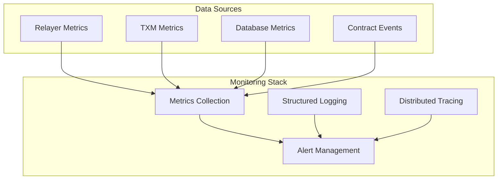

# System Architecture Overview

This document provides a comprehensive overview of the Chainlink SUI architecture, explaining how the various components work together to enable secure cross-chain communication and token transfers.

## High-Level Architecture

The Chainlink SUI system is designed with a modular architecture that separates concerns and enables scalability, security, and maintainability. The system consists of several key layers:


## Core Components

### 1. Chainlink Core Integration

The system integrates with Chainlink Core through the **LOOP Plugin Architecture**, which provides process isolation and independent lifecycle management.

#### LOOP Plugin Interface
- **Purpose**: Provides a standardized interface between Chainlink Core and blockchain-specific implementations
- **Benefits**: Process isolation, independent updates, reduced dependency conflicts
- **Implementation**: Uses gRPC for inter-process communication

### 2. SUI Relayer

The **SUI Relayer** is the central orchestrator that manages all interactions with the Sui blockchain.

#### Key Responsibilities
- **Service Management**: Lifecycle management of all sub-components
- **Configuration**: Centralized configuration management
- **Monitoring**: Health checks and metrics collection
- **Error Handling**: Comprehensive error handling and recovery

#### Architecture
```go
type SuiRelayer struct {
    client         *client.PTBClient
    txm            *txm.SuiTxm
    balanceMonitor services.Service
    chainReader    types.ContractReader
    chainWriter    types.ContractWriter
}
```

### 3. ChainReader

The **ChainReader** provides read-only access to the Sui blockchain, enabling efficient data retrieval and event monitoring.

#### Capabilities
- **Object Reading**: Direct access to Sui objects and their state
- **Function Calls**: Execute view functions using DevInspect
- **Event Monitoring**: Real-time event indexing and querying
- **Historical Data**: Query historical blockchain state

#### Event Indexing Architecture


### 4. ChainWriter

The **ChainWriter** handles all write operations to the Sui blockchain, including transaction submission and PTB construction.

#### Transaction Types
- **Simple Transactions**: Direct function calls with basic parameters
- **Programmable Transaction Blocks (PTBs)**: Complex, multi-step transactions
- **CCIP Operations**: Cross-chain message and token transfers

#### PTB Construction Pipeline


### 5. Transaction Manager (TXM)

The **Transaction Manager** handles the complete lifecycle of transactions from creation to finalization.

#### Transaction States
1. **Pending**: Transaction created but not yet submitted
2. **Submitted**: Transaction sent to Sui node
3. **Finalized**: Transaction confirmed in a checkpoint
4. **Retriable**: Transaction failed with retriable error
5. **Failed**: Transaction failed permanently

#### Components
- **Broadcaster**: Submits transactions to Sui nodes
- **Confirmer**: Monitors transaction status and handles confirmations
- **Retry Manager**: Implements retry logic for failed transactions
- **State Store**: Manages transaction state persistence
- **Reaper**: Cleans up old transactions

## Data Flow

### Cross-Chain Message Flow


### Token Transfer Flow


### Event Monitoring Flow


## Security Model

### Multi-Layer Security

The system implements security at multiple layers:

1. **Network Security**: Secure communication between components
2. **Contract Security**: Audited smart contracts with access controls
3. **Transaction Security**: Signature verification and replay protection
4. **Data Security**: Encrypted data storage and transmission

### Access Control


### Risk Management Network (RMN)

The RMN provides additional security for cross-chain operations:

- **Fraud Detection**: Monitors for suspicious cross-chain activity
- **Emergency Response**: Can pause operations in case of detected attacks
- **Decentralized Security**: Multiple independent risk assessment nodes

## Scalability and Performance

### Horizontal Scaling

The architecture supports horizontal scaling through:

- **Stateless Components**: ChainReader and ChainWriter are stateless
- **Database Sharding**: PostgreSQL can be sharded for high throughput
- **Load Balancing**: Multiple relayer instances can run in parallel

### Performance Optimizations

- **Parallel Processing**: Sui's object model enables parallel transaction processing
- **Efficient Indexing**: Optimized database indexes for fast event queries
- **Connection Pooling**: Efficient connection management to Sui nodes
- **Caching**: Strategic caching of frequently accessed data

### Monitoring and Observability



## Configuration Management

### Configuration Hierarchy

```yaml
# Global Configuration
global:
  chain_id: "sui"
  network: "mainnet"
  
# Relayer Configuration
relayer:
  chain_reader:
    polling_interval: "1s"
    max_concurrent_requests: 10
  chain_writer:
    gas_limit: 10000000
    max_retries: 3
  
# Transaction Manager Configuration
txm:
  broadcast_chan_size: 100
  confirm_poll_secs: 2
  max_gas_amount: 200000
  
# Database Configuration
database:
  host: "localhost"
  port: 5432
  name: "chainlink_sui"
```

### Environment-Specific Configurations

- **Development**: Local Sui network, reduced security
- **Testnet**: Sui testnet, full security with test tokens
- **Mainnet**: Production configuration with full security

## Best Practices

### Development Guidelines

1. **Error Handling**: Always handle errors gracefully with proper logging
2. **Resource Management**: Properly close resources and handle cleanup
3. **Testing**: Comprehensive unit and integration tests
4. **Documentation**: Keep documentation up-to-date with code changes

### Operational Guidelines

1. **Monitoring**: Set up comprehensive monitoring and alerting
2. **Backups**: Regular backups of configuration and state data
3. **Security**: Regular security audits and updates
4. **Capacity Planning**: Monitor and plan for capacity requirements

## Next Steps

- **[Transaction Manager](transaction-manager.md)**: Deep dive into transaction lifecycle management
- **[LOOP Plugin Architecture](loop-plugin.md)**: Understanding the plugin system
- **[Security Model](security.md)**: Comprehensive security analysis
- **[Relayer Components](../relayer/introduction.md)**: Detailed relayer documentation 