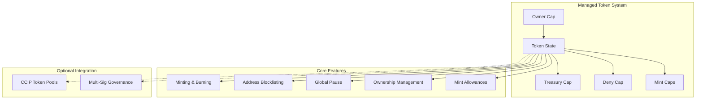

# Managed Tokens

The Managed Token system provides a comprehensive, standalone token management solution with advanced administrative capabilities. It operates completely independently and does not require any additional components, token pools, or CCIP infrastructure, making it ideal for various token management scenarios.

## Overview

The Managed Token is designed as a fully self-contained system that provides all essential token management capabilities without requiring external dependencies beyond the standard Sui framework.

### Key Design Principle

**Complete Independence**: The managed token can be deployed, managed, and used without requiring any external dependencies. It provides comprehensive token management features as a standalone solution while offering optional integration with CCIP for cross-chain functionality.



## Core Components

### TokenState

The main state object that manages all token operations:

```move
public struct TokenState<phantom T> has key, store {
    id: UID,
    treasury_cap: TreasuryCap<T>,           // Treasury capability for minting/burning
    deny_cap: Option<DenyCapV2<T>>,         // Optional deny capability for blocklist/pause
    mint_allowances_map: VecMap<ID, MintAllowance<T>>,  // Authorized minters and allowances
    ownable_state: OwnableState<T>,         // Ownership management
}
```

### MintCap

Represents the ability to mint tokens with specific allowances:

```move
public struct MintCap<phantom T> has key, store {
    id: UID,
}
```

Each `MintCap` is associated with a `MintAllowance` that defines:
- Current allowance amount
- Whether minting is unlimited
- Allowance tracking and management

### MintAllowance

Manages minting permissions and limits:

```move
public struct MintAllowance<phantom T> has store {
    allowance: u64,      // Current allowance amount
    is_unlimited: bool,  // Whether minting is unlimited
}
```

## Core Capabilities

### 🔐 Treasury Management

The managed token securely stores and manages the treasury cap:

```move
// Initialize managed token with treasury cap
public fun initialize<T>(
    treasury_cap: TreasuryCap<T>,
    ctx: &mut TxContext
) {
    let token_state = TokenState {
        id: object::new(ctx),
        treasury_cap,
        deny_cap: option::none(),
        mint_allowances_map: vec_map::empty(),
        ownable_state: ownable::new(ctx),
    };
    
    transfer::share_object(token_state);
}

// Initialize with deny cap for blocklist and pause functionality
public fun initialize_with_deny_cap<T>(
    treasury_cap: TreasuryCap<T>,
    deny_cap: DenyCapV2<T>,
    ctx: &mut TxContext
) {
    let token_state = TokenState {
        id: object::new(ctx),
        treasury_cap,
        deny_cap: option::some(deny_cap),
        mint_allowances_map: vec_map::empty(),
        ownable_state: ownable::new(ctx),
    };
    
    transfer::share_object(token_state);
}
```

### 💰 Minting & Burning

#### Mint Cap Management

Create and manage mint capabilities for authorized parties:

```move
// Configure a new minter with specific allowance
public fun configure_new_minter<T>(
    token_state: &mut TokenState<T>,
    owner_cap: &OwnerCap<T>,
    minter: address,
    allowance: u64,
    is_unlimited: bool,
    ctx: &mut TxContext
) {
    ownable::assert_owner(owner_cap, &token_state.ownable_state);
    
    let mint_cap = MintCap<T> { id: object::new(ctx) };
    let mint_cap_id = object::id(&mint_cap);
    
    let mint_allowance = mint_allowance::new(allowance, is_unlimited);
    token_state.mint_allowances_map.insert(mint_cap_id, mint_allowance);
    
    transfer::public_transfer(mint_cap, minter);
    
    event::emit(MintCapCreated<T> { mint_cap: mint_cap_id });
}
```

#### Token Minting

Mint tokens using authorized mint caps:

```move
// Mint tokens and return coin
public fun mint<T>(
    token_state: &mut TokenState<T>,
    mint_cap: &MintCap<T>,
    deny_list: &DenyList,
    amount: u64,
    recipient: address,
    ctx: &mut TxContext
): Coin<T> {
    // Verify mint cap is authorized
    let mint_cap_id = object::id(mint_cap);
    assert!(
        token_state.mint_allowances_map.contains(&mint_cap_id),
        EMintCapNotAuthorized
    );
    
    // Check allowance
    let allowance = token_state.mint_allowances_map.borrow_mut(&mint_cap_id);
    mint_allowance::consume_allowance(allowance, amount);
    
    // Check if recipient is blocklisted (if deny cap exists)
    if (option::is_some(&token_state.deny_cap)) {
        let deny_cap = option::borrow(&token_state.deny_cap);
        assert!(
            !is_blocklisted<T>(deny_list, recipient),
            ERecipientBlocklisted
        );
    };
    
    // Mint the token
    let coin = coin::mint(&mut token_state.treasury_cap, amount, ctx);
    
    event::emit(TokenMinted<T> {
        mint_cap: mint_cap_id,
        amount,
        recipient,
    });
    
    coin
}

// Mint and transfer directly to recipient
public fun mint_and_transfer<T>(
    token_state: &mut TokenState<T>,
    mint_cap: &MintCap<T>,
    deny_list: &DenyList,
    amount: u64,
    recipient: address,
    ctx: &mut TxContext
) {
    let coin = mint(token_state, mint_cap, deny_list, amount, recipient, ctx);
    transfer::public_transfer(coin, recipient);
}
```

#### Token Burning

Burn tokens to reduce total supply:

```move
// Burn tokens
public fun burn<T>(
    token_state: &mut TokenState<T>,
    mint_cap: &MintCap<T>,
    deny_list: &DenyList,
    coin: Coin<T>,
    from: address,
    ctx: &mut TxContext
) {
    // Verify mint cap is authorized
    let mint_cap_id = object::id(mint_cap);
    assert!(
        token_state.mint_allowances_map.contains(&mint_cap_id),
        EMintCapNotAuthorized
    );
    
    let amount = coin::value(&coin);
    coin::burn(&mut token_state.treasury_cap, coin);
    
    event::emit(TokenBurned<T> {
        mint_cap: mint_cap_id,
        amount,
        from,
    });
}
```

### 🚫 Access Control & Security

#### Address Blocklisting

Block specific addresses from all token operations:

```move
// Blocklist an address
public fun blocklist<T>(
    token_state: &TokenState<T>,
    owner_cap: &OwnerCap<T>,
    deny_list: &mut DenyList,
    user: address,
    ctx: &mut TxContext
) {
    ownable::assert_owner(owner_cap, &token_state.ownable_state);
    assert!(option::is_some(&token_state.deny_cap), EDenyCapNotSet);
    
    let deny_cap = option::borrow(&token_state.deny_cap);
    coin::deny_list_v2_add(deny_list, deny_cap, user, ctx);
    
    event::emit(AddressBlocklisted<T> { user });
}

// Remove address from blocklist
public fun unblocklist<T>(
    token_state: &TokenState<T>,
    owner_cap: &OwnerCap<T>,
    deny_list: &mut DenyList,
    user: address,
    ctx: &mut TxContext
) {
    ownable::assert_owner(owner_cap, &token_state.ownable_state);
    assert!(option::is_some(&token_state.deny_cap), EDenyCapNotSet);
    
    let deny_cap = option::borrow(&token_state.deny_cap);
    coin::deny_list_v2_remove(deny_list, deny_cap, user, ctx);
    
    event::emit(AddressUnblocklisted<T> { user });
}
```

#### Global Pause

Pause all token transfers system-wide:

```move
// Pause all token transfers
public fun pause<T>(
    token_state: &TokenState<T>,
    owner_cap: &OwnerCap<T>,
    deny_list: &mut DenyList,
    ctx: &mut TxContext
) {
    ownable::assert_owner(owner_cap, &token_state.ownable_state);
    assert!(option::is_some(&token_state.deny_cap), EDenyCapNotSet);
    
    let deny_cap = option::borrow(&token_state.deny_cap);
    coin::deny_list_v2_enable_global_pause(deny_list, deny_cap, ctx);
    
    event::emit(TokenPaused<T> {});
}

// Resume all token transfers
public fun unpause<T>(
    token_state: &TokenState<T>,
    owner_cap: &OwnerCap<T>,
    deny_list: &mut DenyList,
    ctx: &mut TxContext
) {
    ownable::assert_owner(owner_cap, &token_state.ownable_state);
    assert!(option::is_some(&token_state.deny_cap), EDenyCapNotSet);
    
    let deny_cap = option::borrow(&token_state.deny_cap);
    coin::deny_list_v2_disable_global_pause(deny_list, deny_cap, ctx);
    
    event::emit(TokenUnpaused<T> {});
}
```

### 👑 Ownership Management

The managed token implements secure two-step ownership transfer:

```move
// Transfer ownership (two-step process)
public fun transfer_ownership<T>(
    token_state: &mut TokenState<T>,
    owner_cap: &OwnerCap<T>,
    new_owner: address,
    ctx: &mut TxContext
) {
    ownable::transfer_ownership(
        owner_cap,
        &mut token_state.ownable_state,
        new_owner,
        ctx
    );
}

// Accept ownership transfer
public fun accept_ownership<T>(
    token_state: &mut TokenState<T>,
    ctx: &mut TxContext
) {
    ownable::accept_ownership(&mut token_state.ownable_state, ctx);
}
```

## Query Functions

### Token Information

```move
// Get total token supply
public fun total_supply<T>(token_state: &TokenState<T>): u64 {
    coin::total_supply(&token_state.treasury_cap)
}

// Check if address is blocklisted
public fun is_address_blocklisted<T>(
    deny_list: &DenyList,
    user: address
): bool {
    is_blocklisted<T>(deny_list, user)
}

// Check if token transfers are paused
public fun is_paused<T>(deny_list: &DenyList): bool {
    is_paused<T>(deny_list)
}
```

### Mint Cap Information

```move
// Get mint allowance for a mint cap
public fun mint_allowance<T>(
    token_state: &TokenState<T>,
    mint_cap: &MintCap<T>
): (u64, bool) {
    let mint_cap_id = object::id(mint_cap);
    let allowance = token_state.mint_allowances_map.borrow(&mint_cap_id);
    (
        mint_allowance::allowance(allowance),
        mint_allowance::is_unlimited(allowance)
    )
}

// Check if mint cap is authorized
public fun is_authorized_mint_cap<T>(
    token_state: &TokenState<T>,
    mint_cap: &MintCap<T>
): bool {
    let mint_cap_id = object::id(mint_cap);
    token_state.mint_allowances_map.contains(&mint_cap_id)
}

// Get all authorized mint cap IDs
public fun get_all_mint_caps<T>(
    token_state: &TokenState<T>
): vector<ID> {
    token_state.mint_allowances_map.keys()
}
```

## Integration Patterns

### Basic Token Deployment

```move
module your_project::my_token {
    use managed_token::managed_token;
    use sui::coin::{Self, TreasuryCap};
    
    public struct MY_TOKEN has drop {}
    
    fun init(witness: MY_TOKEN, ctx: &mut TxContext) {
        // Create the coin
        let (treasury_cap, metadata) = coin::create_currency(
            witness,
            8,                           // decimals
            b"MYT",                     // symbol
            b"My Token",                // name
            b"A managed token example", // description
            option::none(),             // icon_url
            ctx
        );
        
        // Initialize managed token
        managed_token::initialize(treasury_cap, ctx);
        
        // Transfer metadata to deployer
        transfer::public_transfer(metadata, tx_context::sender(ctx));
    }
}
```

### Token with Enhanced Security

```move
module secure_project::secure_token {
    use managed_token::managed_token;
    use sui::coin::{Self, TreasuryCap, DenyCapV2};
    
    public struct SECURE_TOKEN has drop {}
    
    fun init(witness: SECURE_TOKEN, ctx: &mut TxContext) {
        // Create coin with deny cap for blocklist/pause
        let (treasury_cap, deny_cap, metadata) = coin::create_regulated_currency_v2(
            witness,
            8,                              // decimals
            b"SECT",                       // symbol
            b"Secure Token",               // name
            b"A secure managed token",     // description
            option::none(),                // icon_url
            false,                         // allow_global_pause
            ctx
        );
        
        // Initialize managed token with deny cap
        managed_token::initialize_with_deny_cap(treasury_cap, deny_cap, ctx);
        
        transfer::public_transfer(metadata, tx_context::sender(ctx));
    }
}
```

### Multi-Minter Setup

```move
module enterprise_token::distribution {
    use managed_token::managed_token;
    
    public fun setup_distribution_system<T>(
        token_state: &mut TokenState<T>,
        owner_cap: &OwnerCap<T>,
        ctx: &mut TxContext
    ) {
        // Set up different minters with different allowances
        
        // Treasury minter (unlimited)
        managed_token::configure_new_minter(
            token_state,
            owner_cap,
            @treasury_address,
            0,      // Allowance doesn't matter for unlimited
            true,   // Unlimited minting
            ctx
        );
        
        // Rewards minter (limited)
        managed_token::configure_new_minter(
            token_state,
            owner_cap,
            @rewards_contract,
            1000000,  // 1M token allowance
            false,    // Limited minting
            ctx
        );
        
        // Liquidity minter (limited)
        managed_token::configure_new_minter(
            token_state,
            owner_cap,
            @liquidity_contract,
            500000,   // 500K token allowance
            false,    // Limited minting
            ctx
        );
    }
}
```

### Integration with CCIP Token Pools

```move
module cross_chain_token::ccip_integration {
    use managed_token::managed_token;
    use managed_token_pool::managed_token_pool;
    
    public fun setup_cross_chain_token<T>(
        token_state: &mut TokenState<T>,
        owner_cap: &OwnerCap<T>,
        initial_pool_liquidity: u64,
        ctx: &mut TxContext
    ) {
        // Create mint cap for CCIP token pool
        managed_token::configure_new_minter(
            token_state,
            owner_cap,
            @token_pool_address,
            initial_pool_liquidity * 2,  // Allow pool to mint for cross-chain operations
            false,                       // Limited, but high allowance
            ctx
        );
        
        // The token pool will receive the mint cap and can now
        // mint/burn tokens for cross-chain transfers
    }
}
```

## Advanced Features

### Allowance Management

```move
// Increment mint allowance for existing minter
public fun increment_mint_allowance<T>(
    token_state: &mut TokenState<T>,
    owner_cap: &OwnerCap<T>,
    mint_cap_id: ID,
    increment_amount: u64
) {
    ownable::assert_owner(owner_cap, &token_state.ownable_state);
    
    let allowance = token_state.mint_allowances_map.borrow_mut(&mint_cap_id);
    mint_allowance::increment_allowance(allowance, increment_amount);
    
    event::emit(AllowanceIncremented<T> {
        mint_cap: mint_cap_id,
        increment_amount,
    });
}

// Toggle unlimited minting for a mint cap
public fun set_unlimited_mint_allowances<T>(
    token_state: &mut TokenState<T>,
    owner_cap: &OwnerCap<T>,
    mint_cap_id: ID,
    is_unlimited: bool
) {
    ownable::assert_owner(owner_cap, &token_state.ownable_state);
    
    let allowance = token_state.mint_allowances_map.borrow_mut(&mint_cap_id);
    mint_allowance::set_unlimited(allowance, is_unlimited);
    
    event::emit(UnlimitedMintingToggled<T> {
        mint_cap: mint_cap_id,
        is_unlimited,
    });
}
```

### Emergency Functions

```move
// Emergency pause (owner only)
public fun emergency_pause<T>(
    token_state: &TokenState<T>,
    owner_cap: &OwnerCap<T>,
    deny_list: &mut DenyList,
    ctx: &mut TxContext
) {
    pause(token_state, owner_cap, deny_list, ctx);
    
    event::emit(EmergencyPause<T> {
        timestamp: clock::timestamp_ms(clock),
    });
}

// Revoke mint cap (owner only)
public fun revoke_mint_cap<T>(
    token_state: &mut TokenState<T>,
    owner_cap: &OwnerCap<T>,
    mint_cap_id: ID
) {
    ownable::assert_owner(owner_cap, &token_state.ownable_state);
    
    assert!(
        token_state.mint_allowances_map.contains(&mint_cap_id),
        EMintCapNotFound
    );
    
    token_state.mint_allowances_map.remove(&mint_cap_id);
    
    event::emit(MintCapRevoked<T> { mint_cap: mint_cap_id });
}
```

## Events

The managed token system emits comprehensive events for monitoring:

```move
// Minting events
public struct TokenMinted<phantom T> has copy, drop {
    mint_cap: ID,
    amount: u64,
    recipient: address,
}

public struct TokenBurned<phantom T> has copy, drop {
    mint_cap: ID,
    amount: u64,
    from: address,
}

// Administrative events
public struct MintCapCreated<phantom T> has copy, drop {
    mint_cap: ID,
}

public struct MintCapRevoked<phantom T> has copy, drop {
    mint_cap: ID,
}

// Security events
public struct AddressBlocklisted<phantom T> has copy, drop {
    user: address,
}

public struct TokenPaused<phantom T> has copy, drop {}

// Allowance events
public struct AllowanceIncremented<phantom T> has copy, drop {
    mint_cap: ID,
    increment_amount: u64,
}
```

## Best Practices

### 1. Security Configuration

```move
// Always deploy with deny cap for production tokens
managed_token::initialize_with_deny_cap(treasury_cap, deny_cap, ctx);

// Set up proper allowances (avoid unlimited unless necessary)
managed_token::configure_new_minter(
    token_state,
    owner_cap,
    minter_address,
    specific_allowance,  // Specific amount
    false,              // Not unlimited
    ctx
);
```

### 2. Ownership Management

```move
// Use two-step ownership transfer for security
managed_token::transfer_ownership(token_state, owner_cap, new_owner, ctx);
// New owner must call accept_ownership() to complete transfer
```

### 3. Monitoring and Alerts

```move
// Set up event monitoring for security events
let blocklist_events = sui::event::events_by_type<AddressBlocklisted<T>>();
let pause_events = sui::event::events_by_type<TokenPaused<T>>();
let mint_events = sui::event::events_by_type<TokenMinted<T>>();

// Implement alerting for suspicious activity
if (mint_amount > LARGE_MINT_THRESHOLD) {
    emit_alert("Large mint detected", mint_amount);
}
```

### 4. Integration Patterns

```move
// For CCIP integration, create dedicated mint caps
managed_token::configure_new_minter(
    token_state,
    owner_cap,
    @ccip_token_pool,
    calculated_allowance,
    false,  // Keep it limited for security
    ctx
);

// For governance integration, use proper access controls
assert!(is_authorized_governance(ctx.sender()), UNAUTHORIZED);
```

## Use Cases

### Traditional Token Management
- Corporate treasury tokens
- Stablecoin implementations
- Reward token systems
- Governance tokens with advanced controls

### DeFi Applications
- Lending protocol tokens
- Liquidity mining rewards
- Yield farming tokens
- Protocol governance tokens

### Enterprise Solutions
- Supply chain tokens
- Loyalty point systems
- Internal company tokens
- Partnership reward systems

### Cross-Chain Applications (Optional)
- CCIP-enabled tokens for cross-chain transfers
- Multi-chain governance tokens
- Cross-chain DeFi protocols

## Next Steps

- **[Token Pools](token-pools.md)**: Integration with CCIP token pools
- **[MCMS](mcms.md)**: Multi-signature governance integration
- **[Integration Guide](../integration/custom-token-pools.md)**: Building custom integrations
- **[Deployment Guide](../ops/deployment.md)**: Production deployment practices

## Resources

- **[Managed Token Source Code](https://github.com/smartcontractkit/chainlink-sui/tree/main/contracts/ccip/managed_token)**
- **[Sui Coin Standard](https://docs.sui.io/standards/coin)**: Understanding Sui's token framework
- **[Deny List Documentation](https://docs.sui.io/standards/coin#deny-list)**: Sui's deny list functionality 