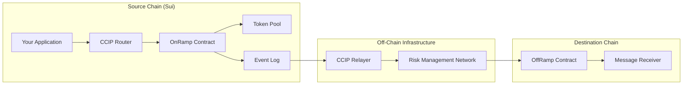
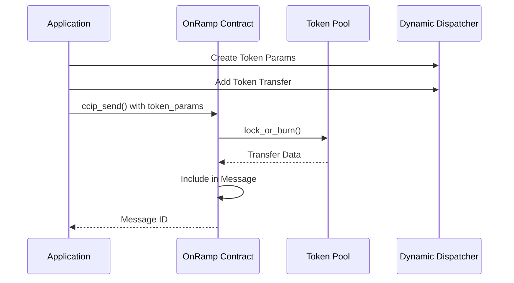

# OnRamp Contract

The OnRamp contract is the entry point for all outgoing cross-chain messages and token transfers from Sui to other blockchain networks. It handles message construction, fee calculation, token coordination, and ensures proper validation before emitting messages for off-chain processing.

## Overview

The OnRamp serves as the source-side component of CCIP's cross-chain messaging infrastructure. When applications want to send messages or tokens to other chains, they interact with the OnRamp to:

1. **Validate** the request and destination chain
2. **Calculate** and collect fees
3. **Coordinate** token transfers through token pools
4. **Construct** the standardized cross-chain message
5. **Emit** events for off-chain relayers to process



## Core Components

### OnRampState

The main state object that manages all onramp operations:

```move
public struct OnRampState has key, store {
    id: UID,
    chain_selector: u64,           // Unique identifier for this chain
    fee_aggregator: address,       // Where collected fees are sent
    allowlist_admin: address,      // Admin for managing sender allowlists
    dest_chain_configs: Table<u64, DestChainConfig>,  // Per-destination configs
    fee_tokens: Bag,              // Storage for collected fee tokens
    nonce_manager_cap: Option<NonceManagerCap>,       // Nonce management
    source_transfer_cap: Option<SourceTransferCap>,   // Token transfer capability
    ownable_state: OwnableState,  // Ownership management
}
```

### Destination Chain Configuration

Each supported destination chain has its own configuration:

```move
public struct DestChainConfig has store, drop {
    is_enabled: bool,                // Whether the destination accepts new messages
    sequence_number: u64,            // Current sequence number for message ordering
    allowlist_enabled: bool,         // Whether sender allowlist is enforced
    allowed_senders: vector<address> // List of authorized sender addresses
}
```

### Message Structure

The OnRamp constructs standardized cross-chain messages:

```move
public struct Sui2AnyRampMessage has store, drop, copy {
    header: RampMessageHeader,           // Message metadata
    sender: address,                     // Sender address on Sui
    data: vector<u8>,                   // Arbitrary message payload
    receiver: vector<u8>,               // Receiver address on destination chain
    extra_args: vector<u8>,             // Additional execution parameters
    fee_token: address,                 // Token used for fee payment
    fee_token_amount: u64,              // Amount of fee tokens paid
    fee_value_juels: u256,              // Fee value in Juels (Chainlink's unit)
    token_amounts: vector<Sui2AnyTokenTransfer> // Token transfers included
}

public struct RampMessageHeader has store, drop, copy {
    message_id: vector<u8>,         // Unique message identifier
    source_chain_selector: u64,     // Source chain identifier
    dest_chain_selector: u64,       // Destination chain identifier
    sequence_number: u64,           // Message sequence number
    nonce: u64                      // Anti-replay nonce
}
```

## Core Functions

### Message Sending

#### `ccip_send<T>()`

The primary function for sending cross-chain messages with optional token transfers.

```move
public fun ccip_send<T>(
    ref: &CCIPObjectRef,              // CCIP state reference
    state: &mut OnRampState,          // OnRamp state
    clock: &Clock,                    // Sui clock for timestamps
    receiver: vector<u8>,             // Destination address
    data: vector<u8>,                 // Message payload
    token_params: TokenParams,        // Token transfer parameters
    fee_token_metadata: &CoinMetadata<T>, // Fee token metadata
    fee_token: Coin<T>,               // Fee payment
    extra_args: vector<u8>,           // Additional parameters
    ctx: &mut TxContext              // Transaction context
): vector<u8>                        // Returns: Message ID
```

**Process Flow:**

1. **Validation**: Checks destination chain support and sender authorization
2. **Fee Calculation**: Calculates required fees based on message content
3. **Token Coordination**: Processes token transfers through token pools
4. **Message Construction**: Builds the standardized message structure
5. **Event Emission**: Emits `CCIPMessageSent` event for off-chain processing
6. **Fee Collection**: Stores fee tokens for later withdrawal

**Example Usage:**

```move
module your_app::cross_chain_sender {
    use ccip_onramp::onramp;
    use ccip::dynamic_dispatcher;
    
    public fun send_greeting(
        onramp: &mut OnRampState,
        ccip_ref: &CCIPObjectRef,
        clock: &Clock,
        destination_chain: u64,
        receiver_address: vector<u8>,
        greeting: vector<u8>,
        fee_coin: Coin<SUI>,
        ctx: &mut TxContext
    ): vector<u8> {
        // Create empty token parameters (no tokens to transfer)
        let token_params = dynamic_dispatcher::create_token_params(destination_chain);
        
        // Send the message
        onramp::ccip_send(
            ccip_ref,
            onramp,
            clock,
            receiver_address,
            greeting,
            token_params,
            &sui_coin_metadata, // Fee token metadata
            fee_coin,
            vector::empty(),    // No extra args
            ctx
        )
    }
}
```

### Fee Management

#### `get_fee<T>()`

Calculates the required fee for a cross-chain message before sending.

```move
public fun get_fee<T>(
    ref: &CCIPObjectRef,
    clock: &Clock,
    dest_chain_selector: u64,
    receiver: vector<u8>,
    data: vector<u8>,
    token_addresses: vector<address>,
    token_amounts: vector<u64>,
    fee_token: &CoinMetadata<T>,
    extra_args: vector<u8>
): u64
```

**Example:**

```move
// Calculate fee before sending
let estimated_fee = onramp::get_fee<SUI>(
    ccip_ref,
    clock,
    destination_chain,
    receiver_address,
    message_data,
    vector::empty(), // No tokens
    vector::empty(), // No amounts
    &sui_metadata,
    vector::empty()  // No extra args
);

// Ensure we have enough for the fee
assert!(coin::value(&fee_coin) >= estimated_fee, INSUFFICIENT_FEE);
```

#### `withdraw_fee_tokens<T>()`

Allows the owner to withdraw collected fees to the configured fee aggregator.

```move
public fun withdraw_fee_tokens<T>(
    owner_cap: &OwnerCap,
    state: &mut OnRampState,
    fee_token_metadata: &CoinMetadata<T>,
    ctx: &mut TxContext
)
```

### Configuration Management

#### `initialize()`

Initializes the OnRamp with essential configurations and capabilities.

```move
public fun initialize(
    state: &mut OnRampState,
    owner_cap: &OwnerCap,
    nonce_manager_cap: NonceManagerCap,
    source_transfer_cap: SourceTransferCap,
    chain_selector: u64,
    fee_aggregator: address,
    allowlist_admin: address,
    dest_chain_selectors: vector<u64>,
    dest_chain_enabled: vector<bool>,
    dest_chain_allowlist_enabled: vector<bool>,
    ctx: &mut TxContext
)
```

#### `set_dest_chain_config()`

Configures settings for destination chains.

```move
public fun set_dest_chain_config(
    owner_cap: &OwnerCap,
    state: &mut OnRampState,
    dest_chain_selectors: vector<u64>,
    dest_chain_configs: vector<DestChainConfig>
)
```

### Allowlist Management

#### `apply_allowlist_updates_dest_chain()`

Manages sender allowlists for specific destination chains.

```move
public fun apply_allowlist_updates_dest_chain(
    allowlist_admin_cap: &AllowlistAdminCap,
    state: &mut OnRampState,
    dest_chain_selector: u64,
    removes: vector<address>,
    adds: vector<address>
)
```

**Example:**

```move
// Add authorized senders
onramp::apply_allowlist_updates_dest_chain(
    &allowlist_admin_cap,
    onramp_state,
    ethereum_chain_selector,
    vector::empty(),           // No removals
    vector[@sender1, @sender2] // Add these senders
);
```

## Token Transfer Integration

The OnRamp coordinates with token pools to handle cross-chain token transfers:

### Token Transfer Flow



### Example: Cross-Chain Token Transfer

```move
module your_app::token_bridge {
    use ccip::dynamic_dispatcher as dd;
    use ccip_onramp::onramp;
    
    public fun bridge_tokens<T>(
        onramp: &mut OnRampState,
        ccip_ref: &CCIPObjectRef,
        clock: &Clock,
        tokens: vector<Coin<T>>,
        amount: u64,
        destination_chain: u64,
        receiver: vector<u8>,
        fee_coin: Coin<SUI>,
        ctx: &mut TxContext
    ): vector<u8> {
        // 1. Create token transfer parameters
        let token_params = dd::create_token_params(destination_chain);
        
        // 2. Add token transfer (this calls the token pool)
        let token_params = dd::add_source_token_transfer<POOL_PROOF>(
            ccip_ref,
            token_params,
            amount,
            type_name::get<T>().get_address(),    // Source token address
            receiver,                              // Destination token address
            vector::empty(),                       // Extra data
            POOL_PROOF {}
        );
        
        // 3. Send message with tokens
        onramp::ccip_send(
            ccip_ref,
            onramp,
            clock,
            receiver,
            vector::empty(),    // No additional message data
            token_params,
            &sui_metadata,
            fee_coin,
            vector::empty(),    // No extra args
            ctx
        )
    }
}
```

## Events

The OnRamp emits several important events for monitoring and off-chain processing:

### CCIPMessageSent

The main event emitted when a message is sent:

```move
public struct CCIPMessageSent has copy, drop {
    dest_chain_selector: u64,
    sequence_number: u64,
    message: Sui2AnyRampMessage
}
```

### Configuration Events

```move
public struct ConfigSet has copy, drop {
    static_config: StaticConfig,
    dynamic_config: DynamicConfig
}

public struct DestChainConfigSet has copy, drop {
    dest_chain_selector: u64,
    is_enabled: bool,
    sequence_number: u64,
    allowlist_enabled: bool
}
```

### Allowlist Events

```move
public struct AllowlistSendersAdded has copy, drop {
    dest_chain_selector: u64,
    senders: vector<address>
}

public struct AllowlistSendersRemoved has copy, drop {
    dest_chain_selector: u64,
    senders: vector<address>
}
```

## Security Features

### Access Control

The OnRamp implements multiple layers of access control:

```move
// Owner-only functions
public fun set_config(owner_cap: &OwnerCap, state: &mut OnRampState, ...) {
    ownable::assert_owner(owner_cap, &state.ownable_state);
    // Configuration logic
}

// Allowlist admin functions
public fun manage_allowlist(
    allowlist_admin_cap: &AllowlistAdminCap,
    state: &mut OnRampState,
    ...
) {
    // Allowlist management logic
}
```

### Sender Allowlists

For restricted destinations, only authorized senders can send messages:

```move
// Check if sender is allowed for destination
if (config.allowlist_enabled) {
    assert!(
        config.allowed_senders.contains(&sender),
        ESenderNotAllowed
    );
}
```

### Rate Limiting

Token pools implement rate limiting to prevent abuse:

```move
// Rate limits are enforced in token pools
token_pool::check_rate_limit(
    pool,
    destination_chain,
    amount,
    true // is_outbound
);
```

### Risk Management Network (RMN) Integration

The OnRamp integrates with RMN for additional security:

```move
// Check if destination chain is cursed by RMN
assert!(!rmn_remote::is_cursed(rmn, destination_chain), ECursedByRmn);
```

## Error Handling

The OnRamp includes comprehensive error handling:

```move
const EDestChainNotEnabled: u64 = 4;
const ESenderNotAllowed: u64 = 5;
const ECursedByRmn: u64 = 9;
const EInvalidDestChainSelector: u64 = 2;
const ECannotSendZeroTokens: u64 = 15;
```

### Common Error Scenarios

| Error | Description | Solution |
|-------|-------------|----------|
| `EDestChainNotEnabled` | Destination chain is disabled | Enable destination chain or choose different destination |
| `ESenderNotAllowed` | Sender not in allowlist | Add sender to allowlist or use authorized sender |
| `ECursedByRmn` | Destination chain cursed by RMN | Wait for RMN to uncurse or use different destination |
| `ECannotSendZeroTokens` | Attempting to transfer zero tokens | Specify positive token amount |

## Integration Patterns

### Basic Message Sending

```move
module messaging_app::simple_messenger {
    use ccip_onramp::onramp;
    
    public struct SimpleMessage has copy, drop {
        content: vector<u8>,
        timestamp: u64,
    }
    
    public fun send_simple_message(
        onramp: &mut OnRampState,
        ccip_ref: &CCIPObjectRef,
        clock: &Clock,
        destination: u64,
        receiver: vector<u8>,
        content: vector<u8>,
        fee_coin: Coin<SUI>,
        ctx: &mut TxContext
    ) {
        let message = SimpleMessage {
            content,
            timestamp: clock::timestamp_ms(clock),
        };
        
        let message_data = bcs::to_bytes(&message);
        let token_params = dd::create_token_params(destination);
        
        onramp::ccip_send(
            ccip_ref,
            onramp,
            clock,
            receiver,
            message_data,
            token_params,
            &sui_metadata,
            fee_coin,
            vector::empty(),
            ctx
        );
    }
}
```

### Cross-Chain DeFi Operations

```move
module defi_app::cross_chain_lending {
    public fun initiate_cross_chain_loan(
        onramp: &mut OnRampState,
        collateral_tokens: vector<Coin<USDC>>,
        loan_amount: u64,
        destination_chain: u64,
        borrower_address: vector<u8>,
        ctx: &mut TxContext
    ) {
        // 1. Lock collateral tokens
        let token_params = dd::create_token_params(destination_chain);
        let token_params = dd::add_source_token_transfer<USDC_POOL_PROOF>(
            ccip_ref,
            token_params,
            loan_amount,
            usdc_address,
            usdc_destination_address,
            bcs::to_bytes(&LoanTerms { /* loan terms */ }),
            USDC_POOL_PROOF {}
        );
        
        // 2. Send loan initiation message
        let loan_message = LoanInitiationMessage {
            collateral_amount: loan_amount,
            borrower: borrower_address,
            terms: /* loan terms */
        };
        
        onramp::ccip_send(
            ccip_ref,
            onramp,
            clock,
            lending_protocol_address,
            bcs::to_bytes(&loan_message),
            token_params,
            &sui_metadata,
            fee_coin,
            vector::empty(),
            ctx
        );
    }
}
```

## Monitoring and Observability

### Event Monitoring

```move
// Monitor for successful message sends
let events = sui::event::events_by_type<CCIPMessageSent>();
for event in events {
    println!("Message sent to chain {} with sequence {}", 
             event.dest_chain_selector, 
             event.sequence_number);
}
```

### Fee Tracking

```move
// Track fee payments
let fee_events = sui::event::events_by_type<FeeTokenWithdrawn>();
for event in fee_events {
    println!("Fee {} withdrawn to {}", 
             event.amount, 
             event.fee_aggregator);
}
```

## Best Practices

### 1. Fee Estimation

Always estimate fees before sending:

```move
// Get fee estimate first
let estimated_fee = onramp::get_fee<SUI>(...);

// Ensure sufficient balance
assert!(coin::value(&fee_coin) >= estimated_fee, INSUFFICIENT_FEE);

// Add some buffer for gas price fluctuations
let fee_with_buffer = estimated_fee * 110 / 100; // 10% buffer
```

### 2. Token Transfer Validation

Validate token transfers before sending:

```move
// Check token pool configuration
assert!(token_admin_registry::is_registered(&token_type), TOKEN_NOT_REGISTERED);

// Verify destination chain support
assert!(onramp::is_dest_chain_enabled(onramp, dest_chain), CHAIN_NOT_SUPPORTED);
```

### 3. Error Handling

Implement comprehensive error handling:

```move
public fun safe_ccip_send(...): Result<vector<u8>, u64> {
    // Pre-flight checks
    if (!onramp::is_dest_chain_enabled(onramp, dest_chain)) {
        return Err(DEST_CHAIN_DISABLED);
    }
    
    if (allowlist_enabled && !is_sender_allowed(sender, dest_chain)) {
        return Err(SENDER_NOT_ALLOWED);
    }
    
    // Attempt to send
    Ok(onramp::ccip_send(...))
}
```

### 4. Gas Optimization

Optimize for gas efficiency:

```move
// Batch multiple operations
public fun batch_send_messages(
    messages: vector<MessageData>,
    destination: u64,
    ctx: &mut TxContext
) {
    // Process all messages in single transaction
    for message in messages {
        onramp::ccip_send(...);
    }
}
```

## Next Steps

- **[OffRamp Contract](offramp.md)**: Understanding message delivery
- **[Router Contract](router.md)**: Message routing and destination management
- **[Token Pools](token-pools.md)**: Token transfer mechanisms
- **[Integration Guide](../integration/ccip.md)**: Building CCIP applications

## Resources

- **[OnRamp Source Code](https://github.com/smartcontractkit/chainlink-sui/tree/main/contracts/ccip/ccip_onramp)**
- **[CCIP Documentation](https://docs.chain.link/ccip)**
- **[Deployment Scripts](../ops/ccip-deployment.md)** 