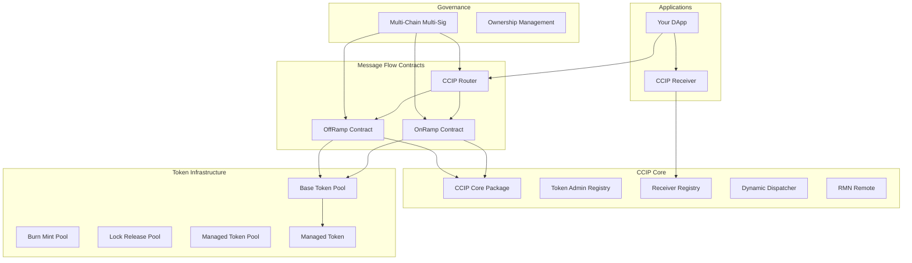

# CCIP Contracts Overview

The Chainlink SUI project implements a comprehensive suite of Move contracts that enable secure cross-chain communication and token transfers. These contracts form the on-chain infrastructure for Chainlink's Cross-Chain Interoperability Protocol (CCIP) on the Sui blockchain.

## Contract Architecture

The CCIP contract system follows a modular architecture where each component handles specific aspects of cross-chain operations:



## Core Components

### 1. CCIP Core Package

**Package**: `contracts/ccip/ccip/`
**Purpose**: Foundational infrastructure for cross-chain messaging

The CCIP core provides essential building blocks for all cross-chain operations:

#### Key Modules:
- **Token Admin Registry**: Manages token pool configurations and administrative control
- **Receiver Registry**: Handles registration and management of CCIP message receivers
- **Dynamic Dispatcher**: Manages token transfer parameters for outgoing messages
- **RMN Remote**: Provides Risk Management Network signature verification
- **Client**: Core data structures and message formats
- **State Object**: Shared state management utilities

```move
// Example: Using CCIP core components
use ccip::token_admin_registry;
use ccip::receiver_registry;
use ccip::dynamic_dispatcher;
use ccip::client::{Any2SuiMessage};
```

### 2. Message Flow Contracts

#### CCIP Router (`contracts/ccip/ccip_router/`)
**Purpose**: Central routing hub for cross-chain messages

The router acts as the entry point for applications wanting to send cross-chain messages. It maintains a registry of onramps for different destination chains.

**Key Features**:
- ✅ Destination chain routing
- ✅ OnRamp registry management
- ✅ Version compatibility checking
- ✅ Ownership and governance integration

#### OnRamp Contract (`contracts/ccip/ccip_onramp/`)
**Purpose**: Handles outgoing cross-chain messages and token transfers

The OnRamp is responsible for:
- Message construction and validation
- Fee calculation and collection
- Token transfer coordination
- Sequence number management
- Allowlist enforcement

```move
// Example: Sending a cross-chain message
public fun ccip_send<T>(
    ref: &CCIPObjectRef,
    state: &mut OnRampState,
    clock: &Clock,
    receiver: vector<u8>,
    data: vector<u8>,
    token_params: TokenParams,
    fee_token: Coin<T>,
    extra_args: vector<u8>,
    ctx: &mut TxContext
): vector<u8>
```

#### OffRamp Contract (`contracts/ccip/ccip_offramp/`)
**Purpose**: Handles incoming cross-chain messages and token delivery

The OffRamp manages:
- Merkle root verification
- Message execution
- Token transfer completion
- Receiver notification
- Risk management integration

### 3. Token Infrastructure

#### Base Token Pool (`contracts/ccip/ccip_token_pools/token_pool/`)
**Purpose**: Foundational token pool functionality

Provides core features for all token pool implementations:
- Cross-chain validation
- Rate limiting per chain
- Decimal handling
- Access control
- Multi-chain configuration

#### Specialized Token Pools

##### Burn & Mint Token Pool
**Path**: `contracts/ccip/ccip_token_pools/burn_mint_token_pool/`
**Use Case**: Tokens that can be burned on source chain and minted on destination

```move
// Burn tokens on source chain
public fun lock_or_burn<T>(
    pool_state: &mut BurnMintTokenPoolState<T>,
    token_admin_registry_ref: &CCIPObjectRef,
    amount: u64,
    // ... other parameters
)
```

##### Lock & Release Token Pool
**Path**: `contracts/ccip/ccip_token_pools/lock_release_token_pool/`
**Use Case**: Tokens that are locked on source and released on destination

```move
// Lock tokens in pool
public fun lock_or_burn<T>(
    pool_state: &mut LockReleaseTokenPoolState<T>,
    token_admin_registry_ref: &CCIPObjectRef,
    tokens: vector<Coin<T>>,
    // ... other parameters
)
```

##### Managed Token Pool
**Path**: `contracts/ccip/ccip_token_pools/managed_token_pool/`
**Use Case**: Integration with managed tokens for enhanced control

#### Managed Token (`contracts/ccip/managed_token/`)
**Purpose**: Standalone token management system

A comprehensive token management solution that operates independently:
- Treasury cap management
- Mint cap issuance
- Address blocklisting
- Global pause functionality
- Multi-signature governance support

### 4. Governance & Administration

#### Multi-Chain Multi-Sig (MCMS) (`contracts/mcms/`)
**Purpose**: Decentralized governance for CCIP contracts

Provides secure, multi-signature governance across multiple chains:
- Time-locked operations
- Multi-signature validation
- Cross-chain governance coordination
- Emergency response capabilities

## Contract Deployment Flow

### 1. Core Infrastructure Deployment

```bash
# Deploy CCIP core package
sui client publish contracts/ccip/ccip --gas-budget 50000000

# Deploy MCMS governance
sui client publish contracts/mcms/mcms --gas-budget 50000000
```

### 2. Message Flow Contract Deployment

```bash
# Deploy Router
sui client publish contracts/ccip/ccip_router --gas-budget 50000000

# Deploy OnRamp
sui client publish contracts/ccip/ccip_onramp --gas-budget 50000000

# Deploy OffRamp  
sui client publish contracts/ccip/ccip_offramp --gas-budget 50000000
```

### 3. Token Infrastructure Deployment

```bash
# Deploy base token pool
sui client publish contracts/ccip/ccip_token_pools/token_pool --gas-budget 50000000

# Deploy specific pool types
sui client publish contracts/ccip/ccip_token_pools/burn_mint_token_pool --gas-budget 50000000
sui client publish contracts/ccip/ccip_token_pools/lock_release_token_pool --gas-budget 50000000

# Deploy managed token
sui client publish contracts/ccip/managed_token --gas-budget 50000000
```

## Integration Patterns

### Basic Cross-Chain Messaging

```move
module your_app::ccip_integration {
    use ccip_router::router;
    use ccip_onramp::onramp;
    use ccip::client;

    public fun send_message(
        router: &RouterState,
        onramp: &mut OnRampState,
        destination_chain: u64,
        receiver: vector<u8>,
        message_data: vector<u8>,
        ctx: &mut TxContext
    ) {
        // 1. Check if destination chain is supported
        assert!(router::is_chain_supported(router, destination_chain), 1);
        
        // 2. Send the message via onramp
        let message_id = onramp::ccip_send(
            onramp,
            destination_chain,
            receiver,
            message_data,
            ctx
        );
        
        // 3. Emit event or return message ID
        // ...
    }
}
```

### Token Transfer Integration

```move
module your_app::token_bridge {
    use ccip::dynamic_dispatcher;
    use burn_mint_token_pool::burn_mint_token_pool;

    public fun bridge_tokens<T>(
        pool: &mut BurnMintTokenPoolState<T>,
        tokens: vector<Coin<T>>,
        destination_chain: u64,
        receiver: vector<u8>,
        ctx: &mut TxContext
    ) {
        // 1. Create token transfer parameters
        let token_params = dynamic_dispatcher::create_token_params(destination_chain);
        
        // 2. Add token transfer to parameters
        let token_params = dynamic_dispatcher::add_source_token_transfer<POOL_PROOF>(
            token_params,
            amount,
            tokens,
            POOL_PROOF {}
        );
        
        // 3. Execute transfer through onramp
        // ...
    }
}
```

### Implementing a CCIP Receiver

```move
module your_app::ccip_receiver {
    use ccip::client::{Any2SuiMessage};
    use ccip::receiver_registry;
    use ccip::offramp_state_helper::{ReceiverParams};

    public struct MyReceiver has key {
        id: UID,
        received_messages: vector<Any2SuiMessage>,
    }

    public struct RECEIVER_PROOF has drop {}

    // Register the receiver
    public fun register_receiver(
        receiver: &mut MyReceiver,
        ccip_ref: &CCIPObjectRef,
        ctx: &mut TxContext
    ) {
        receiver_registry::register_receiver<RECEIVER_PROOF>(
            ccip_ref,
            object::id_to_address(&receiver.id),
            RECEIVER_PROOF {}
        );
    }

    // Handle incoming CCIP message
    public fun ccip_receive(
        receiver: &mut MyReceiver,
        receiver_params: ReceiverParams
    ): ReceiverParams {
        // Extract and process the message
        let message = offramp_state_helper::extract_any2sui_message(&receiver_params);
        receiver.received_messages.push_back(message);
        
        receiver_params
    }
}
```

## Security Considerations

### Access Control

All contracts implement comprehensive access control:

```move
// Example: Owner-only functions
public fun set_config(
    owner_cap: &OwnerCap,
    state: &mut ContractState,
    config: Config
) {
    ownable::assert_owner(owner_cap, &state.ownable_state);
    // Update configuration
}
```

### Rate Limiting

Token pools implement rate limiting to prevent abuse:

```move
// Rate limits are checked on every transfer
public fun check_rate_limit(
    pool: &mut TokenPoolState,
    chain_selector: u64,
    amount: u64,
    is_outbound: bool
) {
    rate_limiter::consume_capacity(
        &mut pool.rate_limiter,
        chain_selector,
        amount,
        is_outbound
    );
}
```

### Risk Management Network (RMN)

RMN provides additional security layer:

```move
// RMN signature verification
public fun verify_rmn_signatures(
    rmn: &RMNRemoteState,
    report: &RMNReport,
    signatures: vector<Signature>
) {
    rmn_remote::verify(rmn, report, signatures);
}
```

## Testing and Development

### Local Testing Setup

```bash
# Start local Sui network
docker compose up -d sui

# Deploy all contracts
./scripts/deploy_ccip_contracts.sh

# Run integration tests
sui move test --package contracts/ccip/ccip
```

### Contract Interaction Examples

```bash
# Send a cross-chain message
sui client call \
  --package $ONRAMP_PACKAGE \
  --module onramp \
  --function ccip_send \
  --args $ONRAMP_STATE $DEST_CHAIN $RECEIVER $MESSAGE_DATA \
  --gas-budget 20000000

# Check message status
sui client events --package $ONRAMP_PACKAGE
```

## Upgrade and Governance

### MCMS Governance

All major contracts support MCMS governance for secure upgrades:

```move
// Propose an upgrade
mcms_registry::propose_operation(
    registry,
    operation_data,
    execution_delay,
    ctx
);

// Execute after timelock
mcms_registry::execute_operation(
    registry,
    operation_id,
    ctx
);
```

### Version Management

Contracts include version information for compatibility:

```move
public fun type_and_version(): String {
    string::utf8(b"OnRamp 1.6.0")
}
```

## Next Steps

- **[CCIP Core](ccip-core.md)**: Deep dive into core CCIP functionality
- **[OnRamp](onramp.md)**: Detailed OnRamp contract documentation
- **[OffRamp](offramp.md)**: Comprehensive OffRamp guide
- **[Router](router.md)**: Router contract implementation
- **[Token Pools](token-pools.md)**: Token pool architecture and implementations
- **[Managed Tokens](managed-tokens.md)**: Standalone token management
- **[MCMS](mcms.md)**: Multi-Chain Multi-Sig governance

## Resources

- **[Contract Deployment Guide](../ops/ccip-deployment.md)**: Step-by-step deployment instructions
- **[Integration Examples](../integration/ccip.md)**: Real-world integration patterns
- **[API Reference](../api/contracts.md)**: Complete contract API documentation 