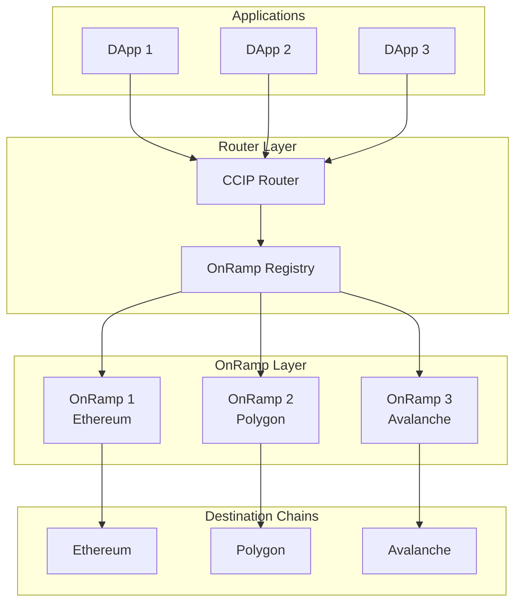

# Router Contract

The CCIP Router serves as the central routing hub for cross-chain messages within the Chainlink SUI ecosystem. It acts as the primary entry point for applications wanting to send cross-chain messages and maintains a registry of OnRamp contracts for different destination chains.

## Overview

The Router contract provides a unified interface for cross-chain communication while abstracting the complexity of destination-specific OnRamp contracts. Applications interact with the Router to send messages, and the Router handles the routing to the appropriate OnRamp based on the destination chain.



## Core Components

### RouterState

The main state object that manages routing configurations:

```move
public struct RouterState has key {
    id: UID,
    ownable_state: OwnableState,
    on_ramp_infos: Table<u64, OnRampInfo>,  // chain_selector -> OnRamp info
}
```

### OnRamp Registry

Each destination chain is mapped to its corresponding OnRamp information:

```move
public struct OnRampInfo has copy, store, drop {
    onramp_address: address,      // Address of the OnRamp contract
    onramp_version: vector<u8>,   // Version compatibility information
}
```

The `onramp_version` field is crucial for compatibility:
- **Length 0**: Destination chain is not supported
- **Length 3**: Version bytes indicating OnRamp contract version

## Core Functions

### Chain Support Query

#### `is_chain_supported()`

Checks if a destination chain is supported by the router:

```move
public fun is_chain_supported(
    router: &RouterState, 
    dest_chain_selector: u64
): bool
```

**Example:**

```move
// Check if Ethereum is supported
let ethereum_chain_selector = 5009297550715157269;
if (router::is_chain_supported(router, ethereum_chain_selector)) {
    // Proceed with cross-chain operation
    send_message_to_ethereum(...);
} else {
    // Handle unsupported destination
    abort UNSUPPORTED_DESTINATION;
}
```

### OnRamp Information Retrieval

#### `get_on_ramp_info()`

Retrieves OnRamp information for a specific destination chain:

```move
public fun get_on_ramp_info(
    router: &RouterState, 
    dest_chain_selector: u64
): (address, vector<u8>)  // Returns: (onramp_address, onramp_version)
```

#### `get_on_ramp_infos()`

Batch retrieval of OnRamp information for multiple chains:

```move
public fun get_on_ramp_infos(
    router: &RouterState, 
    dest_chain_selectors: vector<u64>
): vector<OnRampInfo>
```

**Example:**

```move
// Get OnRamp info for multiple chains
let chain_selectors = vector[
    5009297550715157269,  // Ethereum
    4051577828743386545,  // Polygon
    6433500567565415381   // Avalanche
];

let onramp_infos = router::get_on_ramp_infos(router, chain_selectors);

for (i in 0..vector::length(&onramp_infos)) {
    let info = vector::borrow(&onramp_infos, i);
    if (vector::length(&onramp_info::get_on_ramp_version(*info)) > 0) {
        // Chain is supported
        process_supported_chain(chain_selectors[i], *info);
    }
}
```

### Configuration Management

#### `set_on_ramp_infos()`

Configures OnRamp information for destination chains (owner-only):

```move
public fun set_on_ramp_infos(
    owner_cap: &OwnerCap,
    router: &mut RouterState,
    dest_chain_selectors: vector<u64>,
    on_ramp_addresses: vector<address>,
    on_ramp_versions: vector<vector<u8>>,
)
```

**Configuration Rules:**
- All vectors must have the same length
- Version vector length 0 = remove/disable chain
- Version vector length 3 = valid OnRamp version
- Any other length = invalid configuration

**Example:**

```move
// Configure OnRamps for multiple chains
router::set_on_ramp_infos(
    &owner_cap,
    router,
    vector[
        5009297550715157269,  // Ethereum
        4051577828743386545,  // Polygon  
        6433500567565415381   // Avalanche
    ],
    vector[
        @ethereum_onramp_address,
        @polygon_onramp_address,
        @avalanche_onramp_address
    ],
    vector[
        vector[1, 6, 0],  // Version 1.6.0
        vector[1, 6, 0],  // Version 1.6.0
        vector[1, 5, 2]   // Version 1.5.2
    ]
);
```

#### Disabling Chains

To disable a destination chain, set its version to an empty vector:

```move
// Disable Polygon support
router::set_on_ramp_infos(
    &owner_cap,
    router,
    vector[4051577828743386545],  // Polygon
    vector[@0x0],                 // Address irrelevant when disabling
    vector[vector::empty()]       // Empty version = disabled
);
```

## Integration Patterns

### Basic Router Usage

```move
module your_app::cross_chain_messenger {
    use ccip_router::router;
    use ccip_onramp::onramp;
    
    public fun send_cross_chain_message(
        router: &RouterState,
        onramp: &mut OnRampState,
        destination_chain: u64,
        receiver: vector<u8>,
        message: vector<u8>,
        fee_coin: Coin<SUI>,
        ctx: &mut TxContext
    ): vector<u8> {
        // 1. Verify destination is supported
        assert!(
            router::is_chain_supported(router, destination_chain),
            DESTINATION_NOT_SUPPORTED
        );
        
        // 2. Get OnRamp information
        let (onramp_address, onramp_version) = router::get_on_ramp_info(
            router, 
            destination_chain
        );
        
        // 3. Verify version compatibility
        assert!(
            is_version_compatible(onramp_version),
            INCOMPATIBLE_ONRAMP_VERSION
        );
        
        // 4. Send message via OnRamp
        onramp::ccip_send(
            onramp,
            destination_chain,
            receiver,
            message,
            fee_coin,
            ctx
        )
    }
    
    fun is_version_compatible(version: vector<u8>): bool {
        // Check if version is compatible with your requirements
        vector::length(&version) == 3 && 
        version[0] >= 1 &&  // Major version >= 1
        version[1] >= 6     // Minor version >= 6
    }
}
```

### Multi-Chain Routing

```move
module your_app::multi_chain_dispatcher {
    use ccip_router::router;
    
    public struct MultiChainMessage {
        content: vector<u8>,
        destinations: vector<u64>,
        receivers: vector<vector<u8>>,
    }
    
    public fun broadcast_to_multiple_chains(
        router: &RouterState,
        message: MultiChainMessage,
        fee_coins: vector<Coin<SUI>>,
        ctx: &mut TxContext
    ): vector<vector<u8>> {
        let message_ids = vector::empty<vector<u8>>();
        
        // Get OnRamp info for all destinations
        let onramp_infos = router::get_on_ramp_infos(router, message.destinations);
        
        let i = 0;
        while (i < vector::length(&message.destinations)) {
            let destination = message.destinations[i];
            let receiver = message.receivers[i];
            let onramp_info = onramp_infos[i];
            
            // Check if destination is supported
            if (vector::length(&router::get_on_ramp_version(onramp_info)) > 0) {
                let onramp_address = router::get_on_ramp_address(onramp_info);
                
                // Send message to this destination
                let message_id = send_to_destination(
                    onramp_address,
                    destination,
                    receiver,
                    message.content,
                    fee_coins[i],
                    ctx
                );
                vector::push_back(&mut message_ids, message_id);
            } else {
                // Destination not supported, push empty message ID
                vector::push_back(&mut message_ids, vector::empty());
            }
            
            i = i + 1;
        };
        
        message_ids
    }
}
```

### Router-Based Fee Estimation

```move
module your_app::fee_calculator {
    use ccip_router::router;
    use ccip_onramp::onramp;
    
    public fun estimate_multi_chain_fees(
        router: &RouterState,
        destinations: vector<u64>,
        message_data: vector<u8>,
        token_amounts: vector<u64>
    ): vector<u64> {
        let fees = vector::empty<u64>();
        let onramp_infos = router::get_on_ramp_infos(router, destinations);
        
        let i = 0;
        while (i < vector::length(&destinations)) {
            let destination = destinations[i];
            let onramp_info = onramp_infos[i];
            
            if (vector::length(&router::get_on_ramp_version(onramp_info)) > 0) {
                // Chain is supported, calculate fee
                let onramp_address = router::get_on_ramp_address(onramp_info);
                let fee = onramp::get_fee(
                    onramp_address,
                    destination,
                    message_data,
                    token_amounts,
                    // ... other parameters
                );
                vector::push_back(&mut fees, fee);
            } else {
                // Chain not supported, fee is 0
                vector::push_back(&mut fees, 0);
            }
            
            i = i + 1;
        };
        
        fees
    }
}
```

## Events

The Router emits events for configuration changes:

### OnRampSet

Emitted when OnRamp information is updated:

```move
public struct OnRampSet has copy, drop {
    dest_chain_selector: u64,
    on_ramp_info: OnRampInfo,
}
```

**Event Monitoring:**

```move
// Monitor for OnRamp configuration changes
let events = sui::event::events_by_type<OnRampSet>();
for event in events {
    if (vector::length(&event.on_ramp_info.onramp_version) == 0) {
        println!("Chain {} disabled", event.dest_chain_selector);
    } else {
        println!("Chain {} OnRamp set to {}", 
                 event.dest_chain_selector, 
                 event.on_ramp_info.onramp_address);
    }
}
```

## Ownership and Governance

The Router implements the standard ownable pattern for administrative functions:

### Ownership Functions

```move
// Transfer ownership (two-step process)
public entry fun transfer_ownership(
    state: &mut RouterState,
    owner_cap: &OwnerCap,
    new_owner: address,
    ctx: &mut TxContext,
)

// Accept ownership transfer
public entry fun accept_ownership(
    state: &mut RouterState,
    ctx: &mut TxContext,
)

// Query ownership status
public fun owner(state: &RouterState): address
public fun has_pending_transfer(state: &RouterState): bool
```

### MCMS Integration

The Router supports Multi-Chain Multi-Sig (MCMS) governance:

```move
// Execute MCMS operations
public fun mcms_execute(
    registry: &Registry,
    state: &mut RouterState,
    params: ExecutingCallbackParams,
    ctx: &mut TxContext
)
```

## Error Handling

The Router includes comprehensive error handling:

```move
const EParamsLengthMismatch: u64 = 1;      // Parameter array length mismatch
const EOnrampInfoNotFound: u64 = 2;        // OnRamp info not found for chain
const EInvalidOnrampVersion: u64 = 3;      // Invalid OnRamp version format
const EInvalidOwnerCap: u64 = 4;           // Invalid owner capability
const EInvalidFunction: u64 = 5;           // Invalid function call
```

### Error Handling Example

```move
public fun safe_get_onramp_info(
    router: &RouterState,
    dest_chain_selector: u64
): Option<OnRampInfo> {
    if (router::is_chain_supported(router, dest_chain_selector)) {
        let (address, version) = router::get_on_ramp_info(router, dest_chain_selector);
        option::some(OnRampInfo { 
            onramp_address: address, 
            onramp_version: version 
        })
    } else {
        option::none()
    }
}
```

## Best Practices

### 1. Always Verify Chain Support

```move
// Always check if destination is supported before routing
assert!(
    router::is_chain_supported(router, destination_chain),
    DESTINATION_NOT_SUPPORTED
);
```

### 2. Version Compatibility Checks

```move
fun validate_onramp_version(version: vector<u8>): bool {
    // Ensure version is properly formatted
    if (vector::length(&version) != 3) return false;
    
    // Check minimum required version (e.g., 1.6.0)
    let major = version[0];
    let minor = version[1];
    let patch = version[2];
    
    (major > 1) || (major == 1 && minor >= 6)
}
```

### 3. Batch Operations for Efficiency

```move
// Use batch functions when dealing with multiple chains
let onramp_infos = router::get_on_ramp_infos(router, all_destinations);
// Process all at once instead of individual calls
```

### 4. Handle Configuration Changes

```move
// Cache OnRamp information but validate before use
public struct CachedOnRampInfo {
    info: OnRampInfo,
    last_updated: u64,
    ttl: u64,
}

public fun get_cached_onramp_info(
    cache: &mut CachedOnRampInfo,
    router: &RouterState,
    clock: &Clock,
    dest_chain: u64
): OnRampInfo {
    let current_time = clock::timestamp_ms(clock);
    
    if (current_time > cache.last_updated + cache.ttl) {
        // Refresh cache
        let (address, version) = router::get_on_ramp_info(router, dest_chain);
        cache.info = OnRampInfo { onramp_address: address, onramp_version: version };
        cache.last_updated = current_time;
    }
    
    cache.info
}
```

## Integration with Other Contracts

### Router + OnRamp Integration

```move
module integrated_app::router_onramp_bridge {
    public fun send_via_router(
        router: &RouterState,
        onramps: &Table<u64, OnRampState>,  // Map of chain_selector -> OnRamp
        destination: u64,
        message: vector<u8>,
        ctx: &mut TxContext
    ) {
        // 1. Get OnRamp address from router
        let (onramp_address, version) = router::get_on_ramp_info(router, destination);
        
        // 2. Verify we have the OnRamp state
        assert!(table::contains(onramps, destination), ONRAMP_NOT_AVAILABLE);
        
        // 3. Get OnRamp state
        let onramp = table::borrow_mut(onramps, destination);
        
        // 4. Send message
        onramp::ccip_send(onramp, destination, message, ctx);
    }
}
```

## Deployment and Configuration

### Initial Setup

```move
// 1. Deploy Router contract
let router = router::new(ctx);

// 2. Configure initial OnRamps
router::set_on_ramp_infos(
    &owner_cap,
    &mut router,
    vector[ethereum_chain_id, polygon_chain_id],
    vector[ethereum_onramp, polygon_onramp],
    vector[vector[1, 6, 0], vector[1, 6, 0]]
);
```

### Runtime Management

```move
// Add new chain support
router::set_on_ramp_infos(
    &owner_cap,
    &mut router,
    vector[new_chain_id],
    vector[new_onramp_address],
    vector[vector[1, 6, 0]]
);

// Disable chain support
router::set_on_ramp_infos(
    &owner_cap,
    &mut router,
    vector[deprecated_chain_id],
    vector[@0x0],
    vector[vector::empty()]
);
```

## Next Steps

- **[OnRamp Contract](onramp.md)**: Understanding message origination
- **[OffRamp Contract](offramp.md)**: Message delivery and execution
- **[Token Pools](token-pools.md)**: Token transfer infrastructure
- **[Integration Guide](../integration/ccip.md)**: Building applications with Router

## Resources

- **[Router Source Code](https://github.com/smartcontractkit/chainlink-sui/tree/main/contracts/ccip/ccip_router)**
- **[CCIP Documentation](https://docs.chain.link/ccip)**
- **[Chain Selectors](https://docs.chain.link/ccip/supported-networks)**: List of supported chain selectors 