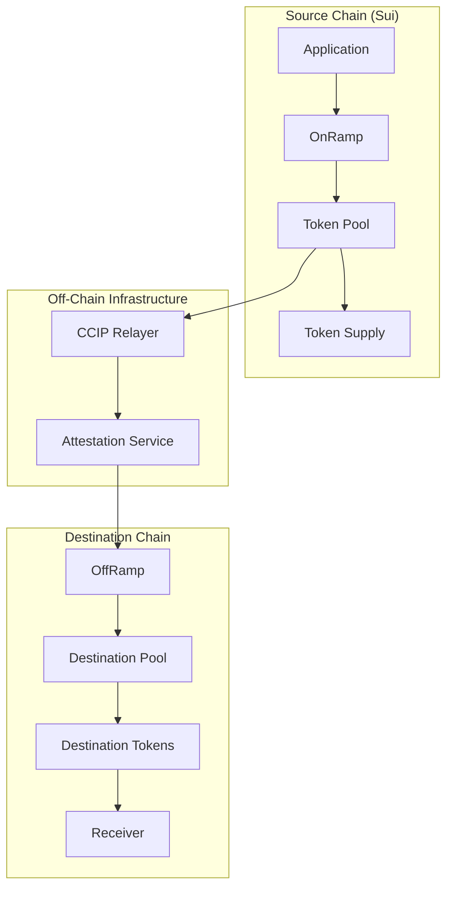
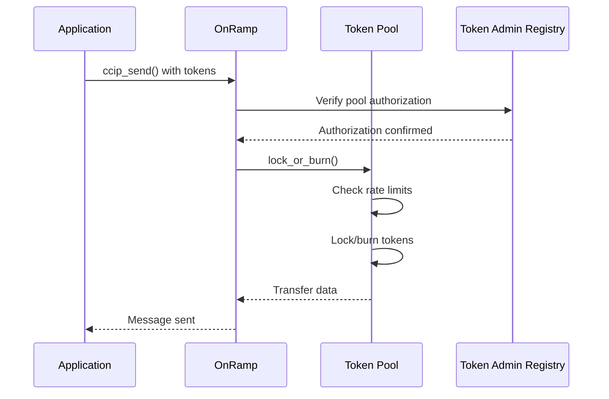
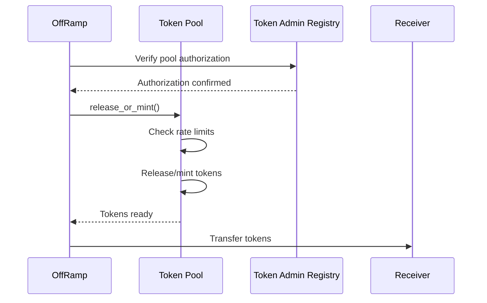

# Token Pools

Token pools are the core infrastructure for cross-chain token transfers in the Chainlink SUI ecosystem. They handle the mechanics of moving tokens between different blockchain networks while maintaining security, rate limiting, and proper accounting.

## Overview

Token pools implement different strategies for cross-chain token transfers based on the token's characteristics and requirements:

- **Burn & Mint Pools**: Burn tokens on source chain, mint on destination
- **Lock & Release Pools**: Lock tokens on source chain, release on destination  
- **Managed Token Pools**: Integration with managed tokens for enhanced control



## Token Pool Architecture

### Base Token Pool

All specialized token pools inherit from the base token pool functionality:

**Path**: `contracts/ccip/ccip_token_pools/token_pool/`

#### Core Features

- ✅ **Cross-chain validation**: Validates operations across different chains
- ✅ **Rate limiting**: Configurable limits per chain to prevent abuse
- ✅ **Decimal handling**: Automatic conversion between different token decimals
- ✅ **Access control**: Owner-only operations with secure ownership transfer
- ✅ **Multi-chain support**: Support for multiple destination chains

#### Key Components

```move
public struct TokenPoolState<phantom T> has key, store {
    id: UID,
    token: address,                              // Token type identifier
    allowlist: AllowlistState,                   // Sender allowlist management
    rate_limiter: TokenPoolRateLimiter,          // Rate limiting per chain
    remote_pools: VecMap<u64, RemotePoolInfo>,   // Chain -> pool mappings
    ownable_state: OwnableState<T>,              // Ownership management
}

public struct RemotePoolInfo has copy, store, drop {
    pool_address: vector<u8>,       // Pool address on remote chain
    token_address: vector<u8>,      // Token address on remote chain
    decimals: u8,                   // Token decimals on remote chain
}
```

### Rate Limiting

Token pools implement sophisticated rate limiting to prevent abuse:

```move
public struct TokenPoolRateLimiter has store {
    rate_limiters: VecMap<u64, RateLimiter>,  // Per-chain rate limiters
}

public struct RateLimiter has copy, store, drop {
    tokens: u128,           // Current token bucket level
    last_updated: u64,      // Last update timestamp
    capacity: u128,         // Maximum bucket capacity
    rate: u128,             // Token refill rate per second
    is_enabled: bool,       // Whether rate limiting is enabled
}
```

## Token Pool Types

### 1. Burn & Mint Token Pool

**Path**: `contracts/ccip/ccip_token_pools/burn_mint_token_pool/`
**Use Case**: Tokens that can be burned on source and minted on destination

This pool type is ideal for tokens where the total supply can be managed across chains by burning on the source and minting equivalent amounts on the destination.

#### Core Functions

```move
// Lock or burn tokens for cross-chain transfer
public fun lock_or_burn<T, P: drop>(
    pool_state: &mut BurnMintTokenPoolState<T>,
    token_admin_registry_ref: &CCIPObjectRef,
    original_sender: address,
    amount: u64,
    dest_chain_selector: u64,
    dest_receiver: vector<u8>,
    proof: P,
    ctx: &mut TxContext
): (u64, vector<u8>)  // Returns: (amount, extra_data)

// Release or mint tokens on destination chain
public fun release_or_mint<T, P: drop>(
    pool_state: &mut BurnMintTokenPoolState<T>,
    token_admin_registry_ref: &CCIPObjectRef,
    original_sender: vector<u8>,
    amount: u64,
    source_chain_selector: u64,
    off_ramp_address: vector<u8>,
    dest_receiver: address,
    extra_data: vector<u8>,
    proof: P,
    ctx: &mut TxContext
): Coin<T>
```

#### Example Usage

```move
module your_app::burn_mint_bridge {
    use burn_mint_token_pool::burn_mint_token_pool;
    
    public struct BURN_MINT_PROOF has drop {}
    
    public fun bridge_tokens_burn_mint<T>(
        pool: &mut BurnMintTokenPoolState<T>,
        tokens: vector<Coin<T>>,
        destination_chain: u64,
        receiver: vector<u8>,
        ctx: &mut TxContext
    ) {
        // Merge all coins
        let merged_coin = vector::pop_back(&mut tokens);
        while (!vector::is_empty(&tokens)) {
            coin::join(&mut merged_coin, vector::pop_back(&mut tokens));
        };
        
        let amount = coin::value(&merged_coin);
        
        // Burn tokens and get transfer data
        let (transfer_amount, extra_data) = burn_mint_token_pool::lock_or_burn(
            pool,
            ccip_ref,
            tx_context::sender(ctx),
            amount,
            destination_chain,
            receiver,
            BURN_MINT_PROOF {},
            ctx
        );
        
        // Coin is automatically burned by the pool
        coin::destroy_zero(merged_coin);
    }
}
```

### 2. Lock & Release Token Pool

**Path**: `contracts/ccip/ccip_token_pools/lock_release_token_pool/`
**Use Case**: Tokens that are locked on source and released on destination

This pool type is used when the total supply is fixed and tokens need to be locked in the pool on the source chain and released from the pool on the destination chain.

#### Core Functions

```move
// Lock tokens for cross-chain transfer
public fun lock_or_burn<T, P: drop>(
    pool_state: &mut LockReleaseTokenPoolState<T>,
    token_admin_registry_ref: &CCIPObjectRef,
    tokens: vector<Coin<T>>,
    dest_chain_selector: u64,
    dest_receiver: vector<u8>,
    proof: P,
    ctx: &mut TxContext
): (u64, vector<u8>)

// Release tokens on destination chain
public fun release_or_mint<T, P: drop>(
    pool_state: &mut LockReleaseTokenPoolState<T>,
    token_admin_registry_ref: &CCIPObjectRef,
    amount: u64,
    dest_receiver: address,
    proof: P,
    ctx: &mut TxContext
): Coin<T>
```

#### Example Usage

```move
module your_app::lock_release_bridge {
    use lock_release_token_pool::lock_release_token_pool;
    
    public struct LOCK_RELEASE_PROOF has drop {}
    
    public fun bridge_tokens_lock_release<T>(
        pool: &mut LockReleaseTokenPoolState<T>,
        tokens: vector<Coin<T>>,
        destination_chain: u64,
        receiver: vector<u8>,
        ctx: &mut TxContext
    ): (u64, vector<u8>) {
        // Lock tokens in the pool
        lock_release_token_pool::lock_or_burn(
            pool,
            ccip_ref,
            tokens,
            destination_chain,
            receiver,
            LOCK_RELEASE_PROOF {},
            ctx
        )
    }
}
```

### 3. Managed Token Pool

**Path**: `contracts/ccip/ccip_token_pools/managed_token_pool/`
**Use Case**: Integration with managed tokens for enhanced administrative control

This pool type integrates with the managed token system to provide additional controls like blocklisting, pausing, and mint cap management.

#### Features

- ✅ **Managed Token Integration**: Works with existing managed token contracts
- ✅ **Enhanced Security**: Leverage managed token's blocklist and pause functionality
- ✅ **Mint Cap Management**: Uses managed token's mint cap system
- ✅ **Administrative Controls**: Additional owner controls through managed token

#### Example Usage

```move
module your_app::managed_token_bridge {
    use managed_token_pool::managed_token_pool;
    use managed_token::managed_token;
    
    public struct MANAGED_TOKEN_PROOF has drop {}
    
    public fun setup_managed_token_pool<T>(
        managed_token_state: &mut TokenState<T>,
        owner_cap: &OwnerCap<T>,
        initial_liquidity: vector<Coin<T>>,
        ctx: &mut TxContext
    ) {
        // Create mint cap for the pool
        managed_token::configure_new_minter(
            managed_token_state,
            owner_cap,
            @pool_address,
            1000000,  // Initial allowance
            false,    // Not unlimited
            ctx
        );
        
        // Initialize the pool with liquidity
        managed_token_pool::initialize_with_liquidity(
            initial_liquidity,
            ctx
        );
    }
}
```

## Token Pool Configuration

### Remote Chain Setup

Each token pool can support multiple destination chains:

```move
// Configure remote chain information
public fun set_remote_pool<T>(
    owner_cap: &OwnerCap<T>,
    pool_state: &mut TokenPoolState<T>,
    chain_selector: u64,
    pool_address: vector<u8>,
    token_address: vector<u8>,
    decimals: u8
) {
    let remote_info = RemotePoolInfo {
        pool_address,
        token_address,
        decimals,
    };
    
    if (pool_state.remote_pools.contains(&chain_selector)) {
        pool_state.remote_pools.remove(&chain_selector);
    };
    
    pool_state.remote_pools.insert(chain_selector, remote_info);
}
```

### Rate Limit Configuration

```move
// Set rate limits for a specific chain
public fun set_chain_rate_limiter_config<T>(
    owner_cap: &OwnerCap<T>,
    pool_state: &mut TokenPoolState<T>,
    chain_selector: u64,
    outbound_config: RateLimiterConfig,
    inbound_config: RateLimiterConfig
) {
    token_pool_rate_limiter::set_rate_limiter_config(
        &mut pool_state.rate_limiter,
        chain_selector,
        outbound_config,
        inbound_config
    );
}

public struct RateLimiterConfig has copy, drop {
    is_enabled: bool,
    capacity: u128,     // Maximum bucket capacity
    rate: u128,         // Refill rate per second
}
```

### Example Configuration

```move
// Configure Ethereum as a destination
set_remote_pool(
    &owner_cap,
    pool_state,
    5009297550715157269,  // Ethereum chain selector
    b"0x742d35Cc6634C0532925a3b8D400c45532c83a36",  // Pool address on Ethereum
    b"0xA0b86a33E6417C44C6B654395AD7d8c5B46A76Bf",  // Token address on Ethereum
    18  // 18 decimals on Ethereum
);

// Set rate limits for Ethereum
set_chain_rate_limiter_config(
    &owner_cap,
    pool_state,
    5009297550715157269,
    RateLimiterConfig {
        is_enabled: true,
        capacity: 1000000 * 1000000,  // 1M tokens
        rate: 100 * 1000000,          // 100 tokens per second
    },
    RateLimiterConfig {
        is_enabled: true,
        capacity: 1000000 * 1000000,  // 1M tokens
        rate: 100 * 1000000,          // 100 tokens per second
    }
);
```

## Decimal Handling

Token pools automatically handle decimal differences between chains:

```move
// Convert amount from source decimals to destination decimals
public fun get_dest_amount(
    pool_state: &TokenPoolState,
    source_amount: u64,
    dest_chain_selector: u64
): u64 {
    let remote_info = pool_state.remote_pools.get(&dest_chain_selector);
    let source_decimals = token::decimals<T>();
    let dest_decimals = remote_info.decimals;
    
    if (source_decimals == dest_decimals) {
        source_amount
    } else if (source_decimals > dest_decimals) {
        // Scale down
        let scale_factor = 10u64.pow(source_decimals - dest_decimals);
        source_amount / scale_factor
    } else {
        // Scale up
        let scale_factor = 10u64.pow(dest_decimals - source_decimals);
        source_amount * scale_factor
    }
}
```

## Security Features

### Access Control

Token pools implement comprehensive access control:

```move
// Only authorized pools can call cross-chain functions
public fun lock_or_burn<T, P: drop>(
    pool_state: &mut TokenPoolState<T>,
    token_admin_registry_ref: &CCIPObjectRef,
    proof: P,  // Type-safe proof of authorization
    // ... other parameters
) {
    // Verify the caller is authorized through token admin registry
    token_admin_registry::verify_pool_authorization<P>(
        token_admin_registry_ref,
        proof
    );
    
    // Proceed with the operation
}
```

### Rate Limiting

Automatic rate limiting prevents abuse:

```move
// Check and consume rate limit capacity
rate_limiter::consume(
    &mut pool_state.rate_limiter,
    chain_selector,
    amount,
    true  // is_outbound
);
```

### Allowlist Management

Optional sender allowlists for restricted access:

```move
// Check if sender is allowed
if (allowlist::get_allowlist_enabled(&pool_state.allowlist)) {
    assert!(
        allowlist::is_allowed(&pool_state.allowlist, sender),
        ESENDER_NOT_ALLOWED
    );
}
```

## Integration with CCIP

### OnRamp Integration

Token pools integrate with OnRamps for outbound transfers:



### OffRamp Integration

Token pools integrate with OffRamps for inbound transfers:



## Advanced Patterns

### Multi-Pool Token Bridge

```move
module advanced_bridge::multi_pool_manager {
    use burn_mint_token_pool::burn_mint_token_pool;
    use lock_release_token_pool::lock_release_token_pool;
    
    public struct PoolManager<phantom T> {
        burn_mint_pools: Table<u64, BurnMintTokenPoolState<T>>,
        lock_release_pools: Table<u64, LockReleaseTokenPoolState<T>>,
        pool_type_map: VecMap<u64, u8>,  // chain_selector -> pool_type
    }
    
    const BURN_MINT_POOL: u8 = 1;
    const LOCK_RELEASE_POOL: u8 = 2;
    
    public fun bridge_tokens_auto<T>(
        manager: &mut PoolManager<T>,
        tokens: vector<Coin<T>>,
        destination_chain: u64,
        receiver: vector<u8>,
        ctx: &mut TxContext
    ): (u64, vector<u8>) {
        let pool_type = *manager.pool_type_map.get(&destination_chain);
        
        if (pool_type == BURN_MINT_POOL) {
            let pool = table::borrow_mut(&mut manager.burn_mint_pools, destination_chain);
            burn_mint_token_pool::lock_or_burn(pool, tokens, destination_chain, receiver, ctx)
        } else if (pool_type == LOCK_RELEASE_POOL) {
            let pool = table::borrow_mut(&mut manager.lock_release_pools, destination_chain);
            lock_release_token_pool::lock_or_burn(pool, tokens, destination_chain, receiver, ctx)
        } else {
            abort UNSUPPORTED_POOL_TYPE;
        }
    }
}
```

### Dynamic Pool Selection

```move
module dynamic_bridge::pool_selector {
    public fun select_optimal_pool<T>(
        token_amount: u64,
        destination_chain: u64,
        pools: &PoolRegistry<T>
    ): address {
        // Get available pools for destination
        let available_pools = pools.get_pools_for_chain(destination_chain);
        
        let best_pool = @0x0;
        let best_score = 0;
        
        for pool_address in available_pools {
            let pool_info = pools.get_pool_info(pool_address);
            
            // Calculate score based on:
            // - Available liquidity
            // - Fee structure
            // - Rate limit availability
            // - Pool reliability
            let score = calculate_pool_score(pool_info, token_amount);
            
            if (score > best_score) {
                best_score = score;
                best_pool = pool_address;
            }
        };
        
        assert!(best_pool != @0x0, NO_SUITABLE_POOL);
        best_pool
    }
}
```

### Liquidity Management

```move
module liquidity_manager::rebalancer {
    public fun rebalance_pools<T>(
        source_pool: &mut LockReleaseTokenPoolState<T>,
        dest_pool: &mut LockReleaseTokenPoolState<T>,
        target_ratio: u64,  // Target liquidity ratio (basis points)
        ctx: &mut TxContext
    ) {
        let source_liquidity = get_pool_liquidity(source_pool);
        let dest_liquidity = get_pool_liquidity(dest_pool);
        let total_liquidity = source_liquidity + dest_liquidity;
        
        let target_source = (total_liquidity * target_ratio) / 10000;
        
        if (source_liquidity > target_source) {
            // Move liquidity from source to dest
            let excess = source_liquidity - target_source;
            transfer_liquidity(source_pool, dest_pool, excess, ctx);
        } else if (source_liquidity < target_source) {
            // Move liquidity from dest to source
            let deficit = target_source - source_liquidity;
            transfer_liquidity(dest_pool, source_pool, deficit, ctx);
        }
    }
}
```

## Monitoring and Observability

### Pool Events

Token pools emit events for monitoring:

```move
public struct TokensLocked has copy, drop {
    sender: address,
    amount: u64,
    dest_chain_selector: u64,
    dest_receiver: vector<u8>,
}

public struct TokensReleased has copy, drop {
    sender: vector<u8>,
    recipient: address,
    amount: u64,
    source_chain_selector: u64,
}

public struct RateLimitExceeded has copy, drop {
    chain_selector: u64,
    requested_amount: u64,
    available_capacity: u64,
}
```

### Pool Health Monitoring

```move
module monitoring::pool_health {
    public struct PoolHealthReport {
        pool_address: address,
        liquidity_level: u64,
        rate_limit_utilization: u64,  // Percentage
        recent_transfer_count: u64,
        error_rate: u64,  // Errors per 1000 transfers
        last_updated: u64,
    }
    
    public fun generate_health_report<T>(
        pool: &TokenPoolState<T>,
        clock: &Clock
    ): PoolHealthReport {
        PoolHealthReport {
            pool_address: object::id_to_address(&pool.id),
            liquidity_level: get_total_liquidity(pool),
            rate_limit_utilization: calculate_rate_limit_usage(pool),
            recent_transfer_count: get_recent_transfers(pool),
            error_rate: calculate_error_rate(pool),
            last_updated: clock::timestamp_ms(clock),
        }
    }
}
```

## Best Practices

### 1. Choose the Right Pool Type

```move
// For tokens with flexible supply (e.g., stablecoins)
use burn_mint_token_pool;

// For tokens with fixed supply (e.g., native tokens)
use lock_release_token_pool;

// For tokens requiring advanced controls
use managed_token_pool;
```

### 2. Configure Appropriate Rate Limits

```move
// Conservative limits for new tokens
RateLimiterConfig {
    is_enabled: true,
    capacity: 10000 * token_decimals_factor,     // 10K tokens max
    rate: 100 * token_decimals_factor,           // 100 tokens/second
}

// Higher limits for established tokens
RateLimiterConfig {
    is_enabled: true,
    capacity: 1000000 * token_decimals_factor,   // 1M tokens max
    rate: 1000 * token_decimals_factor,          // 1K tokens/second
}
```

### 3. Handle Decimal Conversions

```move
// Always validate decimal conversions
public fun safe_cross_chain_transfer<T>(
    pool: &TokenPoolState<T>,
    amount: u64,
    dest_chain: u64
): u64 {
    let dest_amount = get_dest_amount(pool, amount, dest_chain);
    
    // Ensure no precision loss
    let back_converted = get_source_amount(pool, dest_amount, dest_chain);
    assert!(back_converted <= amount, PRECISION_LOSS);
    
    dest_amount
}
```

### 4. Monitor Pool Health

```move
// Regular health checks
public fun check_pool_health<T>(pool: &TokenPoolState<T>) {
    // Check liquidity levels
    let liquidity = get_total_liquidity(pool);
    assert!(liquidity > MIN_LIQUIDITY_THRESHOLD, LOW_LIQUIDITY);
    
    // Check rate limit capacity
    for chain_selector in get_supported_chains(pool) {
        let capacity = get_rate_limit_capacity(pool, chain_selector);
        assert!(capacity > MIN_CAPACITY_THRESHOLD, LOW_CAPACITY);
    }
}
```

## Next Steps

- **[Managed Tokens](managed-tokens.md)**: Understanding the managed token system
- **[OnRamp Contract](onramp.md)**: How pools integrate with message sending
- **[OffRamp Contract](offramp.md)**: How pools handle message delivery
- **[Integration Guide](../integration/custom-token-pools.md)**: Building custom token pools

## Resources

- **[Token Pool Source Code](https://github.com/smartcontractkit/chainlink-sui/tree/main/contracts/ccip/ccip_token_pools)**
- **[Rate Limiting Design](https://docs.chain.link/ccip/concepts#rate-limiting)**
- **[CCIP Token Transfer Guide](https://docs.chain.link/ccip/tutorials/cross-chain-tokens)** 