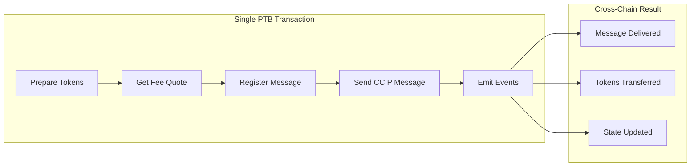
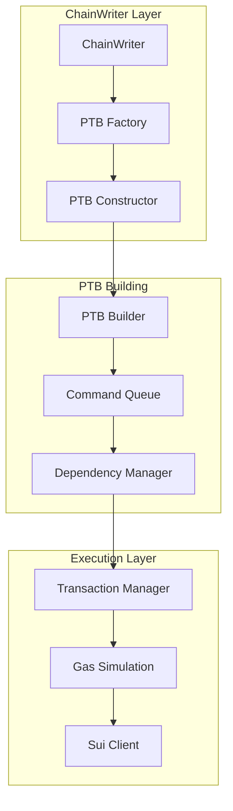
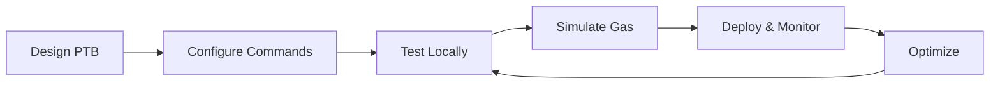

# Programmable Transaction Blocks (PTBs)

Programmable Transaction Blocks (PTBs) are one of Sui's most powerful features, enabling complex, multi-step transactions that can atomically execute multiple operations. In the context of Chainlink SUI, PTBs are essential for building sophisticated cross-chain operations that require multiple contract interactions in a single transaction.

## What are PTBs?

A Programmable Transaction Block is a single transaction that can contain multiple commands, where each command can:

- **Call Move functions** on smart contracts
- **Transfer objects** between addresses  
- **Merge or split coins** for gas and payment management
- **Create, share, or freeze objects** as needed
- **Pass results** from one command to another within the same transaction

Think of PTBs as "transaction scripts" that let you compose multiple operations atomically, ensuring either all operations succeed or all fail together.

### Key Benefits

- ✅ **Atomicity**: All operations succeed or fail together
- ✅ **Efficiency**: Multiple operations in one transaction reduce gas costs
- ✅ **Composability**: Results from one operation can feed into another
- ✅ **Safety**: Type-safe construction prevents many runtime errors
- ✅ **Flexibility**: Combine any set of Sui operations in a single transaction

## PTBs in Chainlink SUI

In the Chainlink SUI ecosystem, PTBs enable powerful cross-chain workflows:



### Common Use Cases

1. **Cross-Chain Token Transfers**: Lock tokens, register transfer, send message
2. **Complex CCIP Operations**: Multi-step message preparation and sending
3. **Token Pool Management**: Initialize, configure, and manage token pools
4. **Batch Operations**: Process multiple cross-chain messages in one transaction
5. **Conditional Logic**: Execute operations based on on-chain state

## PTB Architecture in Chainlink SUI

The Chainlink SUI relayer provides comprehensive PTB support through several components:



### PTB Configuration

PTBs are configured through the ChainWriter configuration:

```yaml
chain_writer:
  contracts:
    CCIPSendMessage:
      # Standard contract call
      contract_name: "ccip_onramp"
      
    CCIPSendWithPTB:
      # PTB-based operation
      contract_name: "PTB"
      from_address: "0x123..."
      configs:
        commands:
          - command_type: "move_call"
            package_id: "0xabc..."
            module: "token_pool" 
            function: "lock_tokens"
            arguments: ["$tokens", "$amount"]
            
          - command_type: "move_call"
            package_id: "0xdef..."
            module: "onramp"
            function: "send_message"
            arguments: ["$destination", "$receiver", "$data"]
            dependencies: [0]  # Depends on previous command
```

## PTB Commands

PTBs support various command types, each serving different purposes:

### 1. Move Call Commands

Execute functions on Move contracts:

```go
type MoveCallCommand struct {
    PackageID  string              `json:"package_id"`
    Module     string              `json:"module"`
    Function   string              `json:"function"`
    Arguments  []interface{}       `json:"arguments"`
    TypeArgs   []string           `json:"type_arguments,omitempty"`
}
```

**Example: Token Transfer**
```yaml
commands:
  - command_type: "move_call"
    package_id: "0x2"
    module: "coin"
    function: "transfer"
    type_arguments: ["0x2::sui::SUI"]
    arguments: ["$coin_object", "$recipient", "$amount"]
```

### 2. Transfer Object Commands

Transfer objects between addresses:

```go
type TransferObjectCommand struct {
    ObjectID  string `json:"object_id"`
    Recipient string `json:"recipient"`
}
```

**Example: NFT Transfer**
```yaml
commands:
  - command_type: "transfer_object"
    object_id: "$nft_object"
    recipient: "$new_owner"
```

### 3. Split Coin Commands

Split coins for payments and gas:

```go
type SplitCoinCommand struct {
    CoinID string        `json:"coin_id"`
    Amounts []uint64     `json:"amounts"`
}
```

**Example: Payment Preparation**
```yaml
commands:
  - command_type: "split_coin"
    coin_id: "$payment_coin"
    amounts: [1000000, 500000]  # Split into 1 SUI and 0.5 SUI
```

### 4. Merge Coin Commands

Merge multiple coins into one:

```go
type MergeCoinCommand struct {
    DestinationCoin string   `json:"destination_coin"`
    SourceCoins     []string `json:"source_coins"`
}
```

### 5. Make Move Vector Commands

Create vectors for function arguments:

```go
type MakeMoveVectorCommand struct {
    ElementType string        `json:"element_type"`
    Elements    []interface{} `json:"elements"`
}
```

**Example: Batch Operations**
```yaml
commands:
  - command_type: "make_move_vector"
    element_type: "address"
    elements: ["$recipient1", "$recipient2", "$recipient3"]
```

## PTB Dependencies

One of PTB's most powerful features is the ability to chain commands together using dependencies:

### Dependency Types

1. **Result Dependencies**: Use the result of a previous command
2. **Object Dependencies**: Use objects created/modified by previous commands
3. **Nested Results**: Access specific fields from complex return types

### Example: Cross-Chain Token Transfer

```yaml
commands:
  # 1. Split coins for payment
  - command_type: "split_coin"
    coin_id: "$gas_coin"
    amounts: [1000000]  # 1 SUI for fees
    
  # 2. Lock tokens in pool (depends on payment coin)
  - command_type: "move_call"
    package_id: "$token_pool_package"
    module: "burn_mint_token_pool"
    function: "lock_tokens"
    arguments: ["$token_pool", "$tokens", "$amount", {"type": "result", "index": 0}]
    dependencies: [0]
    
  # 3. Send CCIP message (depends on lock result)
  - command_type: "move_call"
    package_id: "$onramp_package"
    module: "onramp"
    function: "ccip_send"
    arguments: [
      "$destination_chain",
      "$receiver",
      {"type": "result", "index": 1, "field": "message_data"},
      {"type": "result", "index": 1, "field": "token_transfers"}
    ]
    dependencies: [1]
```

## Error Handling

PTBs provide comprehensive error handling:

### Transaction-Level Failures

If any command in a PTB fails, the entire transaction is reverted:

```go
type PTBError struct {
    CommandIndex int    `json:"command_index"`
    ErrorType    string `json:"error_type"`
    Message      string `json:"message"`
    Retryable    bool   `json:"retryable"`
}
```

### Common Error Scenarios

| Error Type | Cause | Retryable |
|------------|-------|-----------|
| **Insufficient Gas** | Not enough gas for execution | ✅ |
| **Object Not Found** | Referenced object doesn't exist | ❌ |
| **Type Mismatch** | Wrong argument types | ❌ |
| **Dependency Error** | Invalid dependency reference | ❌ |
| **Move Runtime Error** | Contract execution failure | Depends |

### Error Recovery

```go
func (p *PTBConstructor) HandleError(err *PTBError) error {
    switch err.ErrorType {
    case "InsufficientGas":
        // Increase gas budget and retry
        return p.RetryWithMoreGas()
        
    case "ObjectVersionMismatch":
        // Refresh object versions and retry
        return p.RefreshObjectsAndRetry()
        
    case "MoveRuntimeError":
        // Check if it's a retryable move error
        return p.AnalyzeMoveError(err)
        
    default:
        // Non-retryable error
        return fmt.Errorf("permanent PTB error: %v", err)
    }
}
```

## Gas Optimization

PTBs require careful gas management due to their complexity:

### Gas Estimation

```go
type PTBGasEstimate struct {
    ComputationCost uint64 `json:"computation_cost"`
    StorageCost     uint64 `json:"storage_cost"`
    TotalCost       uint64 `json:"total_cost"`
    CommandCosts    []uint64 `json:"command_costs"`
}
```

### Optimization Strategies

1. **Command Ordering**: Place expensive operations first for early failure detection
2. **Object Reuse**: Reuse objects within the PTB to reduce gas costs
3. **Batch Operations**: Combine similar operations into single commands
4. **Gas Object Management**: Properly split and manage gas coins

```yaml
# Optimized PTB structure
commands:
  # 1. Early validation (cheap, fails fast)
  - command_type: "move_call"
    package_id: "$validator_package"
    module: "validator"
    function: "validate_request"
    
  # 2. Expensive operations (after validation)
  - command_type: "move_call"
    package_id: "$ccip_package"
    module: "onramp"
    function: "send_message"
    dependencies: [0]
```

## Best Practices

### Design Principles

1. **Keep It Simple**: Start with simple PTBs and add complexity gradually
2. **Validate Early**: Place validation logic at the beginning
3. **Handle Errors**: Always plan for error scenarios
4. **Test Thoroughly**: PTBs can have complex interactions

### Development Workflow



### Testing Strategy

```go
// Test PTB construction
func TestPTBConstruction(t *testing.T) {
    ptb := NewPTBBuilder()
    
    // Add commands
    ptb.AddMoveCall("package", "module", "function", args)
    ptb.AddTransferObject("object_id", "recipient")
    
    // Validate dependencies
    assert.NoError(t, ptb.ValidateDependencies())
    
    // Simulate execution
    result, err := ptb.Simulate()
    assert.NoError(t, err)
    assert.True(t, result.Success)
}
```

### Monitoring and Debugging

```go
type PTBMetrics struct {
    ConstructionTime   time.Duration `json:"construction_time"`
    SimulationTime     time.Duration `json:"simulation_time"`
    ExecutionTime      time.Duration `json:"execution_time"`
    CommandCount       int           `json:"command_count"`
    DependencyCount    int           `json:"dependency_count"`
    GasUsed           uint64         `json:"gas_used"`
    Success           bool           `json:"success"`
}
```

## Integration Examples

### CCIP Message with Token Transfer

```yaml
# Complete cross-chain operation in one PTB
ptb_config:
  from_address: "$sender"
  commands:
    # Prepare fee payment
    - command_type: "split_coin"
      coin_id: "$fee_coin"
      amounts: [2000000]  # 2 SUI for fees
      
    # Lock tokens in pool
    - command_type: "move_call"
      package_id: "$token_pool_package"
      module: "lock_release_token_pool"
      function: "lock_tokens"
      arguments: ["$pool_state", "$tokens", "$amount"]
      
    # Send CCIP message with tokens
    - command_type: "move_call"
      package_id: "$onramp_package"
      module: "onramp"
      function: "ccip_send_with_tokens"
      arguments: [
        "$destination_chain",
        "$receiver",
        "$message_data",
        {"type": "result", "index": 1, "field": "token_transfers"},
        {"type": "result", "index": 0}  # Fee payment
      ]
      dependencies: [0, 1]
```

### Batch Message Processing

```yaml
# Process multiple messages in one transaction
ptb_config:
  commands:
    # Create message vector
    - command_type: "make_move_vector"
      element_type: "0x123::ccip::Message"
      elements: ["$message1", "$message2", "$message3"]
      
    # Process all messages
    - command_type: "move_call"
      package_id: "$offramp_package"
      module: "offramp"
      function: "execute_messages"
      arguments: [{"type": "result", "index": 0}]
      dependencies: [0]
```

## Next Steps

Now that you understand PTB fundamentals:

- **[Building PTBs](building.md)**: Learn how to construct PTBs programmatically
- **[PTB Dependencies](dependencies.md)**: Master dependency management
- **[Advanced Usage](advanced.md)**: Explore complex PTB patterns
- **[Best Practices](best-practices.md)**: Production-ready PTB development

## Resources

- **[Sui PTB Documentation](https://docs.sui.io/concepts/transactions/prog-txn-blocks)**: Official Sui PTB guide
- **[ChainWriter Configuration](../relayer/chainwriter.md)**: PTB configuration in ChainWriter
- **[Example PTBs](../resources/examples.md)**: Real-world PTB examples 