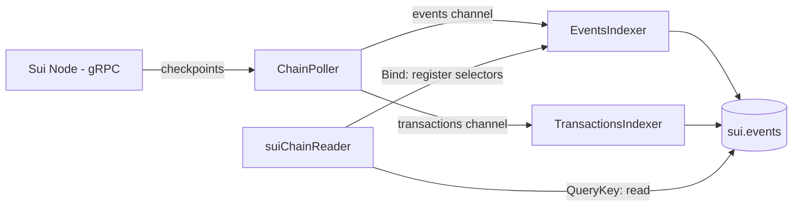

# ChainReader

The ChainReader is a core component of the Chainlink SUI Relayer that provides read access to Sui blockchain state, object data, and events. It consists of three cooperating pieces:

**ContractReader implementation** (`suiChainReader`): exposes the LOOP read interface used by Core:

- `GetLatestValue` — reads the latest value of some state in a bound contract (object read or dev-inspect function call).
- `QueryKey` — queries events emitted on-chain (with optional filtering on event field values).
- `Bind` / `Unbind`, `GetLatestValueWithHeadData`, and other utility methods.

**Events Indexer**: persists the events the ChainReader cares about into a local database, so queries can use the full power of SQL rather than the limited query surface of the node's gRPC API.

**Transactions Indexer**: detects failed transactions from known transmitters and generates **synthetic events** (notably `ExecutionStateChanged` with a `FAILURE` state). This is necessary because, unlike EVM, Sui does not index events from failed transactions — so a failed CCIP execution would otherwise be invisible to event queries.

> **Note**: Each relayer instance has its own database. Query responses must therefore not rely solely on the database; the indexing pipeline keeps the database current from the chain, and `QueryKey` registers the queried event so it is indexed before reading.

## Indexing architecture

The two indexers no longer poll the RPC independently. Both are **consumers** fed by a single producer, the `ChainPoller`, which streams checkpoint data over the node's gRPC API. This change accompanied the PTB Client's migration from JSON-RPC to gRPC, which removed the event/transaction search endpoints the old per-selector pollers depended on. See [Event Indexing](./event-indexing.md) for the full design.



### Who owns and starts what

The combined `Indexer` (`relayer/chainreader/indexer/indexer.go`) constructs and wires the `ChainPoller`, `EventsIndexer`, and `TransactionsIndexer`. In the relayer, the `Indexer` is created and **started by `SuiRelayer`** (alongside the TxM and balance monitor), and is then passed into the ChainReader as a dependency:

```go
// relayer/plugin/relayer.go (abridged)
indexerInstance := indexer.NewIndexer(indexer.Params{
    Logger:       loggerInstance,
    DB:           db,
    Client:       suiClientIndexers, // a separate PTB client so poller load doesn't contend with writes
    PollerConfig: pollerConfig,
})
// ... SuiRelayer.Start starts r.indexer via services.MultiStart ...

chainReader, err := chainreader.NewChainReader(
    ctx, lggr, ptbClient, chainConfig, db, indexerInstance, readerCache,
)
```

`NewChainReader` therefore receives an already-constructed `indexer.IndexerApi`; it does not build or start the indexers itself:

```go
// relayer/chainreader/reader/chainreader.go
func NewChainReader(
    ctx context.Context,
    lgr logger.Logger,
    ptbClient *client.PTBClient,
    configs config.ChainReaderConfig,
    db sqlutil.DataSource,
    indexer indexer.IndexerApi,
    readerCache *Cache,
) (pkgtypes.ContractReader, error) {
    // ... ensures DB schema, stores deps ...
    return &suiChainReader{ /* ... */ indexer: indexer, /* ... */ }, nil
}
```

The ChainReader's own `Start` only applies any (now-deprecated) event offset overrides; the indexing pipeline is already running under the relayer.

## Registering event selectors

The poller only forwards events that match a registered selector. The ChainReader registers selectors at two points:

### At bind time

When `Bind` is called for a contract, the ChainReader registers **every event selector configured for that contract** using the binding's package address (`registerConfiguredEventSelectors`). This means events are filtered in from the moment the contract is bound, rather than only after the first `QueryKey` for each event.

Binding the **OffRamp** contract additionally:

- Resolves the latest OffRamp package ID and hands both the bound and latest package IDs to the Transactions Indexer (`SetOffRampPackage`).
- Registers the `offramp::SourceChainConfigSet` and `ocr3_base::ConfigSet` selectors, which the Transactions Indexer needs to find transmitters and source-chain config when building synthetic events.

Because a selector can only be registered once its contract is bound, the poller may already have advanced past — and discarded — checkpoints carrying those events. So when a bind registers new selectors, the ChainReader calls `RescanRecentCheckpoints`, which rewinds the poller to re-scan recent checkpoints. Re-inserts are idempotent (`ON CONFLICT DO NOTHING`), so this is safe.

```go
// A selector is the Sui event tag: packageId::moduleId::eventId
// e.g. 0x...::offramp::StaticConfigSet
type EventFilterByMoveEventModule struct {
    Package string `json:"package"`
    Module  string `json:"module"`
    Event   string `json:"event"`
}
type EventSelector = EventFilterByMoveEventModule
```

### On demand in `QueryKey`

`QueryKey` constructs the event configuration for the requested key (falling back to an ad-hoc config when none is declared), rewrites the selector's package to the bound contract address, and registers it with the events indexer before reading from the database. This keeps query responses current without over-relying on possibly-stale database records.

```go
// relayer/chainreader/reader/chainreader.go (abridged)
func (s *suiChainReader) QueryKey(..., contract pkgtypes.BoundContract, filter query.KeyFilter, ...) (...) {
    // ...resolve eventConfig (or construct ad-hoc)...

    // only write the contract address; module/event come from config
    eventConfig.Package = contract.Address

    selector := client.EventSelector{
        Package: contract.Address,
        Module:  eventConfig.EventSelector.Module,
        Event:   eventConfig.EventType,
    }
    // ensure the selector is indexed for upcoming checkpoints
    err = s.indexer.GetEventIndexer().AddEventSelector(ctx, &selector)
    // ...then query the database...
}
```

## Database events table

Both real and synthetic events are stored in `sui.events`:

| Column | Type | Description |
|--------|------|-------------|
| `id` | `BIGSERIAL PRIMARY KEY` | Auto-incrementing identifier |
| `event_account_address` | `TEXT NOT NULL` | Package address that owns the event |
| `event_handle` | `TEXT NOT NULL` | Fully qualified `package::module::event` |
| `event_offset` | `BIGINT NOT NULL` | Stable per-handle offset (`0` for synthetic events) |
| `tx_digest` | `TEXT NOT NULL` | Transaction digest (hex) |
| `block_version` | `BIGINT NOT NULL` | Reserved (currently `0`) |
| `block_height` | `TEXT NOT NULL` | Checkpoint sequence number |
| `block_hash` | `BYTEA NOT NULL` | Checkpoint digest bytes |
| `block_timestamp` | `BIGINT NOT NULL` | Checkpoint timestamp (seconds) |
| `data` | `JSONB NOT NULL` | Event payload (camelCase keys) |
| `is_synthetic` | `BOOLEAN DEFAULT FALSE` | `true` for synthetic failure events |

**Unique constraint**: `UNIQUE (event_account_address, event_handle, tx_digest, event_offset)`.

> The `data` column is a JSON blob because Postgres can query JSON fields efficiently. To see the exact fields of each event, refer to the corresponding contract or `relayer/codec/types.go`. Event types are cast to strong types in Chainlink Core, matching the Aptos and other implementations. The codec `types.go` may not list every indexed type (we only need to deserialize some of them), but new types can be added there for reference.

See [Database Integration](./database.md) for indexes and query helpers.

## Transactions Indexer Overview

The Transactions Indexer addresses a Sui-specific gap: events from **failed** transactions are not indexed by the node and cannot be queried. To compensate, it watches transmitter accounts for failed executions and emits synthetic `ExecutionStateChanged` events so downstream systems can track failed cross-chain messages.

It is a **channel consumer**: the `ChainPoller` sends it every transaction in each checkpoint (`CheckpointTransactionsBatch`), and the indexer decides which to act on.

### Bootstrapping

Processing is gated until the indexer has enough context. On start it:

1. Waits for the ChainReader to bind the OffRamp package (`SetOffRampPackage`, called from `Bind`).
2. Polls the database until the first `ocr3_base::ConfigSet` event has been indexed (the source of the transmitter set).

Until both are satisfied it drains its channel without acting, so the poller is never blocked.

```go
type TransactionsIndexerApi interface {
    Start(ctx context.Context, transactionsCh <-chan CheckpointTransactionsBatch) error
    ProcessCheckpointTransactions(ctx context.Context, batch CheckpointTransactionsBatch) error
    SetOffRampPackage(pkg string, latestPkg string)
    Ready() error
    Close() error
}
```

### Failed-transaction detection

For each transaction in a checkpoint, the indexer keeps only those that are:

1. **From a known transmitter** — the sender is in the set parsed from the latest `ocr3_base::ConfigSet` event.
2. **Failed** — `effects.status.success == false`.
3. **Programmable** — the transaction kind is a `ProgrammableTransaction`.

It then parses the Move abort from the gRPC `ExecutionError` (`parseMoveAbortFromExecutionError`), confirms the PTB contains an `offramp::init_execute` call (matching either the bound or latest OffRamp package), and verifies the failure did **not** occur in `init_execute` itself.

### Synthetic event creation

When a valid failed execution is found, the indexer extracts the execution report from the `init_execute` call's arguments, deserializes it, looks up the source-chain config, computes the message hash, and builds a synthetic event:

```go
executionStateChanged := map[string]any{
    "source_chain_selector": strconv.FormatUint(sourceChainSelector, 10),
    "sequence_number":       strconv.FormatUint(execReport.Message.Header.SequenceNumber, 10),
    "message_id":            codec.BytesToAnySlice(execReport.Message.Header.MessageID),
    "message_hash":          codec.BytesToAnySlice(messageHash[:]),
    "state":                 uint8(3), // 3 = FAILURE
}
```

The record is written to the same `sui.events` table with `is_synthetic = true` and `event_offset = 0`. Inserts use batch-with-fallback (per-record on batch failure) for reliability.

### Transmitter discovery

Transmitters are not configured manually. The indexer reads them from the latest `ocr3_base::ConfigSet` event in the database, so it automatically tracks OCR configuration changes without restarts.

## Read path: `GetLatestValue`

`GetLatestValue` resolves the contract binding and module/function config, then performs either an object read or a dev-inspect (read-only) Move call via the PTB Client. Reads are routed through the shared `ReaderCache`, which collapses concurrent identical reads and (when enabled) reuses decoded results for a short TTL, reducing redundant RPCs during config polling. Pointer objects (needed to locate other objects/packages) are pre-loaded at bind time — see [Pointer Tags in ChainReader](./pointer-tags-in-cr.md).
