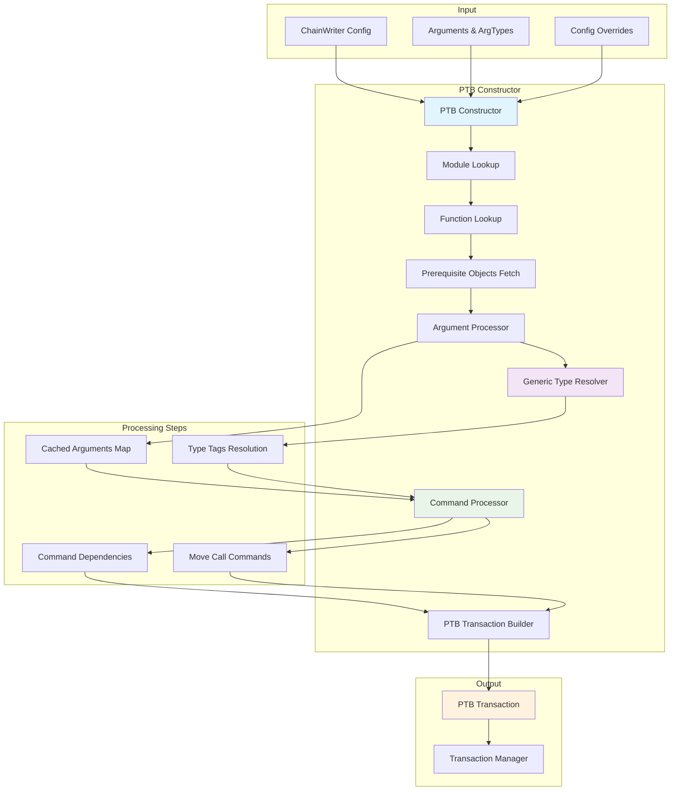

# ChainWriter

The ChainWriter is a core component of the Chainlink SUI Relayer responsible for building and submitting complex Programmable Transaction Blocks (PTBs) to the Sui blockchain. It provides an interface for executing multi-step transactions with comprehensive error handling, gas management, and retry logic through integration with the Transaction Manager. It consists of 3 main components:

**SuiChainWriter Implementation**: The main interface implementing the ContractWriter protocol. The ChainWriter exposes the following methods:

### ContractWriter Interface

```go
// File: /relayer/chainwriter/chainwriter.go

// Primary transaction submission method for PTBs
func (s *SuiChainWriter) SubmitTransaction(ctx context.Context, contractName string, method string, 
    args any, transactionID string, toAddress string, meta *commonTypes.TxMeta, _ *big.Int) error

// Retrieve the current status of a submitted transaction
func (s *SuiChainWriter) GetTransactionStatus(ctx context.Context, transactionID string) (commonTypes.TransactionStatus, error)

// Get fee components for transaction cost estimation (not implemented)
func (s *SuiChainWriter) GetFeeComponents(ctx context.Context) (*commonTypes.ChainFeeComponents, error)

// Get fee estimate for a transaction (not implemented)
func (s *SuiChainWriter) GetEstimateFee(ctx context.Context, contractName string, method string, 
    args any, transactionID string, meta *commonTypes.TxMeta, _ *big.Int) (commonTypes.EstimateFee, error)
```

### Service Interface

```go
// Service lifecycle management methods
func (s *SuiChainWriter) Start(ctx context.Context) error    // Start the ChainWriter service
func (s *SuiChainWriter) Close() error                       // Stop and cleanup the ChainWriter service
func (s *SuiChainWriter) Ready() error                       // Check if the service is ready
func (s *SuiChainWriter) HealthReport() map[string]error     // Get service health status
func (s *SuiChainWriter) Name() string                       // Get the service name
```

Key methods:
- **SubmitTransaction**: Primary entry point for submitting PTB transactions
- **GetTransactionStatus**: Queries transaction status through the Transaction Manager
- **Service Lifecycle**: Standard service management methods (Start, Close, Ready, etc.)

**PTB Constructor**: Handles building complex Programmable Transaction Blocks from configuration-driven commands. The PTB Constructor maps arguments to their respective commands, handles dependencies between commands, and constructs multi-step transactions.

**Transaction Manager Integration**: Leverages the TXM for transaction lifecycle management including creation, signing, state management, retry logic, and confirmation polling.

## ChainWriter Overview

During initialization, the ChainWriter creates a PTB Constructor and integrates with the existing Transaction Manager. The ChainWriter acts as a router, determining whether to submit a standard Move function call or build a complex PTB based on the module configuration.

```go
// File: /relayer/chainwriter/chainwriter.go

func NewSuiChainWriter(lggr logger.Logger, txManager txm.TxManager, config cwConfig.ChainWriterConfig, simulate bool) (*SuiChainWriter, error) {
    suiClient := txManager.GetClient()
    return &SuiChainWriter{
        lggr:       logger.Named(lggr, ServiceName),
        txm:        txManager,
        config:     config,
        simulate:   simulate,
        ptbFactory: ptb.NewPTBConstructor(config, suiClient, lggr),
    }, nil
}
```

The ChainWriter is initialized with several key components:

- **Transaction Manager**: Handles the complete transaction lifecycle from creation to finalization
- **Configuration**: Defines modules, functions, and PTB command specifications
- **PTB Constructor**: Builds complex programmable transaction blocks
- **Simulation Mode**: Allows testing transactions without gas costs

### Transaction Submission Process

The primary entry point `SubmitTransaction` routes PTB requests to the PTB Constructor for building complex multi-step transactions:

```go
// File: /relayer/chainwriter/chainwriter.go

func enqueuePTB(ctx context.Context, s *SuiChainWriter, ptbName string, method string, args any, transactionID string, toAddress string, meta *commonTypes.TxMeta) error {
    moduleConfig, exists := s.config.Modules[ptbName]
    if !exists {
        return commonTypes.ErrNotFound
    }

    functionConfig, exists := moduleConfig.Functions[method]
    if !exists {
        return commonTypes.ErrNotFound
    }

    var arguments cwConfig.Arguments
    if err := mapstructure.Decode(args, &arguments); err != nil {
        return fmt.Errorf("failed to decode args: %w", err)
    }

    configOverrides := &cwConfig.ConfigOverrides{
        ToAddress: toAddress,
    }

    // Build PTB commands using the PTB Constructor
    ptbService, err := s.ptbFactory.BuildPTBCommands(ctx, ptbName, method, arguments, configOverrides)
    if err != nil {
        return err
    }

    // Enqueue the PTB through Transaction Manager
    tx, err := s.txm.EnqueuePTB(ctx, transactionID, meta, functionConfig.PublicKey, ptbService, s.simulate)
    if err != nil {
        return err
    }
    
    s.lggr.Infow("PTB transaction enqueued", "transactionID", tx.TransactionID, "functionName", method)
    return nil
}
```

The ChainWriter focuses on building and submitting complex Programmable Transaction Blocks that can execute multiple operations atomically.

## PTB Constructor Overview

The PTB Constructor handles building Programmable Transaction Blocks from configuration-driven commands. PTBs allow multiple operations to be executed atomically in a single transaction, with dependencies between commands.



```go
// File: /relayer/chainwriter/ptb/ptb_constructor.go

type PTBConstructor struct {
    config cwConfig.ChainWriterConfig // Configuration for building PTBs
    client client.SuiPTBClient        // Client for interacting with Sui PTB functionality
    log    logger.Logger              // Logger for debugging and error reporting
}

func NewPTBConstructor(config cwConfig.ChainWriterConfig, ptbClient client.SuiPTBClient, log logger.Logger) *PTBConstructor {
    return &PTBConstructor{
        config: config,
        client: ptbClient,
        log:    log,
    }
}
```

### PTB Command Processing

The PTB Constructor processes commands in a specific sequence to handle dependencies:

1. **Builds all object arguments first**, storing them in a map keyed by their IDs
2. **Builds all scalar arguments**, storing them in a map with generated keys
3. **Processes each command in order**, mapping pre-built arguments to their respective parameters
4. **Handles PTB dependencies** between commands
5. **Constructs the final PTB** with all commands and their arguments

```go
// File: /relayer/chainwriter/ptb/ptb_constructor.go

func (p *PTBConstructor) BuildPTBCommands(ctx context.Context, moduleName string, function string, arguments cwConfig.Arguments, configOverrides *cwConfig.ConfigOverrides) (*transaction.Transaction, error) {
    // Look up the module and function configuration
    module, ok := p.config.Modules[moduleName]
    if !ok {
        return nil, fmt.Errorf("missing module %s not found in configuration", moduleName)
    }

    txnConfig, ok := module.Functions[function]
    if !ok {
        return nil, fmt.Errorf("missing function config (%s) not found in module (%s)", function, moduleName)
    }

    // Create a new transaction builder
    ptb := transaction.NewTransaction()
    ptb.SetSuiClient(p.client.GetClient().(*sui.Client))

    // Fetch prerequisite objects if needed
    err := p.FetchPrereqObjects(ctx, txnConfig.PrerequisiteObjects, &arguments.Args, overrideToAddress)
    if err != nil {
        return nil, err
    }

    // Process each command in the PTB
    for _, cmd := range ptbCommands {
        switch cmd.Type {
        case codec.SuiPTBCommandMoveCall:
            _, err := p.ProcessMoveCall(ctx, ptb, cmd, &arguments, &cachedArgs)
            if err != nil {
                return nil, err
            }
        // Other command types...
        }
    }

    return ptb, nil
}
```

### PTB Command Dependencies

PTB commands can depend on the results of previous commands within the same transaction. The PTB Constructor handles these dependencies automatically:

```go
// File: /relayer/chainwriter/ptb/ptb_constructor.go

// Check if this is a PTB result dependency
if param.PTBDependency != nil {
    if param.PTBDependency.ResultIndex == nil {
        // Dependency on entire result of dependee command
        processedArgs = append(processedArgs, transaction.Argument{
            Result: &param.PTBDependency.CommandIndex,
        })
    } else {
        // Dependency on specific result from dependee command
        processedArgs = append(processedArgs, transaction.Argument{
            NestedResult: &transaction.NestedResult{
                Index:       param.PTBDependency.CommandIndex,
                ResultIndex: *param.PTBDependency.ResultIndex,
            },
        })
    }
}
```

This dependency system allows complex multi-step operations where later commands use the outputs of earlier commands.

### Prerequisite Object Fetching

Before building PTBs, the constructor can fetch prerequisite objects from the blockchain based on configuration:

```go
// File: /relayer/chainwriter/config/config.go

type PrerequisiteObject struct {
    OwnerId *string
    Name    string // Key under which the value is inserted in the args
    Tag     string // Object type to match
    SetKeys bool   // Optionally set object keys instead of name
}
```

The PTB Constructor automatically fetches these objects using `SuiX_GetOwnedObjects` calls and populates them into the argument map before constructing the PTB commands.

## Configuration System

The ChainWriter uses a flexible configuration system that defines modules, functions, and PTB commands:

```go
// File: /relayer/chainwriter/config/config.go

type ChainWriterConfig struct {
    Modules map[string]*ChainWriterModule
}

type ChainWriterModule struct {
    Name      string
    ModuleID  string
    Functions map[string]*ChainWriterFunction
}

type ChainWriterFunction struct {
    Name                string
    PublicKey           []byte
    PrerequisiteObjects []PrerequisiteObject
    AddressMappings     map[string]string
    PTBCommands         []ChainWriterPTBCommand   // PTB command definitions
}
```

### PTB Command Configuration

PTB commands are defined declaratively in the configuration:

```go
// File: /relayer/chainwriter/config/config.go

type ChainWriterPTBCommand struct {
    Type      codec.SuiPTBCommandType
    PackageId *string
    ModuleId  *string
    Function  *string
    TypeArgs  []string
    Params    []codec.SuiFunctionParam
}
```

Each PTB command specifies:
- **Command Type**: MoveCall, Publish, Transfer, etc.
- **Target**: Package, module, and function identifiers
- **Parameters**: Typed parameters with dependency specifications
- **Type Arguments**: Generic type arguments for Move functions

## Transaction Manager Integration

The ChainWriter delegates transaction lifecycle management to the Transaction Manager, which handles:

- **Transaction Creation**: Building and signing transactions
- **State Management**: Persistent transaction state tracking
- **Retry Logic**: Automatic retry with exponential backoff
- **Gas Management**: Estimation and optimization
- **Confirmation Polling**: Monitoring transaction status

```go
// File: /relayer/chainwriter/chainwriter.go

func (s *SuiChainWriter) GetTransactionStatus(ctx context.Context, transactionID string) (commonTypes.TransactionStatus, error) {
    return s.txm.GetTransactionStatus(ctx, transactionID)
}
```

The ChainWriter provides a simplified interface while leveraging the robust transaction management capabilities of the TXM for reliability and error handling.

## Generics Processing

The ChainWriter has sophisticated support for generic types in Move functions, allowing dynamic type resolution at transaction submission time. This is crucial for interacting with generic Move functions that use type parameters like `Coin<T>` or `vector<T>`.

### Generic Parameter Configuration

Generic parameters are now defined directly in the function configuration using the `GenericType` field, which explicitly specifies the concrete type to use:

```go
// File: /relayer/codec/types.go

type SuiFunctionParam struct {
    Name         string
    Type         string
    GenericType  *string  // Explicit generic type specification (e.g., "0x2::sui::SUI")
    Required     bool
    DefaultValue any
    // ... other fields
}
```

This approach provides several advantages:
- **Explicit Type Declaration**: Generic types are specified directly in the configuration, making them self-documenting
- **No Runtime Type Resolution**: Eliminates the need for `ArgTypes` mapping during transaction submission
- **Better Type Safety**: Configuration validation can catch type mismatches at startup
- **Simplified API**: No need to provide separate type mappings in arguments

### Generic Type Resolution Process

When building PTB commands, the ChainWriter resolves generic types through the `ResolveGenericTypeTags` method, which now preserves first-appearance order:


### Type Tag Construction

The system supports multiple type formats for generic resolution:

#### Struct Types
For Move struct types with the format `package::module::name`:

```go
// File: /relayer/chainwriter/ptb/generics.go

func (b *TypeTagBuilder) createStructTypeTag(typeStr string) (transaction.TypeTag, error) {
    parts := strings.Split(typeStr, "::")
    if len(parts) != 3 {
        return transaction.TypeTag{}, fmt.Errorf("invalid struct type format %q, expected package::module::name", typeStr)
    }

    packageID, module, name := parts[0], parts[1], parts[2]

    return transaction.TypeTag{
        Struct: &transaction.StructTag{
            Address:    packageAddr,
            Module:     module,
            Name:       name,
            TypeParams: []*transaction.TypeTag{},
        },
    }, nil
}
```

#### Vector Types
For vector types like `vector<u8>` or `vector<0x2::sui::SUI>`:

```go
// File: /relayer/chainwriter/ptb/generics.go

// Handle vector types - extract inner type for type tag creation
if strings.HasPrefix(typeStr, "vector<") && strings.HasSuffix(typeStr, ">") {
    innerType := extractVectorInnerType(typeStr)
    typeTag, err := b.createTypeTag(innerType)
    if err != nil {
        return transaction.TypeTag{}, fmt.Errorf("failed to create type tag for vector inner type %s: %w", innerType, err)
    }
    return typeTag, nil
}
```

### Usage Example

Here's how to use generics in a PTB configuration with the new explicit approach:

```go
// PTB Command configuration with explicit generic type
ptbCommand := ChainWriterPTBCommand{
    Type:      codec.SuiPTBCommandMoveCall,
    PackageId: "0x123",
    ModuleId:  "token_pool",
    Function:  "deposit",
    Params: []codec.SuiFunctionParam{
        {
            Name:        "coin",
            Type:        "Coin<T>",
            GenericType: strPtr("0x2::sui::SUI"), // Explicit type specification
            Required:    true,
        },
        {
            Name:     "amount",
            Type:     "u64", 
            Required: true,
        },
    },
}

// Arguments - no need for ArgTypes mapping anymore
arguments := config.Arguments{
    Args: map[string]any{
        "coin":   "0xabc123...", // Object ID of the coin
        "amount": 1000000,
    },
    // ArgTypes field is no longer needed for generic type resolution
}

// Helper function for string pointer
func strPtr(s string) *string {
    return &s
}
```

### Type Deduplication and Ordering

The generics system deduplicates identical types to avoid redundant type tags while preserving first-appearance order. This ensures deterministic ordering where type tags are returned in the order they first appear in the parameter list, with identical types only included once in the result. This provides cross-platform consistency across different environments (local, CI/CD, etc.).

### Limitations and Considerations

**Current Limitations:**
- Primitive types (u8, u64, etc.) are not fully supported as generic arguments due to SDK limitations
- Complex nested generics are not yet supported
- Only struct types and vector inner types are fully supported

**Best Practices:**
- Always provide `GenericType` values for parameters that require generic type resolution
- Use the standard Sui type format: `package::module::name` for struct types
- Ensure vector types follow the `vector<inner_type>` format
- Configuration validation happens at startup, catching type mismatches early
- No need to provide `ArgTypes` mappings at runtime - all type information is in the configuration

**NOTE**: The ChainWriter supports both simulation mode for testing and production mode for actual transaction submission, controlled by the `simulate` flag during initialization.