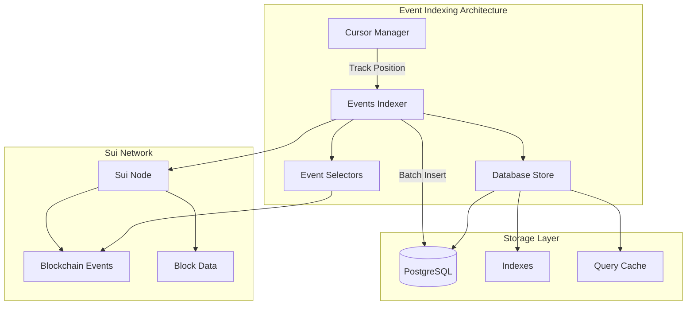

# Event Indexing

The Event Indexing system is a crucial component of the Chainlink SUI Relayer that provides real-time monitoring and structured storage of blockchain events. It enables efficient querying of historical events and supports complex filtering capabilities for building responsive applications.

## Table of Contents

1. [Overview](#overview)
2. [Architecture](#architecture)
3. [Core Components](#core-components)
4. [Configuration](#configuration)
5. [Event Selectors](#event-selectors)
6. [Real-time Indexing](#real-time-indexing)
7. [Database Storage](#database-storage)
8. [Querying Events](#querying-events)
9. [Performance Optimization](#performance-optimization)
10. [Monitoring](#monitoring)
11. [Troubleshooting](#troubleshooting)

## Overview

The Event Indexing system provides comprehensive blockchain event monitoring with:

- **Real-time Indexing**: Continuous monitoring of blockchain events as they occur
- **Structured Storage**: PostgreSQL-backed storage with optimized indexing
- **Advanced Filtering**: Complex query capabilities with time, value, and state filters  
- **Cursor Management**: Efficient pagination and resumption from last processed position
- **Batch Processing**: Optimized batch operations for high-throughput scenarios
- **Error Recovery**: Robust error handling with automatic retry and recovery



## Architecture

### Event Flow

The event indexing system follows a structured flow:

1. **Event Discovery**: Monitor configured event types on the blockchain
2. **Batch Collection**: Collect events in configurable batch sizes
3. **Data Enrichment**: Add block metadata and transaction context
4. **Storage**: Persist events to PostgreSQL with proper indexing
5. **Cursor Management**: Track processing position for resumption

### Indexing Strategy

The system uses a polling-based indexing strategy with:

- **Configurable Polling Intervals**: Balance between latency and resource usage
- **Cursor-based Pagination**: Efficient resumption from last processed position
- **Batch Processing**: Optimize database operations with batch inserts
- **Parallel Processing**: Multiple event selectors can run concurrently

## Core Components

### 1. Events Indexer

The main indexing engine responsible for event discovery and storage:

```go
type EventsIndexer struct {
    db              *database.DBStore
    client          client.SuiPTBClient
    logger          logger.Logger
    pollingInterval time.Duration
    syncTimeout     time.Duration
    eventConfigurations []*client.EventSelector
    lastProcessedCursors map[string]*models.EventId
}
```

**Key Features:**
- Configurable polling intervals
- Automatic cursor management
- Batch event retrieval and storage
- Error recovery and retry logic

### 2. Event Selectors

Define which events to monitor:

```go
type EventSelector struct {
    Package string  // Contract package address
    Module  string  // Module name within package
    Event   string  // Event name to monitor
}
```

**Example:**
```go
eventSelector := &client.EventSelector{
    Package: "0x123...",
    Module:  "counter",
    Event:   "CounterIncremented",
}
```

### 3. Database Store

PostgreSQL-backed storage with optimized schema:

```go
type EventRecord struct {
    EventAccountAddress string
    EventHandle         string
    EventOffset         uint64
    TxDigest           string
    BlockVersion       int64
    BlockHeight        string
    BlockHash          []byte
    BlockTimestamp     uint64
    Data               map[string]interface{}
}
```

### 4. Cursor Management

Tracks processing position for each event type:

```go
type EventId struct {
    TxDigest string
    EventSeq string
}
```

## Configuration

### Basic Configuration

Configure event indexing in your relayer TOML:

```toml
[Chains.ChainReader]
EventsIndexer.PollingInterval = "1s"
EventsIndexer.SyncTimeout = "30s"
```

### Event Selector Configuration

Define which events to monitor:

```go
eventConfigurations := []*client.EventSelector{
    {
        Package: "0x123...",
        Module:  "counter",
        Event:   "CounterIncremented",
    },
    {
        Package: "0x456...",
        Module:  "token",
        Event:   "Transfer",
    },
    {
        Package: "0x789...",
        Module:  "ccip",
        Event:   "MessageSent",
    },
}
```

### Database Configuration

Ensure proper database setup:

```sql
-- Events table with optimized indexes
CREATE TABLE events (
    id BIGSERIAL PRIMARY KEY,
    event_account_address TEXT NOT NULL,
    event_handle TEXT NOT NULL,
    event_offset BIGINT NOT NULL,
    tx_digest TEXT NOT NULL,
    block_version BIGINT NOT NULL,
    block_height TEXT NOT NULL,
    block_hash BYTEA NOT NULL,
    block_timestamp BIGINT NOT NULL,
    data JSONB NOT NULL,
    created_at TIMESTAMP DEFAULT NOW()
);

-- Performance indexes
CREATE INDEX idx_events_handle_timestamp ON events(event_handle, block_timestamp DESC);
CREATE INDEX idx_events_offset ON events(event_account_address, event_handle, event_offset);
CREATE INDEX idx_events_tx_digest ON events(tx_digest);
CREATE INDEX idx_events_data_gin ON events USING gin(data);
```

## Event Selectors

### Creating Event Selectors

Event selectors define exactly which events to monitor:

```go
// Monitor counter increments
counterSelector := &client.EventSelector{
    Package: packageId,
    Module:  "counter", 
    Event:   "CounterIncremented",
}

// Monitor token transfers
transferSelector := &client.EventSelector{
    Package: tokenPackageId,
    Module:  "token",
    Event:   "Transfer",
}

// Monitor CCIP messages
ccipSelector := &client.EventSelector{
    Package: ccipPackageId,
    Module:  "onramp",
    Event:   "CCIPMessageSent",
}
```

### Event Handle Format

Events are stored with a structured handle:

```go
eventHandle := fmt.Sprintf("%s::%s::%s", selector.Package, selector.Module, selector.Event)
// Example: "0x123::counter::CounterIncremented"
```

### Dynamic Event Registration

Add new event selectors at runtime:

```go
func (eIndexer *EventsIndexer) AddEventSelector(selector *client.EventSelector) {
    if !eIndexer.isEventSelectorAdded(*selector) {
        eIndexer.eventConfigurations = append(eIndexer.eventConfigurations, selector)
        eIndexer.logger.Infow("Added new event selector", 
                             "package", selector.Package,
                             "module", selector.Module, 
                             "event", selector.Event)
    }
}
```

## Real-time Indexing

### Starting the Indexer

Initialize and start event indexing:

```go
// Create indexer
indexer := indexer.NewEventIndexer(
    dbStore,
    logger,
    suiClient,
    eventConfigurations,
    time.Second,     // polling interval
    30*time.Second,  // sync timeout
)

// Start indexing (runs in background)
go func() {
    if err := indexer.Start(ctx); err != nil {
        logger.Error("Event indexer failed", "error", err)
    }
}()
```

### Polling Strategy

The indexer uses configurable polling:

```go
func (eIndexer *EventsIndexer) Start(ctx context.Context) error {
    ticker := time.NewTicker(eIndexer.pollingInterval)
    defer ticker.Stop()

    for {
        select {
        case <-ticker.C:
            syncCtx, cancel := context.WithTimeout(ctx, eIndexer.syncTimeout)
            err := eIndexer.SyncAllEvents(syncCtx)
            cancel()
            
            if err != nil {
                eIndexer.logger.Warnw("Event sync error", "error", err)
            }

        case <-ctx.Done():
            return ctx.Err()
        }
    }
}
```

### Batch Processing

Events are processed in configurable batches:

```go
const batchSizeRecords = 50

// Fetch events in batches
eventsPage, err := eIndexer.client.QueryEvents(
    ctx, 
    *selector, 
    &batchSize, 
    clientCursor, 
    sortOptions,
)

// Process batch
for _, event := range eventsPage.Data {
    record := database.EventRecord{
        EventAccountAddress: selector.Package,
        EventHandle:         eventHandle,
        EventOffset:        offset,
        TxDigest:           event.Id.TxDigest,
        BlockHeight:        fmt.Sprintf("%d", block.Height),
        BlockTimestamp:     block.Timestamp,
        Data:               event.ParsedJson,
    }
    batchRecords = append(batchRecords, record)
}

// Batch insert to database
if err := eIndexer.db.InsertEvents(ctx, batchRecords); err != nil {
    return fmt.Errorf("failed to insert batch: %w", err)
}
```

## Database Storage

### Schema Design

The event storage schema is optimized for query performance:

```sql
CREATE TABLE events (
    id BIGSERIAL PRIMARY KEY,
    event_account_address TEXT NOT NULL,
    event_handle TEXT NOT NULL,
    event_offset BIGINT NOT NULL,
    tx_digest TEXT NOT NULL,
    block_version BIGINT NOT NULL,
    block_height TEXT NOT NULL,
    block_hash BYTEA NOT NULL,
    block_timestamp BIGINT NOT NULL,
    data JSONB NOT NULL,
    created_at TIMESTAMP DEFAULT NOW()
);
```

### Optimized Indexes

Strategic indexes for common query patterns:

```sql
-- Handle + timestamp for time-based queries
CREATE INDEX idx_events_handle_timestamp ON events(event_handle, block_timestamp DESC);

-- Offset tracking for cursor management
CREATE INDEX idx_events_offset ON events(event_account_address, event_handle, event_offset);

-- Transaction lookup
CREATE INDEX idx_events_tx_digest ON events(tx_digest);

-- JSON data queries
CREATE INDEX idx_events_data_gin ON events USING gin(data);

-- Composite index for common filters
CREATE INDEX idx_events_composite ON events(event_handle, block_timestamp DESC, event_account_address);
```

### Data Types

Event data is stored as JSONB for flexible querying:

```go
// Example event data structure
eventData := map[string]interface{}{
    "counter_id": "0x123...",
    "old_value":  "42",
    "new_value":  "43", 
    "user":       "0xabc...",
    "timestamp":  1640995200,
}
```

### Batch Insertion

Optimized batch insertion for high throughput:

```go
func (db *DBStore) InsertEvents(ctx context.Context, records []EventRecord) error {
    if len(records) == 0 {
        return nil
    }

    // Prepare batch insert statement
    query := `
        INSERT INTO events (
            event_account_address, event_handle, event_offset,
            tx_digest, block_version, block_height, block_hash,
            block_timestamp, data
        ) VALUES ($1, $2, $3, $4, $5, $6, $7, $8, $9)`

    // Execute batch insert
    for _, record := range records {
        _, err := db.conn.ExecContext(ctx, query,
            record.EventAccountAddress,
            record.EventHandle,
            record.EventOffset,
            record.TxDigest,
            record.BlockVersion,
            record.BlockHeight,
            record.BlockHash,
            record.BlockTimestamp,
            record.Data,
        )
        if err != nil {
            return fmt.Errorf("failed to insert event: %w", err)
        }
    }

    return nil
}
```

## Querying Events

### Basic Event Queries

Query events with filtering and pagination:

```go
// Query recent counter events
events, err := dbStore.QueryEvents(
    ctx,
    packageId,
    "0x123::counter::CounterIncremented",
    nil, // no cursor for latest events
    query.LimitAndSort{
        Limit: query.Limit{Count: 10},
        Sort:  query.NewSortByTimestamp(query.Desc),
    },
)
```

### Advanced Filtering

Use complex queries with multiple filters:

```go
// Query events with time and value filters
events, err := reader.QueryKey(
    ctx,
    types.BoundContract{
        Address: packageId,
        Name:    "counter",
    },
    query.KeyFilter{
        Key: "CounterIncremented",
        Expressions: []query.Expression{
            // Time range filter
            query.Timestamp(uint64(startTime.Unix()), query.Gte),
            query.Timestamp(uint64(endTime.Unix()), query.Lte),
            // Value filter
            query.Eq("new_value", "100"),
            // Confidence level
            query.Confidence(primitives.Finalized),
        },
    },
    query.LimitAndSort{
        Limit: query.Limit{Count: 50},
        Sort:  query.NewSortByTimestamp(query.Desc),
    },
    &CounterEvent{},
)
```

### Cursor-based Pagination

Efficient pagination for large result sets:

```go
func paginateEvents(ctx context.Context, eventHandle string) error {
    var cursor *query.Cursor
    pageSize := uint64(100)

    for {
        events, nextCursor, err := dbStore.QueryEventsWithCursor(
            ctx,
            packageId,
            eventHandle,
            cursor,
            query.LimitAndSort{
                Limit: query.Limit{Count: pageSize},
                Sort:  query.NewSortByTimestamp(query.Asc),
            },
        )
        if err != nil {
            return err
        }

        if len(events) == 0 {
            break // No more events
        }

        // Process events
        for _, event := range events {
            processEvent(event)
        }

        // Update cursor for next page
        cursor = nextCursor
        if cursor == nil {
            break // No more pages
        }
    }

    return nil
}
```

### Real-time Event Streaming

Stream events as they are indexed:

```go
func streamEvents(ctx context.Context, eventHandle string) error {
    ticker := time.NewTicker(2 * time.Second)
    defer ticker.Stop()

    var lastTimestamp uint64

    for {
        select {
        case <-ticker.C:
            // Query new events since last check
            events, err := dbStore.QueryEvents(
                ctx,
                packageId,
                eventHandle,
                nil,
                query.LimitAndSort{
                    Limit: query.Limit{Count: 100},
                    Sort:  query.NewSortByTimestamp(query.Asc),
                },
            )
            if err != nil {
                logger.Error("Failed to query events", "error", err)
                continue
            }

            // Filter events newer than last processed
            newEvents := filterEventsByTimestamp(events, lastTimestamp)
            
            // Process new events
            for _, event := range newEvents {
                processNewEvent(event)
                if event.BlockTimestamp > lastTimestamp {
                    lastTimestamp = event.BlockTimestamp
                }
            }

        case <-ctx.Done():
            return ctx.Err()
        }
    }
}
```

## Performance Optimization

### Database Optimization

#### Connection Pooling

Configure optimal connection settings:

```go
// Database connection configuration
db.SetMaxOpenConns(25)
db.SetMaxIdleConns(10)
db.SetConnMaxLifetime(5 * time.Minute)
db.SetConnMaxIdleTime(30 * time.Second)
```

#### Query Optimization

Use prepared statements and proper indexing:

```sql
-- Analyze query performance
EXPLAIN ANALYZE SELECT * FROM events 
WHERE event_handle = $1 
AND block_timestamp >= $2 
ORDER BY block_timestamp DESC 
LIMIT 100;

-- Monitor index usage
SELECT schemaname, tablename, indexname, idx_scan, idx_tup_read
FROM pg_stat_user_indexes 
WHERE tablename = 'events';
```

#### Batch Size Tuning

Optimize batch sizes based on event volume:

```go
// High-volume events: smaller batches for lower latency
const highVolumeBatchSize = 25

// Low-volume events: larger batches for efficiency  
const lowVolumeBatchSize = 100

func getBatchSize(eventType string) uint {
    highVolumeEvents := []string{"Transfer", "Swap", "Trade"}
    
    for _, hvEvent := range highVolumeEvents {
        if strings.Contains(eventType, hvEvent) {
            return highVolumeBatchSize
        }
    }
    
    return lowVolumeBatchSize
}
```

### Memory Management

#### Cursor Cleanup

Implement cursor cleanup to prevent memory leaks:

```go
func (eIndexer *EventsIndexer) cleanupOldCursors() {
    const maxCursorAge = 24 * time.Hour
    
    for eventHandle, cursor := range eIndexer.lastProcessedCursors {
        // Check if cursor is too old (implementation-specific)
        if isCursorExpired(cursor, maxCursorAge) {
            delete(eIndexer.lastProcessedCursors, eventHandle)
            eIndexer.logger.Debugw("Cleaned up old cursor", "eventHandle", eventHandle)
        }
    }
}
```

#### Batch Processing Memory

Control memory usage during batch processing:

```go
func processBatchWithMemoryControl(records []EventRecord) error {
    const maxBatchMemory = 100 * 1024 * 1024 // 100MB
    
    var currentBatch []EventRecord
    var currentMemory int64
    
    for _, record := range records {
        recordSize := estimateRecordSize(record)
        
        if currentMemory + recordSize > maxBatchMemory {
            // Process current batch
            if err := processBatch(currentBatch); err != nil {
                return err
            }
            
            // Reset for next batch
            currentBatch = currentBatch[:0]
            currentMemory = 0
        }
        
        currentBatch = append(currentBatch, record)
        currentMemory += recordSize
    }
    
    // Process remaining batch
    if len(currentBatch) > 0 {
        return processBatch(currentBatch)
    }
    
    return nil
}
```

## Monitoring

### Key Metrics

Track important indexing metrics:

```go
var (
    eventsIndexedTotal = prometheus.NewCounterVec(
        prometheus.CounterOpts{
            Name: "events_indexed_total",
            Help: "Total number of events indexed",
        },
        []string{"package", "module", "event"},
    )
    
    indexingLatency = prometheus.NewHistogramVec(
        prometheus.HistogramOpts{
            Name: "event_indexing_duration_seconds",
            Help: "Time spent indexing events",
        },
        []string{"operation"},
    )
    
    indexingErrors = prometheus.NewCounterVec(
        prometheus.CounterOpts{
            Name: "event_indexing_errors_total",
            Help: "Total number of indexing errors",
        },
        []string{"error_type"},
    )
)

// Usage in indexer
start := time.Now()
defer func() {
    indexingLatency.WithLabelValues("sync_events").Observe(time.Since(start).Seconds())
    eventsIndexedTotal.WithLabelValues(selector.Package, selector.Module, selector.Event).Add(float64(len(batchRecords)))
}()
```

### Health Checks

Implement comprehensive health monitoring:

```go
func (eIndexer *EventsIndexer) HealthCheck() error {
    // Check database connectivity
    if err := eIndexer.db.Ping(); err != nil {
        return fmt.Errorf("database connection failed: %w", err)
    }
    
    // Check Sui client connectivity
    if _, err := eIndexer.client.GetLatestCheckpoint(context.Background()); err != nil {
        return fmt.Errorf("sui client connection failed: %w", err)
    }
    
    // Check indexing lag
    lag, err := eIndexer.getIndexingLag()
    if err != nil {
        return fmt.Errorf("failed to check indexing lag: %w", err)
    }
    
    if lag > 5*time.Minute {
        return fmt.Errorf("indexing lag too high: %v", lag)
    }
    
    return nil
}

func (eIndexer *EventsIndexer) getIndexingLag() (time.Duration, error) {
    // Get latest block timestamp from network
    checkpoint, err := eIndexer.client.GetLatestCheckpoint(context.Background())
    if err != nil {
        return 0, err
    }
    
    // Get latest indexed event timestamp
    latestEvent, err := eIndexer.db.GetLatestEvent(context.Background())
    if err != nil {
        return 0, err
    }
    
    networkTime := time.Unix(int64(checkpoint.Timestamp), 0)
    indexedTime := time.Unix(int64(latestEvent.BlockTimestamp), 0)
    
    return networkTime.Sub(indexedTime), nil
}
```

### Alerting

Set up alerting for critical issues:

```go
type AlertManager struct {
    webhookURL string
    logger     logger.Logger
}

func (am *AlertManager) SendAlert(alertType, message string) {
    alert := map[string]interface{}{
        "alert_type": alertType,
        "message":    message,
        "timestamp":  time.Now().Unix(),
        "service":    "sui-event-indexer",
    }
    
    // Send to monitoring system
    if err := am.sendWebhook(alert); err != nil {
        am.logger.Error("Failed to send alert", "error", err)
    }
}

// Usage
if indexingLag > 10*time.Minute {
    alertManager.SendAlert("HIGH_INDEXING_LAG", 
        fmt.Sprintf("Event indexing lag is %v", indexingLag))
}
```

## Troubleshooting

### Common Issues

| Issue | Symptoms | Solution |
|-------|----------|----------|
| **High Indexing Lag** | Events appear delayed | Decrease polling interval, increase batch size, check database performance |
| **Missing Events** | Some events not indexed | Verify event selectors, check network connectivity, review error logs |
| **Database Lock Contention** | Slow queries, timeouts | Optimize indexes, reduce batch size, implement connection pooling |
| **Memory Leaks** | Increasing memory usage | Implement cursor cleanup, limit batch sizes, check goroutine leaks |
| **Cursor Position Lost** | Duplicate or missed events | Implement cursor persistence, add recovery logic |

### Debug Tools

#### Event Indexing Status

```go
func (eIndexer *EventsIndexer) GetIndexingStatus() map[string]interface{} {
    status := map[string]interface{}{
        "active_selectors": len(eIndexer.eventConfigurations),
        "cursor_positions": make(map[string]string),
        "last_sync_time":   time.Now(), // Track last successful sync
    }
    
    for eventHandle, cursor := range eIndexer.lastProcessedCursors {
        status["cursor_positions"].(map[string]string)[eventHandle] = cursor.TxDigest
    }
    
    return status
}
```

#### Manual Event Sync

```go
func (eIndexer *EventsIndexer) ManualSync(packageId, module, event string) error {
    selector := &client.EventSelector{
        Package: packageId,
        Module:  module,
        Event:   event,
    }
    
    return eIndexer.SyncEvent(context.Background(), selector)
}
```

#### Database Diagnostics

```sql
-- Check event distribution
SELECT event_handle, COUNT(*) as event_count 
FROM events 
GROUP BY event_handle 
ORDER BY event_count DESC;

-- Check indexing performance
SELECT 
    event_handle,
    MIN(block_timestamp) as first_event,
    MAX(block_timestamp) as last_event,
    COUNT(*) as total_events
FROM events 
GROUP BY event_handle;

-- Identify slow queries
SELECT query, mean_time, calls 
FROM pg_stat_statements 
WHERE query LIKE '%events%' 
ORDER BY mean_time DESC;
```

The Event Indexing system provides a robust foundation for real-time blockchain event monitoring with comprehensive storage, querying, and performance optimization capabilities. By following the patterns and best practices outlined in this guide, you can build efficient applications that reliably monitor and respond to blockchain events. 