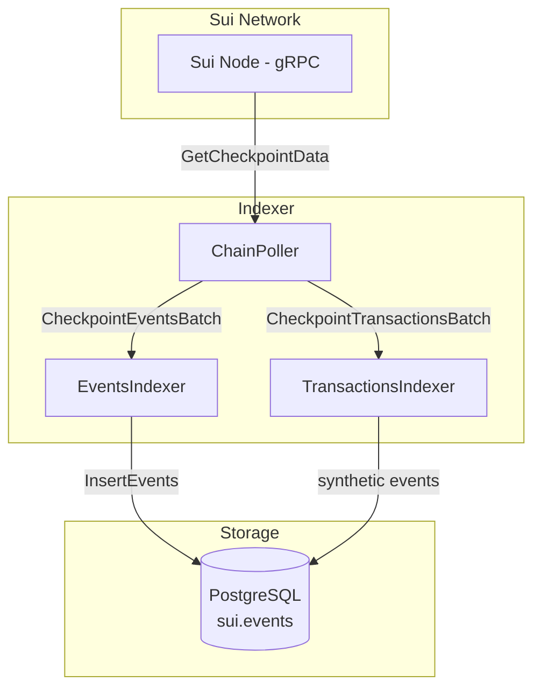

# Event Indexing

The Event Indexing system monitors the Sui blockchain and persists relevant events into a local PostgreSQL store so the ChainReader can answer queries with the full power of SQL. It is built around a **checkpoint-based polling** model: a single `ChainPoller` watches every checkpoint the node produces and fans the contained events and transactions out to two consumers.

## Why checkpoint-based polling?

The relayer's PTB Client migrated from Sui's JSON-RPC API to its **gRPC** API (see [PTB Client](./ptb-client.md)). The gRPC API does not expose the event- and transaction-search endpoints the original indexer relied on (there is no server-side "query events by `package::module::event`" over gRPC). Rather than search, the relayer now **streams checkpoints** and filters their contents client-side:

- The `ChainPoller` fetches each checkpoint's full data (its transactions and their events).
- It filters events against the set of registered selectors and forwards matches.
- It forwards every transaction so failed transactions can be turned into synthetic events.

This replaces the previous design in which each indexer independently polled the RPC's event-search endpoint with a per-selector cursor.

## Architecture


```mermaid
graph TB
    subgraph "Sui Network"
        Node[Sui Node - gRPC]
    end

    subgraph "Indexer"
        CP[ChainPoller]
        EI[EventsIndexer]
        TI[TransactionsIndexer]
    end

    subgraph "Storage"
        PG[(PostgreSQL<br/>sui.events)]
    end

    Node -->|GetCheckpointData| CP
    CP -->|CheckpointEventsBatch| EI
    CP -->|CheckpointTransactionsBatch| TI
    EI -->|InsertEvents| PG
    TI -->|synthetic events| PG
```

The three components are constructed and wired together by `indexer.NewIndexer` and orchestrated by the `Indexer` type (`relayer/chainreader/indexer/indexer.go`). The `ChainPoller` produces; the `EventsIndexer` and `TransactionsIndexer` consume from Go channels.

## Components

### 1. ChainPoller

The `ChainPoller` (`chain_poller.go`) is the single producer. It:

1. Computes a **start sequence** (see [Backfill & start sequence](#backfill--start-sequence)).
2. Runs a **catch-up loop** from the start sequence to the latest checkpoint.
3. Switches to **live polling** on a ticker (`PollingInterval`), processing any new checkpoints since the last one it handled.

For each checkpoint it fetches the full checkpoint data via `client.GetCheckpointData`, builds:

- a `CheckpointEventsBatch` — only the events that match a registered selector, and
- a `CheckpointTransactionsBatch` — **all** transactions in the checkpoint,

and sends them over the events and transactions channels respectively. Events are sent before transactions so event indexing is not blocked when the transactions channel is full (for example while the `TransactionsIndexer` is still bootstrapping).

```go
type ChainPollerAPI interface {
    Start(ctx context.Context) error
    EventsChannel() <-chan CheckpointEventsBatch
    TransactionsChannel() <-chan CheckpointTransactionsBatch
    // RescanRecent rewinds the poller so recently-processed checkpoints are re-scanned
    // (used when a new event selector is registered after the poller has already advanced).
    RescanRecent()
    Close() error
}
```

The poller pulls the **current** selector set on every checkpoint via a `SelectorProvider` (wired to `EventsIndexer.GetEventSelectors`), so selectors registered later — e.g. when the ChainReader binds a contract — are honored without re-wiring.

#### Channel data types (`checkpoint_batch.go`)

```go
type CheckpointMeta struct {
    SequenceNumber uint64
    Digest         string
    TimestampMs    uint64 // from checkpoint summary
}

type CheckpointEventItem struct {
    Event      *suirpcv2.Event
    TxDigest   string
    EventIndex uint32 // position within tx events list (for offset stability)
}

type CheckpointEventsBatch struct {
    Checkpoint CheckpointMeta
    Events     []CheckpointEventItem
}

type CheckpointTransactionsBatch struct {
    Checkpoint   CheckpointMeta
    Transactions []*suirpcv2.ExecutedTransaction
}
```

#### Event matching

An event matches a selector when its package ID, module, and event name all match. The poller is tolerant of `0x` prefix differences on the package ID and extracts the event name from the fully qualified gRPC `EventType` (`0x..::module::EventName` → `EventName`).

### 2. EventsIndexer

The `EventsIndexer` (`events_indexer.go`) is now a **channel consumer**, not an RPC poller. Its loop reads `CheckpointEventsBatch` values and persists them:

```go
type EventsIndexerApi interface {
    Start(ctx context.Context, eventsCh <-chan CheckpointEventsBatch) error
    ProcessCheckpointEvents(ctx context.Context, batch CheckpointEventsBatch) error
    AddEventSelector(ctx context.Context, selector *client.EventSelector) error
    GetEventSelectors() []*client.EventSelector
    SetEventOffsetOverrides(ctx context.Context, overrides map[string]client.EventId) error // deprecated
    Ready() error
    Close() error
}
```

For each batch it:

1. Groups events by their event handle (`package::module::event`).
2. Computes a stable `event_offset` per record as `totalCount + i + 1`, where `totalCount` is the number of rows already stored for that handle.
3. Normalizes the event JSON (camelCase keys) and converts the tx digest to hex.
4. **Batch-inserts** the records, falling back to per-record inserts if the batch fails.

Because inserts use `ON CONFLICT DO NOTHING` on the unique key, re-processing a checkpoint is idempotent — which is what makes [rescans](#rescans-on-new-selectors) safe.

> **Deprecated**: `SetEventOffsetOverrides` is a no-op kept for backward compatibility. Events are now ordered by checkpoint, so per-selector offset overrides are no longer meaningful.

### 3. TransactionsIndexer

The `TransactionsIndexer` (`transactions_indexer.go`) consumes `CheckpointTransactionsBatch` values and generates **synthetic events** for failed transactions. It is covered in detail in [ChainReader → Transactions Indexer](./chainreader.md#transactions-indexer-overview); in summary it:

1. Waits for the OffRamp package to be bound and for the first `ocr3_base::ConfigSet` event to be indexed (so it knows the transmitter set) before enabling processing. Until then it drains its channel without acting, so the poller is never blocked.
2. For each checkpoint, keeps only failed, programmable transactions sent by a known transmitter.
3. Parses the Move abort, extracts the execution report from the `offramp::init_execute` call, and emits a synthetic `ExecutionStateChanged` event with `state = 3 (FAILURE)` and `is_synthetic = true`.

## Event Selectors

A selector is a `package::module::event` triple:

```go
type EventFilterByMoveEventModule struct {
    Package string `json:"package"`
    Module  string `json:"module"`
    Event   string `json:"event"`
}

// EventSelector is an alias for EventFilterByMoveEventModule.
type EventSelector = EventFilterByMoveEventModule
```

Selectors are registered with the `EventsIndexer` (and therefore become visible to the poller) in two ways:

- **At bind time**: when the ChainReader binds a contract, it registers every event selector configured for that contract using the binding's package address. This ensures the poller filters those events in from the moment the contract is bound.
- **On demand**: `QueryKey` registers a selector for the event being queried if one is not already present.

`AddEventSelector` is idempotent, so re-binding never creates duplicates.

### Rescans on new selectors

A selector can only be registered once its contract is discovered and bound. By then the poller may have already processed — and, lacking the selector, discarded — checkpoints that carried matching events. To recover them, registering a new selector triggers `RescanRecent`, which rewinds the poller's in-memory `lastProcessed` cursor so those recent checkpoints are re-scanned. The rewind span is the configured backfill window (`BackfillCheckpointCount`, default `100`); re-inserts are idempotent.

## Backfill & start sequence

On startup the poller chooses where to begin:

1. If `StartCheckpointSequence` is set, start there.
2. Otherwise, if `BackfillCheckpointCount` (= N) is set, start at `latest - N` (or `0` if `latest < N`).
3. Otherwise, start at the latest checkpoint (no backfill).

It then catches up to the latest checkpoint and begins live polling.

## Configuration

The ChainPoller is configured through the `[Sui.ChainPoller]` TOML section, which maps to `ChainPollerConfig`:

```go
type ChainPollerConfig struct {
    PollingInterval         time.Duration
    SyncTimeout             time.Duration
    BackfillCheckpointCount *uint64 // optional: start at latest - N
    StartCheckpointSequence *uint64 // optional: explicit start (overrides backfill)
    ChannelBufferSize       int     // default 16
}
```

| Setting | Default | Description |
|---------|---------|-------------|
| `PollingIntervalSecs` | `2` | How often live polling checks for new checkpoints |
| `SyncTimeoutSecs` | `60` | Timeout for processing a single checkpoint |
| `ChannelBufferSize` | `16` | Buffer size of the events/transactions channels |
| `BackfillCheckpointCount` | `100` | Backfill window (start at `latest - N`) and rescan rewind span |
| `StartCheckpointSequence` | _unset_ | Explicit start sequence (overrides backfill) |

> The legacy `[Sui.ChainReader] EventsIndexer.*` / `TransactionsIndexer.*` polling settings no longer drive checkpoint fetching — the single ChainPoller does. See [Configuration](./configuration.md).

## Database Storage

All indexed events — real and synthetic — are written to the `sui.events` table:

| Column | Type | Description |
|--------|------|-------------|
| `id` | `BIGSERIAL PRIMARY KEY` | Auto-incrementing identifier |
| `event_account_address` | `TEXT` | Package address that owns the event |
| `event_handle` | `TEXT` | Fully qualified `package::module::event` |
| `event_offset` | `BIGINT` | Stable per-handle offset (`0` for synthetic events) |
| `tx_digest` | `TEXT` | Transaction digest (hex) |
| `block_version` | `BIGINT` | Reserved (currently `0`) |
| `block_height` | `TEXT` | Checkpoint sequence number |
| `block_hash` | `BYTEA` | Checkpoint digest bytes |
| `block_timestamp` | `BIGINT` | Checkpoint timestamp (seconds) |
| `data` | `JSONB` | Event payload (camelCase keys) |
| `is_synthetic` | `BOOLEAN` | `true` for synthetic failure events |

**Unique constraint**: `UNIQUE (event_account_address, event_handle, tx_digest, event_offset)`. Inserts use `ON CONFLICT DO NOTHING`, making re-processing safe.

See [Database Integration](./database.md) for the full schema, indexes, and query helpers.

## Querying Events

The ChainReader's `QueryKey` reads from this table. To avoid stale reads it registers the queried event's selector (so future checkpoints are indexed) before querying the database. See [ChainReader](./chainreader.md) for the query path and field decoding.

## Lifecycle

`Indexer.Start` starts the components in order:

1. **ChainPoller** — creates the channels and begins fetching checkpoints.
2. **EventsIndexer** — ensures the DB schema and begins consuming events.
3. **TransactionsIndexer** — started in the background (its startup blocks until the OffRamp package is bound).

On `Close`, the poller's context is cancelled, which closes the channels; the consumers drain and exit, and the orchestrator waits for all goroutines via a `WaitGroup`.

## Troubleshooting

| Symptom | Likely cause | What to check |
|---------|--------------|---------------|
| Events for a contract never appear | Selector never registered | Confirm the contract was bound and `AddEventSelector` ran; check the "Registered event selector" log line |
| Events around bind time are missing | Poller advanced past them before the selector existed | Confirm a rescan fired (`Rewinding poller to re-scan...`); increase `BackfillCheckpointCount` |
| Indexer lags the chain | `PollingInterval` too high or node slow on `GetCheckpointData` | Lower `PollingIntervalSecs`; check node gRPC latency and the indexer client's connection pool |
| `checkpoint not found` warnings | The poller reached a checkpoint not yet produced | Benign at the chain tip; the poller retries on the next tick |
| No synthetic failure events | Transmitters/OffRamp not yet known | Confirm OffRamp is bound and a `ConfigSet` event has been indexed |
