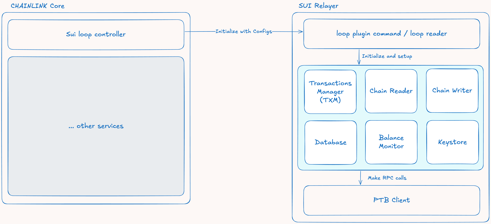

# Relayer Introduction

## Overview

The Chainlink SUI Relayer is the core component that enables communication between Chainlink Core and the Sui blockchain. It provides a comprehensive interface for reading from and writing to the Sui network, handling everything from simple contract calls to complex cross-chain operations.

The high-level architecture of the Sui Relayer follows a modular design where Chainlink Core provides initial configurations that are used to initialize the Sui relayer components.

The Sui relayer is responsible for using deployment configurations from Core to initialize internal services. The core services of the relayer are:

### Core Components

**Transaction Manager (TXM)**: Responsible for maintaining a list of calls that need to be made to contracts (e.g., CCIP Send), enqueuing those transactions, tracking their states, and retrying failed transactions when needed. For more details, see the [Transaction Manager documentation](../relayer/transaction-manager.md).

**ChainReader (CR)**: Responsible for reading values from contracts, watching for events, and monitoring failed transactions. It provides a separate entry point for the LOOP interface used by Core to read values. In Sui (similar to Aptos), we leverage a database to maintain a local store of events and synthetic events from failed transactions. For more details, see the [ChainReader documentation](../relayer/chainreader.md).

**ChainWriter (CW)**: Responsible for constructing PTBs (Programmable Transaction Blocks) with the necessary values based on configuration to ensure contract calls are made correctly. It contains a `SubmitTransaction` entry point that receives signals (such as CCIPSend) and prepares them for enqueuing in the Transaction Manager. The ChainWriter is the main interface for writing to contracts via the LOOP interface. For more details, see the [ChainWriter documentation](../relayer/chainwriter.md).

**PTB Client**: Responsible for making calls to the RPC node and decoding/deserializing BCS-encoded responses. Used by both ChainReader and ChainWriter. For more details, see the [PTB Client documentation](../relayer/ptb-client.md).

**Database**: Responsible for storing an event log used by ChainReader to respond to queries. For more details, see the [Database documentation](../relayer/database.md).

**Balance Monitor**: Responsible for monitoring transmitter balances to ensure they don't fall below specified thresholds. For more details, see the [Balance Monitor documentation](../relayer/balance-monitor.md).

**Keystore**: Responsible for securely holding keys used to sign transactions. For more details, see the [Keystore documentation](../relayer/keystore.md).

