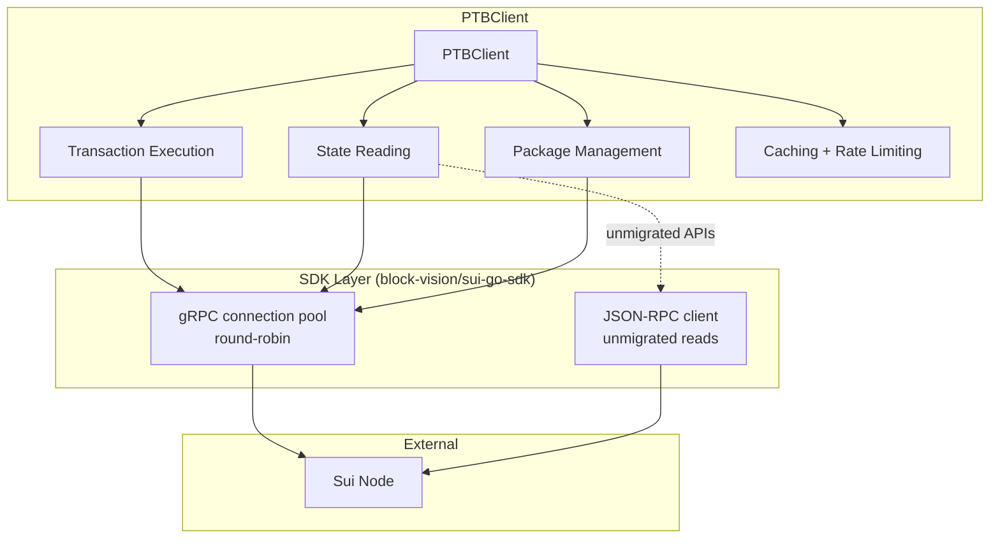

# PTB Client

The PTB (Programmable Transaction Block) Client is the core component responsible for interacting with the Sui blockchain in the Chainlink-Sui relayer. It provides the interface for executing transactions, reading blockchain state, managing gas payments, and handling Move function calls.

## Overview

The `PTBClient` implements the `SuiPTBClient` interface and serves as the primary gateway for all Sui blockchain operations. It is built on top of the [BlockVision `sui-go-sdk`](https://github.com/block-vision/sui-go-sdk).

> **gRPC migration**: The PTB Client has migrated from Sui's JSON-RPC API to its **gRPC** API. The JSON-RPC endpoints that the relayer originally relied on (notably the event- and transaction-search endpoints) are not all available over gRPC, which is what motivated the move to checkpoint-based indexing — see [Event Indexing](./event-indexing.md).
>
> The migration is incremental. During the transition the client holds **both** a gRPC connection pool and a JSON-RPC client: methods that have been migrated use the gRPC service accessors, and the few that have not yet been migrated continue to use JSON-RPC. As a result, most read/write methods now return Sui gRPC v2 protobuf types (the `github.com/block-vision/sui-go-sdk/pb/sui/rpc/v2` package, aliased as `suirpcv2` throughout the code).

### Core Capabilities

- **Transaction Management**: Building, signing, and executing Programmable Transaction Blocks
- **State Reading**: Querying objects, simulating Move functions (dev inspect), and reading checkpoints over gRPC
- **Gas Management**: Estimating gas, selecting gas payment coins, and reading balances
- **Caching**: A general-purpose cache (`go-cache`) for resolved package IDs and other metadata, plus an optional object-metadata cache injected on the read hot path
- **Rate Limiting**: A weighted semaphore that bounds the number of concurrent in-flight RPCs
- **gRPC Connection Pooling**: A round-robin pool of independent gRPC connections so a single connection's HTTP/2 stream limit does not become a bottleneck under bursty reads
- **Package Management**: Package-upgrade detection and resolution of the latest package ID for a module

## Architecture



## Core Components

### 1. gRPC Connection Pool

The client opens a pool of independent gRPC connections to the node and hands them out round-robin via the service getters (`grpc_services.go`). Spreading RPCs across several connections multiplies the available concurrent HTTP/2 streams, so a single connection's per-connection stream limit does not throttle bursty reads.

- Pool size is configured by `PTBClientConfig.MaxGrpcConnections` (default `DefaultMaxGrpcConnections = 128`).
- Each connection wraps a `grpcconn.SuiGrpcClient` and is initialized lazily and race-free on first use.
- Service getters (e.g. `getMovePackageService`, `getTransactionExecutionService`) pick the next connection and return the typed gRPC service stub.

### 2. JSON-RPC Client (transitional)

A `sui.ISuiAPI` JSON-RPC client (`moveModuleClient`) is retained for the read APIs that have not yet been migrated to gRPC. It is only created when gRPC is configured. This will be removed as the remaining methods are migrated.

### 3. Caching

The client uses two cache layers:

- **General cache** (`go-cache`): caches resolved package IDs and other metadata.
  - `DefaultCacheExpiration = 120 minutes`, `DefaultCacheCleanupInterval = 240 minutes`.
  - `DefaultPackageIdCacheTTL = 5 minutes` caches resolved "latest package ID" lookups to avoid repeating heavy `GetFunction`/`GetPackage`/`ListOwnedObjects` chains under bursty config polling.
- **Object-metadata cache** (`ObjectMetadataCache`, optional): de-duplicates and caches version-stable object reference metadata (owner/version/digest) so the per-read `GetObject` fan-out does not hit the node on every read. It is injected via `PTBClientConfig.ObjectCache` (implemented by `chainreader/reader.Cache`) and may be `nil`.

### 4. Rate Limiting and Concurrency Control

`WithRateLimit` wraps RPC calls with a weighted semaphore (`golang.org/x/sync/semaphore`) sized to `MaxConcurrentRequests` and applies the per-call `transactionTimeout`.

- Per-method weights are defined in the `RateLimitWeights` map. A weight of `0` skips the semaphore entirely for that method (avoiding unnecessary queuing); currently the map assigns weight `0` to all listed methods, so the semaphore is effectively a safety backstop rather than an active throttle.
- `MaxConcurrentRequests` defaults to `500` when not set (or set `<= 0`).

## Configuration

### Client Initialization

The client is constructed from a `PTBClientConfig`:

```go
client, err := client.NewPTBClient(logger, client.PTBClientConfig{
    GrpcTarget:            "sui-grpc-host:443", // gRPC endpoint
    GrpcToken:             "your-api-token",     // gRPC auth token
    MaxRetries:            &maxRetries,
    TransactionTimeout:    30 * time.Second,
    KeystoreService:       keystoreService,
    MaxConcurrentRequests: 500,
    MaxGrpcConnections:    128,                  // 0 => DefaultMaxGrpcConnections
    ObjectCache:           readerCache,          // optional, may be nil
    DefaultRequestType:    client.WaitForEffectsCert,
})
```

`NewPTBClient` delegates to `NewPTBClientFromConfig`. gRPC is considered enabled only when **both** `GrpcTarget` and `GrpcToken` are set; otherwise the client logs that it is running JSON-RPC only.

### `PTBClientConfig` Parameters

| Parameter | Type | Default | Description |
|-----------|------|---------|-------------|
| `GrpcTarget` | `string` | - | gRPC endpoint (`host:port`) |
| `GrpcToken` | `string` | - | gRPC auth token |
| `MaxRetries` | `*int` | - | Max retry attempts for failed operations |
| `TransactionTimeout` | `time.Duration` | - | Per-operation timeout (also used as the gRPC call timeout) |
| `KeystoreService` | `loop.Keystore` | - | Keystore used for signing |
| `MaxConcurrentRequests` | `int64` | `500` | Semaphore size for concurrent RPCs |
| `MaxGrpcConnections` | `int` | `128` | Round-robin gRPC connection pool size |
| `ObjectCache` | `ObjectMetadataCache` | `nil` | Optional object-metadata cache for the read hot path |
| `DefaultRequestType` | `TransactionRequestType` | - | Default execution mode for transactions |

### Constants

```go
const (
    DefaultGasPrice             = 10_000          // MIST
    DefaultGasBudget            = 1_000_000_000   // 1 SUI
    DefaultMinGasBudget         = 1_000_000
    DefaultCacheExpiration      = 120 * time.Minute
    DefaultCacheCleanupInterval = 240 * time.Minute
    DefaultHTTPTimeout          = 30 * time.Second
    DefaultReadOpTimeout        = 30 * time.Second // caps a single read chain (transform + simulate)
    DefaultPackageIdCacheTTL    = 5 * time.Minute

    // gRPC (grpc_factory.go)
    DefaultGrpcTimeout        = 30 * time.Second
    DefaultGrpcRetryCount     = 3
    DefaultGrpcMaxMsgSize     = 20 * 1024 * 1024 // 20 MiB
    DefaultMaxGrpcConnections = 128
)
```

## Core API Methods

The methods below reflect the current `SuiPTBClient` interface. Note that most reads now return `suirpcv2` protobuf types.

### Transaction Methods

```go
// Build transaction bytes for a single Move call (primarily used in tests).
metadata, err := ptbClient.MoveCall(ctx, client.MoveCallRequest{
    Signer:          signerAddress,
    PackageObjectId: packageId,
    Module:          "ccip",
    Function:        "execute_message",
    Arguments:       args,
    GasBudget:       client.DefaultGasBudget,
})

// Sign and execute raw BCS transaction bytes (uses the client's default request type).
resp, err := ptbClient.SignAndSendTransaction(ctx, txBytesBase64, signerPublicKey)

// Execute an already-signed transaction via the execution service.
resp, err := ptbClient.SendTransaction(ctx, execRequest)

// Build, sign, and send a fully constructed PTB.
resp, err := ptbClient.FinishPTBAndSend(ctx, txnSigner, ptb, client.WaitForEffectsCert)

// Simulate a PTB (BCS bytes) and return the decoded results.
results, err := ptbClient.SimulatePTB(ctx, bcsBytes)

// Estimate gas for a constructed transaction.
gas, err := ptbClient.EstimateGas(ctx, tx)

// Look up the status of a previously submitted transaction.
status, err := ptbClient.GetTransactionStatus(ctx, digest)
```

### State Reading Methods

```go
// Read object data by ID (returns a gRPC v2 Object).
obj, err := ptbClient.ReadObjectId(ctx, objectId)

// Read owned objects (optionally filtered by struct type).
objs, err := ptbClient.ReadOwnedObjects(ctx, ownerAddress, cursor)
objs, err := ptbClient.ReadFilterOwnedObjectIds(ctx, ownerAddress, structType, cursor)

// Execute a read-only Move function (dev inspect).
results, err := ptbClient.ReadFunction(ctx, packageId, "ccip", "get_status", args, argTypes, typeArgs)

// Coins and balances.
coins, err := ptbClient.GetCoinsByAddress(ctx, address)
coins, err := ptbClient.QueryCoinsByAddress(ctx, address, coinType)
balance, err := ptbClient.GetSUIBalance(ctx, address)
gasPrice, err := ptbClient.GetReferenceGasPrice(ctx)
```

### Checkpoint Methods

These power the checkpoint-based [ChainPoller](./event-indexing.md):

```go
// Latest checkpoint (used to compute the poller's start/catch-up window).
checkpoint, err := ptbClient.GetLatestCheckpoint(ctx)

// Full checkpoint data (transactions + their events) for a sequence number.
data, err := ptbClient.GetCheckpointData(ctx, sequenceNumber)

// Look up a checkpoint by digest, or the latest epoch.
checkpoint, err := ptbClient.GetBlockById(ctx, checkpointDigest)
epoch, err := ptbClient.GetLatestEpoch(ctx)
```

`GetCheckpointData` returns a `*client.CheckpointData` containing the checkpoint summary and the list of `*suirpcv2.ExecutedTransaction` (each carrying its events). This is the primary input to the indexers.

### Package Management Methods

```go
// All package versions for a module (upgrade tracking).
packageIds, err := ptbClient.LoadModulePackageIds(ctx, packageId, "ccip")

// Latest package ID for a module (cached for DefaultPackageIdCacheTTL).
latest, err := ptbClient.GetLatestPackageId(ctx, packageId, "ccip")

// Normalized module definition (ABI-like).
normalized, err := ptbClient.GetNormalizedModule(ctx, packageId, "ccip")

// Resolve the CCIP package ID from the OffRamp package.
ccipPackageId, err := ptbClient.GetCCIPPackageID(ctx, offRampPackageID)
```

### Pointer / Object Field Helpers

```go
// Resolve a pointer object's parent object ID (see Pointer Tags in ChainReader).
parentId, err := ptbClient.GetParentObjectID(ctx, packageID, "state_object", pointerName)

// Read named fields from a package-owned object.
values, err := ptbClient.GetValuesFromPackageOwnedObjectField(ctx, packageID, moduleID, objectName, fieldKeys)
```

## Integration with the Transaction Manager

The PTB Client is used by both the ChainReader (reads) and the Transaction Manager / ChainWriter (writes). For writes, the typical flow is:

1. The ChainWriter / TxM constructs a `transaction.Transaction` (PTB).
2. The PTB Client builds the BCS bytes, selects a gas payment coin, and estimates gas.
3. The transaction is signed via the keystore service.
4. The signed transaction is submitted over gRPC and its status is tracked.

```go
ptb := transaction.NewTransaction()
ptb.SetSender(signerAddress)
ptb.SetGasBudget(gasBudget)
// ... add MoveCall / TransferObjects commands ...

resp, err := ptbClient.FinishPTBAndSend(ctx, txnSigner, ptb, client.WaitForEffectsCert)
```

## Error Handling

The client wraps and surfaces several error categories:

- **gRPC errors**: connectivity, `NotFound` (e.g. a checkpoint not yet available), deadline exceeded. `google.golang.org/grpc/status` codes are inspected where it matters (e.g. the ChainPoller treats `codes.NotFound` as "checkpoint not yet produced").
- **Transaction errors**: invalid transactions, insufficient gas, Move aborts.
- **Signing errors**: keystore unavailability or invalid keys.
- **Rate-limit / timeout errors**: failures acquiring the semaphore within `transactionTimeout`.

## Best Practices

- **Reuse clients**: construct one PTB Client per role. The relayer uses a separate client instance for the indexers (the ChainPoller fetches checkpoints continuously) so their load does not contend with the transaction-submission client.
- **Tune the connection pool**: under heavy concurrent reads, the gRPC connection pool size (`MaxGrpcConnections`) matters more than the semaphore, because it determines how many HTTP/2 streams are available.
- **Enable the object cache**: pass an `ObjectCache` to avoid repeatedly fetching version-stable shared objects on every config-poll cycle.
- **Set sensible timeouts**: `TransactionTimeout` bounds each RPC; keep it under the deadline of any caller (e.g. the CCIP config poller).

## Security Considerations

- **Keystore integration**: all signing goes through the keystore service; private keys never leave it.
- **Transport**: gRPC connections support TLS (`GrpcClientConfig.UseTLS`); use authenticated, encrypted endpoints in production.
- **Gas limits**: always set appropriate gas budgets to bound transaction cost.
