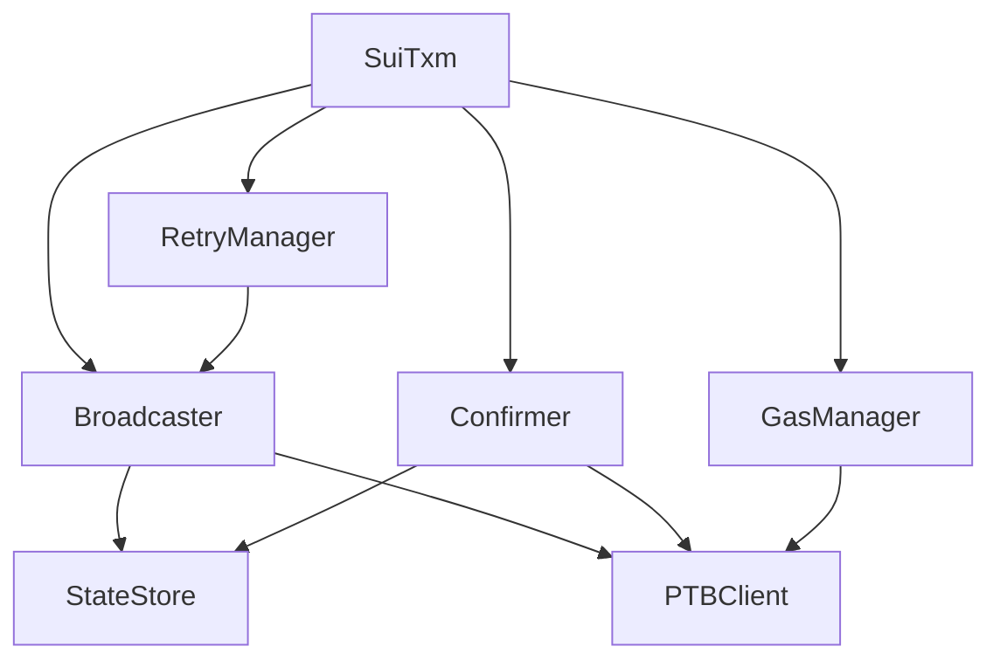
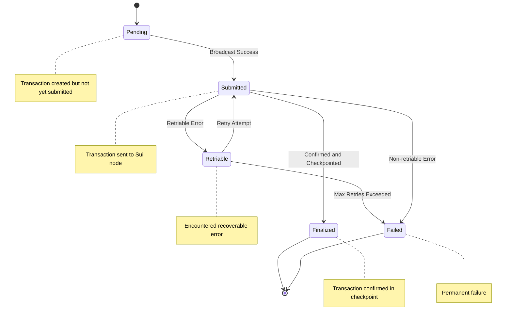
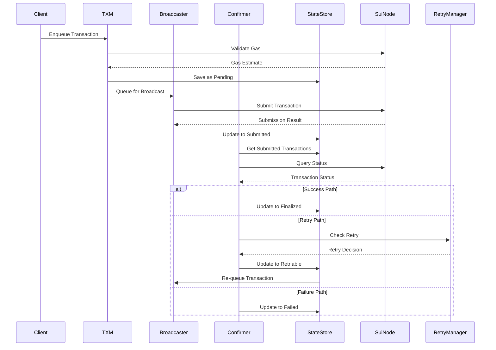

# Transaction Manager (TXM) Architecture

The Transaction Manager (TXM) is a core component of the Relayer. It is responsible for managing the complete lifecycle of transactions from creation to finalization. It ensures reliability, scalability, and handles Sui-specific requirements like gas estimation, object version management, and Programmable Transaction Block (PTB) support.

## Overview

The TXM handles transactions through a well-defined state machine, providing error handling, retry mechanisms, and gas optimization while leveraging the Sui client interface for all blockchain interactions. The current implementation is production-ready and includes support for both standard Move function calls and Programmable Transaction Blocks.

### Key Objectives

- **Transaction Lifecycle Management**: Efficiently manage transactions from creation to finalization
- **Reliability**: Ensure transaction finality and correctness with comprehensive error handling
- **Scalability**: Handle high transaction volumes with optimal resource usage and batched processing
- **Sui Optimization**: Fully leverage Sui's unique features like object model, parallel execution, and PTBs
- **Gas Management**: Intelligent gas estimation and dynamic gas bumping for failed transactions

## Architecture

### High-Level Components

The TXM consists of several interconnected components working together:



### Transaction States

The TXM manages transactions through five distinct states:



### Transaction Lifecycle

The following sequence diagram illustrates the complete flow of a transaction through the TXM system:



## Core Components

### 1. SuiTxm (Main Transaction Manager)

The central coordinator that manages all transaction operations and component lifecycle. The `SuiTxm` implements the `TxManager` interface and the `services.Service` interface from chainlink-common.

```go
type SuiTxm struct {
    lggr                  logger.Logger
    suiGateway            client.SuiPTBClient
    keystoreService       loop.Keystore
    transactionRepository TxmStore
    retryManager          RetryManager
    gasManager            GasManager
    configuration         Config
    Starter               commonutils.StartStopOnce
    done                  sync.WaitGroup
    broadcastChannel      chan string
    stopChannel           chan struct{}
}
```

#### Key Responsibilities

- **Transaction Enqueueing**: Accept and validate both Move function calls and PTB transactions
- **Component Orchestration**: Manage lifecycle of broadcaster and confirmer goroutines
- **Resource Management**: Handle goroutine lifecycle and cleanup using WaitGroup and stop channels
- **Error Coordination**: Centralize error handling and recovery across all components
- **Service Management**: Implement proper start/stop lifecycle with health reporting

#### Main Operations

```go
// Enqueue a standard Move function call transaction
func (txm *SuiTxm) Enqueue(
    ctx context.Context,
    transactionID string,
    txMetadata *commontypes.TxMeta,
    signerPublicKey []byte,
    function string,
    typeArgs []string,
    paramTypes []string,
    paramValues []any,
    simulateTx bool,
) (*SuiTx, error)

// Enqueue a Programmable Transaction Block
func (txm *SuiTxm) EnqueuePTB(
    ctx context.Context,
    transactionID string,
    txMetadata *commontypes.TxMeta,
    signerPublicKey []byte,
    ptb *transaction.Transaction,
    simulateTx bool,
) (*SuiTx, error)

// Get transaction status for monitoring
func (txm *SuiTxm) GetTransactionStatus(
    ctx context.Context,
    transactionID string,
) (commontypes.TransactionStatus, error)
```

#### Service Lifecycle

The TXM implements proper service lifecycle management:

```go
// Start the service and launch background goroutines
func (txm *SuiTxm) Start(ctx context.Context) error {
    return txm.Starter.StartOnce("SuiTxm", func() error {
        txm.done.Add(2) // broadcaster and confirmer goroutines
        go txm.broadcastLoop()
        go txm.confirmerLoop()
        return nil
    })
}

// Stop the service and wait for goroutines to finish
func (txm *SuiTxm) Close() error {
    return txm.Starter.StopOnce("SuiTxm", func() error {
        close(txm.stopChannel)
        txm.done.Wait()
        return nil
    })
}
```

### 2. Broadcaster Routine

Handles transaction submission to Sui nodes with batching, proper ordering, and backpressure management.

#### Responsibilities

- **Batch Processing**: Collect multiple transactions from the channel and process them together
- **Transaction Submission**: Submit transactions to Sui nodes using the `SendTransaction` RPC
- **Ordering Management**: Ensure older transactions (including retries) are processed first
- **State Updates**: Update transaction state to `StateSubmitted` after successful broadcast
- **Error Handling**: Handle submission errors and update transaction state appropriately

#### Implementation Details

The broadcaster uses a batching mechanism that drains the broadcast channel to process multiple transactions efficiently:

```go
func (txm *SuiTxm) broadcastLoop() {
    defer txm.done.Done()
    
    loopCtx, cancel := services.StopRChan(txm.stopChannel).NewCtx()
    defer cancel()

    for {
        select {
        case <-txm.stopChannel:
            return
        case initialId, ok := <-txm.broadcastChannel:
            if !ok {
                return // Channel closed
            }
            
            // Batch collect all pending transaction IDs
            broadcastIds := getAllBroadcastIds(initialId, txm.broadcastChannel)
            transactions := getInflightTransactions(txm, broadcastIds)
            broadcastTransactions(loopCtx, txm, transactions)
        }
    }
}
```

#### Transaction Processing

Each transaction is processed with comprehensive error handling:

```go
func broadcastTransactions(loopCtx context.Context, txm *SuiTxm, transactions []SuiTx) {
    for _, tx := range transactions {
        payload := client.TransactionBlockRequest{
            TxBytes:    tx.Payload,
            Signatures: tx.Signatures,
            Options: client.TransactionBlockOptions{
                ShowInput:          true,
                ShowRawInput:       true,
                ShowEffects:        true,
                ShowObjectChanges:  true,
                ShowBalanceChanges: true,
                ShowEvents:         true,
            },
            RequestType: tx.RequestType,
        }

        resp, err := txm.suiGateway.SendTransaction(loopCtx, payload)
        
        // Always increment attempts regardless of success/failure
        txm.transactionRepository.IncrementAttempts(tx.TransactionID)
        
        if err != nil {
            // Handle submission error - may mark as failed if no digest
            if resp.TxDigest == "" {
                txm.transactionRepository.ChangeState(tx.TransactionID, StateFailed)
            }
            continue
        }
        
        // Update transaction with digest and mark as submitted
        txm.transactionRepository.UpdateTransactionDigest(tx.TransactionID, resp.TxDigest)
        txm.transactionRepository.ChangeState(tx.TransactionID, StateSubmitted)
    }
}
```

#### Ordering Strategy

Transactions are processed in timestamp order to ensure:
- Older transactions (including retries) get priority
- Consistent ordering across multiple batches
- Fair processing under high load

### 3. Confirmer Routine

Monitors submitted transactions and updates their status based on blockchain confirmations using a periodic polling mechanism.

#### Responsibilities

- **Status Monitoring**: Poll Sui nodes for transaction status
- **Confirmation Handling**: Process successful transaction confirmations and mark as finalized
- **Retry Coordination**: Work with the retry manager component to handle failed transactions
- **Gas Bumping**: Coordinate with gas manager component for gas-related failures
- **State Updates**: Update transaction status based on blockchain state and error analysis

#### Implementation Details

The confirmer runs on a jittered ticker to avoid thundering herd problems:

```go
func (txm *SuiTxm) confirmerLoop() {
    defer txm.done.Done()
    
    loopCtx, cancel := services.StopRChan(txm.stopChannel).NewCtx()
    defer cancel()

    basePeriod := txm.configuration.ConfirmPollSecs
    ticker, jitteredDuration := GetTicker(basePeriod)
    defer ticker.Stop()

    for {
        select {
        case <-txm.stopChannel:
            return
        case <-loopCtx.Done():
            return
        case <-ticker.C:
            checkConfirmations(loopCtx, txm)
        }
    }
}
```

#### Transaction Status Processing

For each in-flight transaction, the confirmer:

```go
func checkConfirmations(loopCtx context.Context, txm *SuiTxm) {
    inFlightTransactions, err := txm.transactionRepository.GetInflightTransactions()
    if err != nil {
        return
    }
    
    for _, tx := range inFlightTransactions {
        switch tx.State {
        case StateSubmitted:
            resp, err := txm.suiGateway.GetTransactionStatus(loopCtx, tx.Digest)
            if err != nil {
                continue
            }
            
            switch resp.Status {
            case "success":
                handleSuccess(txm, tx)
            case "failure":
                handleTransactionError(loopCtx, txm, tx, &resp)
            }
        case StateRetriable:
            // TODO: Implement retry timing logic
        }
    }
}
```

#### Error Handling and Retry Logic

When a transaction fails, the confirmer coordinates with the retry manager:

```go
func handleTransactionError(ctx context.Context, txm *SuiTxm, tx SuiTx, result *client.TransactionResult) error {
    isRetryable, strategy := txm.retryManager.IsRetryable(&tx, result.Error)
    txError := suierrors.ParseSuiErrorMessage(result.Error)

    if isRetryable {
        switch strategy {
        case GasBump:
            updatedGas, err := txm.gasManager.GasBump(ctx, &tx)
            if err != nil {
                // Mark as failed if gas bump fails
                txm.transactionRepository.ChangeState(tx.TransactionID, StateFailed)
                return nil
            }
            
            // Update gas and re-enqueue
            txm.transactionRepository.UpdateTransactionGas(tx.TransactionID, &updatedGas)
            txm.transactionRepository.ChangeState(tx.TransactionID, StateRetriable)
            txm.broadcastChannel <- tx.TransactionID
            
        case ExponentialBackoff:
            // TODO: Implement exponential backoff timing
            
        case NoRetry:
            txm.transactionRepository.ChangeState(tx.TransactionID, StateFailed)
        }
    } else {
        txm.transactionRepository.ChangeState(tx.TransactionID, StateFailed)
        txm.transactionRepository.UpdateTransactionError(tx.TransactionID, txError)
    }
    
    return nil
}
```

### 4. Retry Manager

Implements sophisticated retry logic using pluggable strategy functions for different error types.

#### Interface and Implementation

```go
type RetryManager interface {
    IsRetryable(tx *SuiTx, errMessage string) (bool, RetryStrategy)
    RegisterStrategyFunc(strategyFunc RetryStrategyFunc)
    GetMaxNumberRetries() int
}

type DefaultRetryManager struct {
    strategyFunc     RetryStrategyFunc
    maxNumberRetries int
}
```

#### Retry Strategies

The retry manager supports three distinct strategies:

```go
type RetryStrategy int

const (
    NoRetry RetryStrategy = iota           // Don't retry the transaction
    ExponentialBackoff                     // Retry with exponential backoff (to be implemented)
    GasBump                               // Retry after increasing gas budget
)
```

#### Error Classification and Strategy Selection

The default strategy function analyzes Sui error messages to determine retry eligibility:

```go
func defaultRetryStrategy(tx *SuiTx, txErrorMsg string, maxRetries int) (bool, RetryStrategy) {
    txError := suierrors.ParseSuiErrorMessage(txErrorMsg)
    if !suierrors.IsRetryable(txError) {
        return false, NoRetry
    }

    // Check retry count limit
    if tx.Attempt >= maxRetries {
        return false, NoRetry
    }

    // Select strategy based on error category
    switch txError.Category {
    case suierrors.GasErrors:
        return true, GasBump
    default:
        return true, ExponentialBackoff
    }
}
```

#### Strategy Function Registration

Custom retry strategies can be registered for specific use cases:

```go
func (rm *DefaultRetryManager) RegisterStrategyFunc(strategyFunc RetryStrategyFunc) {
    rm.strategyFunc = strategyFunc
}

// Example custom strategy
customStrategy := func(tx *SuiTx, errorMsg string, maxRetries int) (bool, RetryStrategy) {
    // Custom logic for specific error patterns
    if strings.Contains(errorMsg, "insufficient_gas") {
        return true, GasBump
    }
    return false, NoRetry
}
retryManager.RegisterStrategyFunc(customStrategy)
```

### 5. State Store

Manages transaction state persistence with thread-safe operations and comprehensive transaction lifecycle support.

#### Storage Interface

The `TxmStore` interface provides comprehensive transaction management capabilities:

```go
type TxmStore interface {
    // Core transaction operations
    AddTransaction(tx SuiTx) error
    GetTransaction(transactionID string) (SuiTx, error)
    DeleteTransaction(transactionID string) error
    
    // State management
    ChangeState(transactionID string, state TransactionState) error
    GetTransactionsByState(state TransactionState) ([]SuiTx, error)
    GetInflightTransactions() ([]SuiTx, error)
    
    // Transaction updates
    UpdateTransactionDigest(transactionID string, digest string) error
    UpdateTransactionGas(transactionID string, gasBudget *big.Int) error
    UpdateTransactionError(transactionID string, txError *suierrors.SuiError) error
    IncrementAttempts(transactionID string) error
}
```

#### Transaction States

The system manages five distinct transaction states:

```go
type TransactionState int

const (
    StatePending    TransactionState = iota  // Created but not submitted
    StateSubmitted                           // Sent to Sui node
    StateFinalized                           // Successfully executed and finalized
    StateRetriable                           // Failed but can be retried
    StateFailed                             // Permanently failed
)
```

#### Transaction Structure

Each transaction contains comprehensive metadata:

```go
type SuiTx struct {
    TransactionID string
    Sender        string
    Metadata      *commontypes.TxMeta
    Timestamp     uint64
    Payload       string                    // BCS base64 encoded transaction bytes
    Functions     []*SuiFunction
    Signatures    []string
    RequestType   string
    Attempt       int
    State         TransactionState
    Digest        string
    LastUpdatedAt uint64
    TxError       *suierrors.SuiError
}
```

#### Implementation Options

<!-- tabs:start -->

#### **In-Memory Store**

```go
type InMemoryStore struct {
    transactions map[string]*SuiTx
    mutex        sync.RWMutex
}

// Best for: Development, testing, lightweight deployments
// Pros: Fast, simple, no external dependencies
// Cons: Data loss on restart, memory usage grows over time
```

<!-- tabs:end -->

### 6. Gas Manager

Handles gas estimation and gas bumping for Sui transactions with a focus on cost optimization and retry success.

#### Interface and Implementation

```go
type GasManager interface {
    EstimateGasBudget(ctx context.Context, tx *SuiTx) (uint64, error)
    GasBump(ctx context.Context, tx *SuiTx) (big.Int, error)
}

type SuiGasManager struct {
    lggr               logger.Logger
    maxGasBudget       big.Int
    percentualIncrease int64
    ptbClient          client.SuiPTBClient
}
```

#### Gas Estimation

The gas manager estimates transaction costs by simulating execution:

```go
func (s *SuiGasManager) EstimateGasBudget(ctx context.Context, tx *SuiTx) (uint64, error) {
    gasBudget, err := s.ptbClient.EstimateGas(ctx, tx.Payload)
    if err != nil {
        return 0, fmt.Errorf("failed to estimate gas budget: %w", err)
    }
    return gasBudget, nil
}
```

#### Gas Bumping Strategy

When transactions fail due to insufficient gas, the gas manager applies a percentage-based increase:

```go
func (s *SuiGasManager) GasBump(ctx context.Context, tx *SuiTx) (big.Int, error) {
    // Check if already at maximum
    if tx.Metadata.GasLimit.Cmp(&s.maxGasBudget) >= 0 {
        return *big.NewInt(0), errors.New("gas budget is already at max gas budget")
    }

    // Calculate new budget: current * 120 / 100 (20% increase)
    newBudget := new(big.Int).Mul(tx.Metadata.GasLimit, big.NewInt(120))
    newBudget.Div(newBudget, big.NewInt(100))

    // Cap at maximum allowed
    if newBudget.Cmp(&s.maxGasBudget) > 0 {
        newBudget.Set(&s.maxGasBudget)
    }

    return *newBudget, nil
}
```

#### Configuration

Gas management behavior is configurable:

```go
const (
    gasLimitPercentualIncrease = 120  // 20% increase
    percentualNormalization = 100
)

// Default max gas budget can be set during manager creation
gasManager := NewSuiGasManager(logger, ptbClient, maxGasBudget, percentualIncrease)
```

### 7. Reaper Routine

> **Note**: The reaper routine is not yet implemented in the current codebase. This section describes the planned implementation.

The reaper routine will perform periodic cleanup of old transactions to prevent memory/storage bloat and maintain optimal performance.

#### Planned Cleanup Criteria

- **Finalized Transactions**: Remove after configured retention period
- **Failed Transactions**: Remove after error analysis period  
- **Stale Transactions**: Remove transactions stuck in intermediate states beyond timeout

#### Future Configuration

```go
type ReaperConfig struct {
    CleanupInterval    time.Duration  // How often to run cleanup
    FinalizedRetention time.Duration  // How long to keep finalized transactions
    FailedRetention    time.Duration  // How long to keep failed transactions
    MaxBatchSize       int           // Maximum transactions to process per cleanup
}
```

#### Implementation Status

The reaper routine is planned for future implementation and will be added as a third goroutine in the TXM service lifecycle.

## Configuration

### Configuration Structure

The TXM uses a comprehensive configuration structure:

```go
type Config struct {
    BroadcastChanSize     uint      // Size of the broadcast channel buffer
    RequestType           string    // Default request type for transactions
    ConfirmPollSecs       uint      // Polling interval for confirmer in seconds
    DefaultMaxGasAmount   uint64    // Default maximum gas amount
    MaxTxRetryAttempts    uint64    // Maximum retry attempts per transaction
    TransactionTimeout    string    // Transaction timeout duration
    MaxConcurrentRequests uint64    // Maximum concurrent requests
}
```

### Default Configuration

```go
var DefaultConfigSet = Config{
    BroadcastChanSize:     100,                    // Channel buffer size
    RequestType:           "WaitForLocalExecution", // Wait for local execution
    ConfirmPollSecs:       2,                      // Poll every 2 seconds
    DefaultMaxGasAmount:   200000,                 // 200k gas units
    MaxTxRetryAttempts:    5,                      // Up to 5 retries
    TransactionTimeout:    "10s",                  // 10 second timeout
    MaxConcurrentRequests: 5,                      // 5 concurrent requests
}
```

### Configuration Usage

The configuration is passed during TXM initialization:

```go
txm, err := NewSuiTxm(
    logger,
    suiClient,
    keystore,
    config,           // Configuration instance
    txStore,
    retryManager,
    gasManager,
)
```

### Environment-Specific Tuning

Different environments may require different configurations:

```go
// High-throughput production configuration
productionConfig := Config{
    BroadcastChanSize:     500,     // Larger buffer for high volume
    ConfirmPollSecs:       1,       // Faster polling
    MaxConcurrentRequests: 20,      // More concurrent processing
}

// Development configuration
devConfig := Config{
    BroadcastChanSize:     50,      // Smaller buffer
    ConfirmPollSecs:       5,       // Slower polling to reduce load
    MaxConcurrentRequests: 2,       // Limited concurrency
}
```

## Error Handling

### Error Processing Pipeline

The TXM implements a comprehensive error handling system that integrates with Sui's error reporting:

```go
// Error processing flow in the confirmer
func handleTransactionError(ctx context.Context, txm *SuiTxm, tx SuiTx, result *client.TransactionResult) error {
    // Parse Sui-specific error message
    txError := suierrors.ParseSuiErrorMessage(result.Error)
    
    // Check if error is retryable using retry manager
    isRetryable, strategy := txm.retryManager.IsRetryable(&tx, result.Error)
    
    if isRetryable {
        return handleRetryableError(ctx, txm, tx, strategy)
    } else {
        return handlePermanentError(txm, tx, txError)
    }
}
```

### Sui Error Integration

The system leverages the `suierrors` package for error classification:

```go
// Example error categories handled
switch txError.Category {
case suierrors.GasErrors:
    // Insufficient gas, object not found for gas payment, etc.
    strategy = GasBump
    
case suierrors.ObjectErrors:
    // Object version mismatch, object not found, etc.
    // May be retryable with exponential backoff
    
case suierrors.TransactionErrors:
    // Invalid transaction structure, signature issues, etc.
    // Usually permanent failures
}
```

### Retry Strategies

Different retry strategies are applied based on error type:

```go
func handleRetryableError(ctx context.Context, txm *SuiTxm, tx SuiTx, strategy RetryStrategy) error {
    switch strategy {
    case GasBump:
        // Increase gas budget and retry
        updatedGas, err := txm.gasManager.GasBump(ctx, &tx)
        if err != nil {
            // Gas bump failed, mark as failed
            txm.transactionRepository.ChangeState(tx.TransactionID, StateFailed)
            return nil
        }
        
        // Update transaction and re-enqueue
        txm.transactionRepository.UpdateTransactionGas(tx.TransactionID, &updatedGas)
        txm.transactionRepository.ChangeState(tx.TransactionID, StateRetriable)
        txm.broadcastChannel <- tx.TransactionID
        
    case ExponentialBackoff:
        // TODO: Implement exponential backoff with jitter
        // For now, just re-enqueue immediately
        txm.transactionRepository.ChangeState(tx.TransactionID, StateRetriable)
        txm.broadcastChannel <- tx.TransactionID
        
    case NoRetry:
        txm.transactionRepository.ChangeState(tx.TransactionID, StateFailed)
    }
    
    return nil
}
```

### Common Error Scenarios

| Error Type | Retryable | Strategy |
|------------|-----------|----------|
| **Insufficient Gas** | ✅ | Increase gas amount and retry |
| **Object Version Conflict** | ✅ | Refresh object version and retry |
| **Network Timeout** | ✅ | Exponential backoff retry |
| **Invalid Transaction** | ❌ | Mark as failed permanently |
| **Expired Gas Object** | ❌ | Require new gas object |
| **Insufficient Balance** | ❌ | Require funding |

## Monitoring and Metrics

### Key Metrics

```go
type TxmMetrics struct {
    // Transaction counts
    TotalTransactions    prometheus.Counter
    PendingTransactions  prometheus.Gauge
    SubmittedTransactions prometheus.Gauge
    FinalizedTransactions prometheus.Counter
    FailedTransactions   prometheus.Counter
    
    // Performance metrics
    SubmissionLatency    prometheus.Histogram
    ConfirmationLatency  prometheus.Histogram
    RetryRate           prometheus.Histogram
    
    // Error metrics
    ErrorsByType        *prometheus.CounterVec
    GasEstimationErrors prometheus.Counter
    
    // Resource usage
    StoreSize           prometheus.Gauge
    GoroutineCount      prometheus.Gauge
}
```

### Health Checks

```go
func (txm *SuiTxm) HealthCheck() error {
    // Check component health
    if err := txm.suiGateway.HealthCheck(); err != nil {
        return fmt.Errorf("sui gateway unhealthy: %w", err)
    }
    
    // Check store health
    if err := txm.transactionRepository.HealthCheck(); err != nil {
        return fmt.Errorf("transaction store unhealthy: %w", err)
    }
    
    // Check queue health
    if len(txm.broadcastChannel) > txm.config.BroadcastChanSize*0.8 {
        return errors.New("broadcast queue near capacity")
    }
    
    return nil
}
```

## Current Implementation Status

### Completed Features

✅ **Core TXM Service**: Fully implemented with proper lifecycle management  
✅ **Transaction Enqueueing**: Support for both Move function calls and PTBs  
✅ **Broadcaster Routine**: Intelligent batching and transaction submission  
✅ **Confirmer Routine**: Status monitoring with jittered polling  
✅ **Retry Manager**: Pluggable retry strategies with error classification  
✅ **Gas Manager**: Gas estimation and intelligent gas bumping  
✅ **State Store Interface**: Comprehensive transaction state management  
✅ **Error Handling**: Integration with Sui error parsing and classification  

### Future Enhancements

🔄 **Exponential Backoff**: Currently marked as TODO in retry strategies  
🔄 **Reaper Routine**: Planned for transaction cleanup and storage optimization  

🔄 **Metrics and Monitoring**: Integration with prometheus metrics  

## Related Documentation

- **[ChainWriter](../relayer/chainwriter.md)**: High-level transaction submission interface
- **[PTB Introduction](../ptb/introduction.md)**: Programmable Transaction Block construction
- **[Relayer Configuration](../relayer/configuration.md)**: Overall relayer configuration
- **[Getting Started](../getting-started/quick-start.md)**: Setting up the Sui integration
