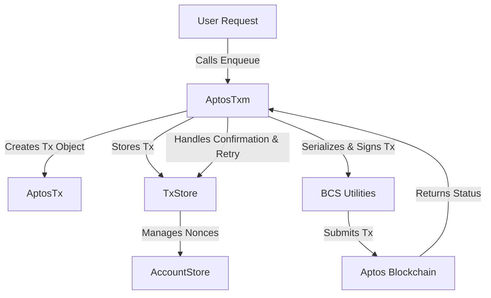
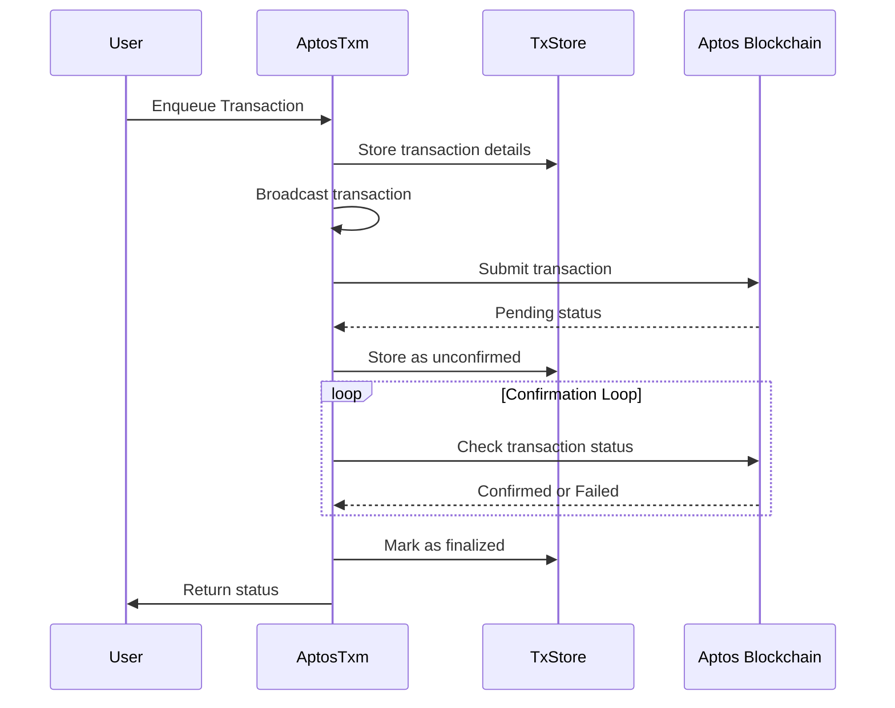

## **Aptos Transaction Manager: Overview and Architecture**

The provided Go files implement a **Transaction Manager (TxM)** for Aptos, responsible for handling transaction lifecycle events, from creation to finalization. Below is a structured breakdown of its main components and their responsibilities.

---

### **Main Components**
The transaction manager consists of several key components:

1. **`AptosTxm` (Transaction Manager) - `txm.go`**
2. **`AptosTx` (Transaction Data Structure) - `tx.go`**
3. **`TxStore` (Transaction Store) - `txstore.go`**
4. **`AccountStore` (Account-based Transaction Tracking) - `txstore.go`**
5. **`Config` (Configuration Management) - `config.go`**
6. **`bcs_util.go` (BCS Serialization Utilities)**

---

### **High-Level Architecture**


---

## **1. `AptosTxm` (Transaction Manager)**
The **AptosTxm** struct is the central component managing transactions.

### **Responsibilities:**
- Handles **transaction creation** via `Enqueue()`
- **Manages** transaction lifecycle (broadcast, confirmation)
- **Serializes & signs** transactions before submission
- Handles **failures & retries** if needed
- Maintains a **thread-safe transaction queue**
- **Prunes** old transactions periodically

### **Key Methods:**
| Method | Description |
|--------|-------------|
| `New()` | Initializes the transaction manager. |
| `Enqueue()` | Adds a transaction to be processed. |
| `Start()` | Starts background loops for broadcasting & confirmation. |
| `Close()` | Gracefully shuts down transaction processing. |
| `GetStatus()` | Fetches the status of a given transaction. |
| `broadcastLoop()` | Continuously sends transactions to the Aptos blockchain. |
| `confirmLoop()` | Periodically checks if transactions are finalized. |
| `signAndBroadcast()` | Serializes, signs, and submits transactions to Aptos. |
| `maybeRetry()` | Handles retry logic if transactions fail. |

---

## **2. `AptosTx` (Transaction Data Structure)**
This struct represents an **Aptos transaction**.

### **Structure:**
```go
type AptosTx struct {
	ID              string
	Metadata        *commontypes.TxMeta
	Timestamp       uint64
	FromAddress     aptos.AccountAddress
	PublicKey       ed25519.PublicKey
	ContractAddress aptos.AccountAddress
	ModuleName      string
	FunctionName    string
	TypeTags        []aptos.TypeTag
	BcsValues       [][]byte
	Attempt         uint64
	Status          commontypes.TransactionStatus
	Simulate        bool
}
```

### **Responsibilities:**
- Stores transaction details such as:
  - Sender, contract, function, parameters
  - Status tracking (`Pending`, `Confirmed`, `Failed`)
  - Tracks attempts and retries
- Used by **TxStore** and **AptosTxm** to track progress.

---

## **3. `TxStore` (Transaction Storage & Nonce Tracking)**
A **per-account transaction store** that:
- Tracks **unconfirmed transactions**
- Manages **nonces** to ensure correct sequencing
- Handles **failed transactions** to retry them properly

### **Key Methods:**
| Method | Description |
|--------|-------------|
| `NewTxStore()` | Initializes a transaction store. |
| `GetNextNonce()` | Returns the next nonce to use. |
| `AddUnconfirmed()` | Marks a transaction as unconfirmed. |
| `Confirm()` | Marks a transaction as finalized or failed. |
| `GetUnconfirmed()` | Retrieves unconfirmed transactions. |
| `InflightCount()` | Returns the count of unconfirmed transactions. |

---

## **4. `AccountStore` (Account-based Transaction Tracking)**
The **AccountStore** manages multiple `TxStore` instances, each tracking transactions for a specific account.

### **Responsibilities:**
- Provides **isolation** between accounts.
- Stores multiple `TxStore` instances.
- Allows **batch retrieval** of unconfirmed transactions.
- Maintains **in-flight transaction count**.

### **Key Methods:**
| Method | Description |
|--------|-------------|
| `NewAccountStore()` | Creates a new account store. |
| `CreateTxStore()` | Creates a TxStore for an account. |
| `GetTxStore()` | Retrieves the TxStore for an account. |
| `GetTotalInflightCount()` | Counts all in-flight transactions. |

---

## **5. `Config` (Configuration Management)**
Defines various **timeouts, retry limits, and gas parameters**.

### **Configuration Fields**
| Parameter | Description | Default |
|-----------|-------------|---------|
| `BroadcastChanSize` | Max transactions in queue | `100` |
| `ConfirmPollSecs` | Interval for checking confirmations | `2s` |
| `DefaultMaxGasAmount` | Gas limit per transaction | `200,000` |
| `MaxSimulateAttempts` | Retry attempts for simulations | `5` |
| `MaxSubmitRetryAttempts` | Retries for transaction submission | `10` |
| `SubmitDelayDuration` | Delay between retries | `3s` |
| `TxExpirationSecs` | Expiration time for a transaction | `10s` |
| `MaxTxRetryAttempts` | Max transaction retries | `5` |
| `PruneIntervalSecs` | Interval for pruning old transactions | `4h` |
| `PruneTxExpirationSecs` | Age threshold for pruning | `2h` |

---

## **6. `bcs_util.go` (BCS Serialization Utilities)**
This module handles **BCS (Binary Canonical Serialization)** used in Aptos.

### **Responsibilities:**
- Converts transaction parameters into **BCS format**.
- Ensures proper serialization for different data types.
- Provides helper functions for:
  - **Type tag creation** (`CreateTypeTag()`)
  - **Value serialization** (`CreateBcsValue()`)

### **Key Methods:**
| Method | Description |
|--------|-------------|
| `CreateTypeTag()` | Converts a type string into an Aptos TypeTag. |
| `CreateBcsValue()` | Serializes a Go value into BCS format. |

---

## **Transaction Lifecycle**
The following flowchart illustrates the lifecycle of a transaction in `AptosTxm`:



---

## **Conclusion**
The **Aptos Transaction Manager (AptosTxm)** efficiently handles transaction management using a structured architecture:
- **`AptosTxm`** orchestrates transactions.
- **`TxStore` & `AccountStore`** manage nonce tracking and retries.
- **`BCS Utilities`** ensure Aptos-compatible serialization.
- **`Config`** allows fine-tuned performance settings.

This design ensures **reliable transaction submission, nonce handling, retries, and confirmation tracking** in a scalable manner. 🚀