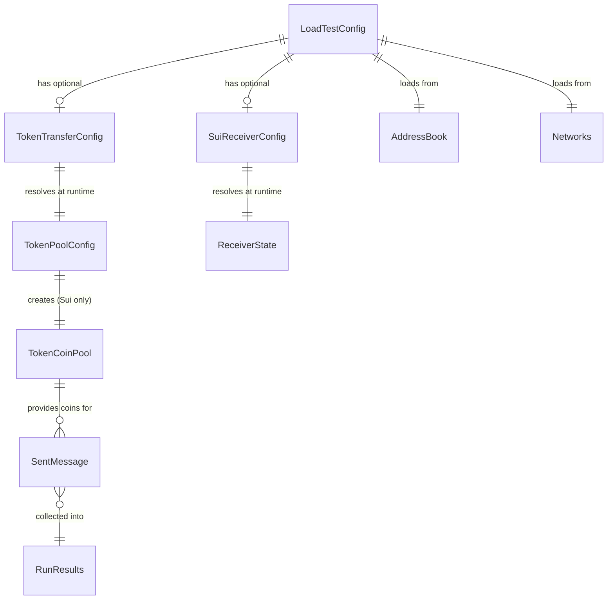

# Data Model: Load Test Token Transfers

**Feature**: 002-load-test-token-transfers
**Date**: 2026-08-05

## Entities

### 1. TokenTransferConfig (Run Config — Layer 4)

Represents the token-specific parameters loaded from the `[token]` section of the run config TOML.

| Field | Type | Required | Description |
|-------|------|----------|-------------|
| `TokenIdentifier` | `string` | Yes (if `[token]` present) | Coin metadata object ID (Sui source) or ERC-20 token address (EVM source). Maps from two TOML keys: `coin_metadata_id` (Sui source) or `token_address` (EVM source) |
| `Amount` | `uint64` | Yes (if `[token]` present) | Token amount per message in base units (raw smallest units) |
| `Mode` | `string` | Yes (if `[token]` present) | Transfer mode: `"token_only"` or `"token_and_message"` |

**Validation Rules**:
- If `[token]` section is present, `Amount` MUST be > 0.
- If `Mode` is `"token_and_message"`, the run config's `message_data` MUST be non-empty and `evm_callback_gas_limit` MUST be > 0.
- If `[token]` section is absent, the test runs in message-only mode (backward compatible).

**TOML Example (Sui source)**:
```toml
[token]
coin_metadata_id = "0x331ce2ba0901fec09d863f0d4162ae29bae2898922e345f3e4cd356363ce3c1b"
amount = 1000000000
mode = "token_only"
```

**TOML Example (EVM source)**:
```toml
[token]
token_address = "0x88A2d74F47a237a62e7A51cdDa67270CE381555e"
amount = 1000000000000000000
mode = "token_only"
```

**Field Mapping**: The `[token]` section uses `coin_metadata_id` for Sui source chains and `token_address` for EVM source chains. Both map to the single `TokenIdentifier` Go field in `TokenTransferConfig`. The config loader determines which key to read based on the source chain type.

---

### 2. SuiReceiverConfig (Run Config — Layer 4)

Represents the Sui receiver parameters for EVM→Sui programmable transfers, loaded from the `[sui_receiver]` section.

| Field | Type | Required | Description |
|-------|------|----------|-------------|
| `PackageID` | `string` | Yes (if `[sui_receiver]` present) | Sui receiver package ID (hex-encoded, 32 bytes) |

**Validation Rules**:
- If `[sui_receiver]` is present, `PackageID` MUST be a valid hex string (with or without `0x` prefix).
- If `[sui_receiver]` is absent and the transfer mode is `"token_and_message"` for EVM→Sui, the test MUST fail with a clear error.

**TOML Example**:
```toml
[sui_receiver]
package_id = "0x1810288cfa4414848aad6d0d11afcb95836255d195c114d902fd933e5965511e"
```

**Runtime Resolution**: The receiver state object ID and clock object ID are NOT stored in this config. They are resolved at runtime:
- `ReceiverStateObjectID` ← `getObjectFromPackage(PackageID, "CCIPReceiverState")` via devInspect
- `ClockObjectID` ← always `0x6`

---

### 3. TokenPoolConfig (Runtime — Resolved On-Chain)

Represents the token pool configuration fetched from the CCIP token admin registry at runtime.

| Field | Type | Source | Description |
|-------|------|--------|-------------|
| `PoolPackageID` | `string` | `token_pool_package_id` | Original pool package ID (before latest-version resolution) |
| `PoolModule` | `string` | `token_pool_module` | Module name: `managed_token_pool`, `lock_release_token_pool`, or `burn_mint_token_pool` |
| `PoolKind` | `string` | Derived from module | `"managed"`, `"lock_release"`, or `"burn_mint"` |
| `PoolStateObjectID` | `string` | `lock_or_burn_params[1]` or `[3]` | Pool state shared object ID |
| `CoinType` | `string` | `token_type` | Full Move coin type (e.g., `0x...::link::LINK`) |
| `LatestPoolPackageID` | `string` | Resolved at runtime | Latest deployed version of the pool package |

**Resolution Flow**:
1. Call `token_admin_registry::get_token_config_struct(CCIPObjectRef, coinMetadataId)` via devInspect.
2. Parse the BCS-encoded result to extract `token_pool_package_id`, `token_pool_module`, `lock_or_burn_params`.
3. Determine `PoolKind` from `token_pool_module`.
4. Extract `PoolStateObjectID` from `lock_or_burn_params` (index 3 for managed, index 1 for lock_release/burn_mint).
5. Resolve `LatestPoolPackageID` from `PoolPackageID` using the existing latest-package resolution pattern.

**State Transitions**: None — this is a read-only lookup.

---

### 4. TokenCoinPool (Runtime — Sui→EVM)

A pre-split pool of token coin objects, analogous to the existing `SuiCoinPool` for SUI gas/fee coins.

| Field | Type | Description |
|-------|------|-------------|
| `coins` | `chan string` | Channel of token coin object IDs |
| `coinType` | `string` | Full Move coin type (e.g., `0x...::link::LINK`) |
| `amountPerCoin` | `uint64` | Exact amount per coin (equals the transfer amount per message) |

**Lifecycle**:
1. **Created**: Before the send loop, query sender's coins of `coinType`, find the largest one.
2. **Split**: Split the source coin into N coins of exactly `amountPerCoin` each, where N = `messageCount`.
3. **Consumed**: Each message pops one coin from the pool. The `lock_or_burn` call consumes the entire coin.
4. **Destroyed**: After all messages are sent (or on error), the pool channel is closed.

**Invariants**:
- Each coin is used exactly once (no reuse across messages).
- The gas coin, fee coin, and token coin for a single message are all distinct objects (Sui PTB constraint).

---

### 5. SentMessage (Extended — Results)

The existing results entity, extended with token-specific fields.

| Field | Type | Description |
|-------|------|-------------|
| `MessageID` | `string` | CCIP message ID (hex) |
| `TransactionHash` | `string` | Source chain transaction hash |
| `SourceChainSelector` | `uint64` | Source chain selector |
| `DestChainSelector` | `uint64` | Destination chain selector |
| `Timestamp` | `string` | ISO 8601 timestamp |
| `Success` | `bool` | Whether the send succeeded |
| `Error` | `string` | Error message if failed (omitempty) |
| `SequenceNumber` | `string` | CCIP sequence number (omitempty) |
| **`TokenAmount`** | `string` | **NEW**: Token amount in base units (omitempty) |
| **`TokenIdentifier`** | `string` | **NEW**: Token identifier — coin metadata ID or ERC-20 address (omitempty) |

**Backward Compatibility**: The new fields use `omitempty` so existing message-only results files remain valid JSON. Token fields are only populated when a `[token]` section is present in the run config.

---

### 6. LoadTestConfig (Extended — In-Memory)

The fully assembled configuration, extended with token and Sui receiver fields.

| New Field | Type | Source | Description |
|-----------|------|--------|-------------|
| `TokenConfig` | `*TokenTransferConfig` | Run config `[token]` | nil if message-only |
| `SuiReceiverConfig` | `*SuiReceiverConfig` | Run config `[sui_receiver]` | nil if not needed |

**Existing fields** (unchanged): `RunName`, `EnvName`, `SourceChainSelector`, `DestChainSelector`, `MessageCount`, `MessageData`, `ReceiverAddress`, `SuiGasBudget`, `EvmGasLimit`, `EvmCallbackGasLimit`, `SuiPrivateKey`, `EVMPrivateKey`, `AddressBook`, `Networks`.

---

## Entity Relationships



## State Transitions

### TokenCoinPool Lifecycle

```
[Created] ──split──▶ [Ready] ──pop per message──▶ [Empty] ──close──▶ [Destroyed]
                         │
                         └── error during split ──▶ [Failed: insufficient balance]
```

### EVM Allowance Lifecycle

```
[Unapproved] ──approve tx──▶ [Approved: totalAmount] ──send loop──▶ [Consumed]
                                  │
                                  └── already sufficient ──▶ [Skip approval]
```
